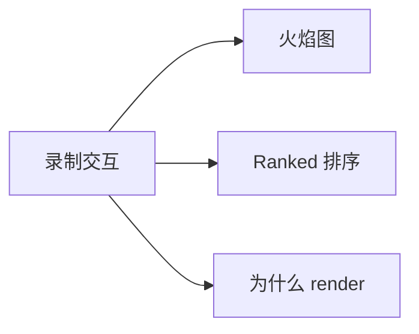
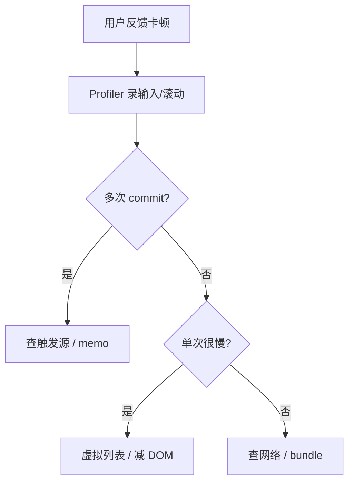

# Profiler 与性能分析

> **React DevTools Profiler** 记录每次 commit 的耗时与原因，是前端 React 性能排查的**首选工具**——比猜 memo 有效得多。

---

## 一、打开 Profiler

1. 安装 [React Developer Tools](https://react.dev/learn/react-developer-tools) 浏览器扩展  
2. DevTools → **Profiler** 标签  
3. 点击录制 ● → 操作页面 → 停止 ■



---

## 二、火焰图（Flamegraph）

| 视觉 | 含义 |
|------|------|
| 条块宽度 | 该组件及子树耗时占比 |
| 颜色黄/红 | 相对慢 |
| 灰色 | 未 render（memo 跳过等） |

**看谁最宽**——优先优化最宽且 render 频繁的组件。

---

## 三、Ranked 视图

按**单组件自身 render 耗时**排序，适合找「单次很重」的组件（大 DOM、复杂计算）。

---

## 四、「Why did this render?」

Profiler 设置里开启 **Record why each component rendered**（或 Components 面板查看）：

| 原因 | 处理方向 |
|------|----------|
| Hooks changed | 哪个 state/context 变了 |
| Parent re-rendered | 考虑 memo 或状态下沉 |
| Props changed | 稳定引用 / 少传对象 |

---

## 五、典型排查流程



---

## 六、Profiler API（代码内）

```tsx
import { Profiler, ProfilerOnRenderCallback } from 'react';

const onRender: ProfilerOnRenderCallback = (
  id, phase, actualDuration, baseDuration, startTime, commitTime,
) => {
  if (actualDuration > 16) {
    console.warn(`[${id}] ${phase} took ${actualDuration.toFixed(1)}ms`);
  }
};

<Profiler id="UserList" onRender={onRender}>
  <UserList />
</Profiler>
```

| phase | 含义 |
|-------|------|
| mount | 首次 |
| update | 更新 |

生产环境可采样上报，勿全量 log。

---

## 七、与浏览器 Performance

| 工具 | 擅长 |
|------|------|
| React Profiler | 组件级、为何 render |
| Chrome Performance | 长任务、布局、脚本总览 |
| Lighthouse | 加载指标、建议 |

React 问题先用 Profiler；INP 长任务可叠加 Performance。

---

## 八、案例：输入框卡

**现象**：搜索框每键 re-render 整表。

**Profiler**：每次按键 `UserTable` 全绿 render。

**修复**：`SearchBox` 状态下沉 + `UserRow` memo + 稳定 `onSelect` useCallback。

---

## 九、小结

| 步骤 | |
|------|--|
| 录制真实交互 | |
| 火焰图找热点 | |
| 看 render 原因 | |
| 改完再录对比 | |

**上一篇**：[02-memo-useMemo-useCallback](./02-memo-useMemo-useCallback.md)  
**下一篇**：[04-虚拟列表与大数据渲染](./04-虚拟列表与大数据渲染.md)
