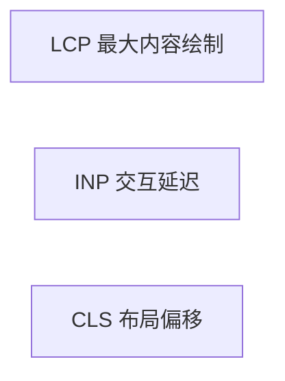

# Web Vitals 与体验指标

**Core Web Vitals** 是 Google 定义的页面体验核心指标。React 优化最终要落到 **LCP、INP、CLS** 等可测量数字上，而不只是「感觉快了」。

---

## Core Web Vitals 三指标



| 指标 | 衡量什么 | 良好阈值（约） |
|------|----------|----------------|
| **LCP** | 主内容出现速度 | ≤ 2.5s |
| **INP** | 点击到响应（取代 FID） | ≤ 200ms |
| **CLS** | 视觉稳定性 | ≤ 0.1 |

三个指标分别对应加载、交互、视觉稳定。优化要有目标数字，Profiler 找组件问题，web-vitals 验证真实用户侧体验。

---

## LCP 与 React

LCP 元素常见：大图片、标题块、首屏 hero。

| 优化 | React 侧 |
|------|----------|
| 减小 JS | 路由 lazy、tree-shaking |
| 优先关键内容 | 勿阻塞首屏的 heavy 组件 |
| 图片 | `loading="lazy"` 勿用于 LCP 图；用 `fetchpriority="high"` |
| SSR / SSG | Next.js 首屏 HTML |

```tsx
// LCP 图：优先加载

```

LCP 慢常见原因是 JS bundle 过大阻塞解析，或 LCP 图片加载优先级不够。首屏 heavy 组件应 lazy，LCP 图反而要优先加载、不要 lazy。

---

## INP 与 React

INP 关注**整页**交互延迟（多次交互最差分位）。

| 原因 | 处理 |
|------|------|
| 主线程长任务 | 减 render、虚拟列表 |
| 大 sync setState | `startTransition` |
| 第三方脚本 | 延迟加载 analytics |

```tsx
import { startTransition } from 'react';

function Search() {
  const [q, setQ] = useState('');
  const [results, setResults] = useState<Item[]>([]);

  function onChange(value: string) {
    setQ(value);  // 高优先级：输入即时
    startTransition(() => {
      setResults(filterHugeList(value));  // 低优先级
    });
  }
}
```

INP 差通常是主线程被长任务占满。大列表同步过滤、每次按键全树 render 都会拉高 INP；`startTransition` 让输入保持高优先级。

---

## CLS 与 React

布局偏移：图片无尺寸、字体 swap、动态插入 banner。

| 做法 | |
|------|，|
| 图片 width/height 或 aspect-ratio | |
| 骨架屏占位 | Suspense fallback 固定高 |
| 勿顶部突然插入通知条 | 预留空间或 fixed |

```tsx
<Suspense fallback={<div style={{ height: 320 }}><Skeleton /></div>}>
  <AsyncChart />
</Suspense>
```

异步内容加载后撑开布局是 CLS 常见来源。Suspense fallback 应预留与实际内容相近的高度。

---

## 其他常用指标

| 指标 | 含义 |
|------|------|
| **FCP** | 首次任意内容绘制 |
| **TTFB** | 首字节（偏后端/CDN） |
| **TTI** | 可交互（旧，参考用） |

FCP 比 LCP 更早，TTFB 偏后端和 CDN，优化时要分清前后端责任。

---

## 测量方式

```tsx
import { onLCP, onINP, onCLS } from 'web-vitals';

onLCP(metric => reportToAnalytics(metric));
onINP(metric => reportToAnalytics(metric));
onCLS(metric => reportToAnalytics(metric));
```

| 工具 | 用途 |
|------|------|
| Lighthouse | 实验室单次 |
| Chrome UX Report | 真实用户场数据 |
| web-vitals 库 | 生产 RUM 上报 |

Lighthouse 适合本地单次评估；生产环境用 web-vitals 库上报 RUM 数据，才能反映真实用户网络和设备。

---

## React 专项优化要点

| LCP | INP | CLS |
|-----|-----|-----|
| 路由拆包 | memo / transition | 骨架固定高 |
| SSR 首屏 | 虚拟列表 | 图片尺寸 |
| 少 blocking JS | 避免 effect 里 sync 重活 | 字体 preload |

---

## 小结

React 优化最终要落到 LCP、INP、CLS 等可测量指标；Profiler 找组件问题，web-vitals 验证用户侧体验。

Core Web Vitals 三个核心指标：LCP（主内容 ≤2.5s）、INP（交互 ≤200ms）、CLS（布局稳定 ≤0.1）。React 侧 LCP 靠路由 lazy、SSR 首屏、LCP 图高优先级加载；INP 靠减 render、虚拟列表、`startTransition` 避免 sync 重活；CLS 靠图片尺寸、Suspense 骨架固定高、避免动态插入撑布局。用 web-vitals 库生产上报，Lighthouse 做实验室评估。优化要对指标，Profiler 和 web-vitals 结合使用，前者定位组件级问题，后者验证用户真实体验。
