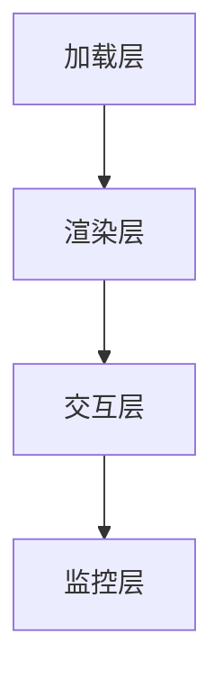
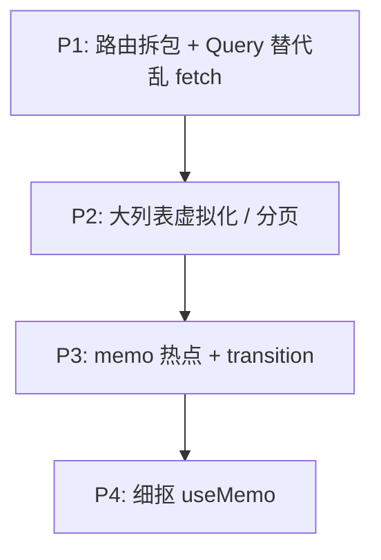

# 性能优化 Checklist

> 上线前 / Review 时按清单过一遍，避免遗漏常见性能坑。按 **加载 → 渲染 → 交互 → 监控** 四层组织。

---

## 一、总览



---

## 二、加载层

| ☐ | 项 | 说明 |
|---|-----|------|
| ☐ | 路由 lazy | 非首屏 `React.lazy` |
| ☐ | 分析 bundle | visualizer / vite-bundle-analyzer |
| ☐ | 树摇 | 按路径 import 图标/工具库 |
| ☐ | 压缩与 CDN | 构建产物 gzip/brotli |
| ☐ | 图片 WebP/AVIF | 合适尺寸，LCP 图优先 |
| ☐ | 第三方脚本 defer |  analytics 不阻塞 |

```tsx
// ❌ 整库
import _ from 'lodash';

// ✅
import debounce from 'lodash/debounce';
```

---

## 三、渲染层

| ☐ | 项 | 说明 |
|---|-----|------|
| ☐ | 状态下沉 | 输入不拖垮整页 |
| ☐ | Context 拆分 | 见 08 模块 |
| ☐ | memo 热点行 | 大列表行组件 |
| ☐ | 虚拟列表 | 万级 DOM |
| ☐ | 避免 index key | 列表用稳定 id |
| ☐ | Strict Mode 双调用 | 开发态 effect 跑两次是预期 |

---

## 四、交互层

| ☐ | 项 | 说明 |
|---|-----|------|
| ☐ | startTransition | 重过滤/大 setState |
| ☐ | useDeferredValue | 延迟展示重结果 |
| ☐ | 防抖搜索 | 减 API + render |
| ☐ | Query staleTime | 减重复请求 |
| ☐ | 大表单分步 | 减单页字段数 |

---

## 五、数据层

| ☐ | 项 | 说明 |
|---|-----|------|
| ☐ | TanStack Query | 服务端 state 不手写 effect |
| ☐ | select 派生 | 减不必要 re-render |
| ☐ | prefetch | 悬停预取详情 |
| ☐ | 分页 / 无限滚动 | 勿一次拉全量 |

---

## 六、监控层

| ☐ | 项 | 说明 |
|---|-----|------|
| ☐ | web-vitals 上报 | LCP / INP / CLS |
| ☐ | Error Boundary | 局部崩溃不白屏 |
| ☐ | Profiler 抽检 | 核心路径录制 |
| ☐ | 慢 API 告警 | 后端与前端分离看 |

---

## 七、优先级（资源有限时）



**先做影响面大的**，勿一上来全文件 memo。

---

## 八、面试常问串联

| 问题 | 答点 |
|------|------|
| React 如何优化？ | 减 render、减 DOM、拆包、并发 |
| memo 和 useCallback 关系？ | 子 memo 才需要稳引用 |
| 虚拟列表原理？ | 窗口化 + 占位 |
| LCP / INP？ | 见 Web Vitals 篇 |

---

## 九、小结

| 文档 | 主题 |
|------|------|
| 01 | 原理 |
| 02 | memo 三件套 |
| 03 | Profiler |
| 04 | 虚拟列表 |
| 05 | Web Vitals |
| **06** | **本清单** |

**上一篇**：[05-Web-Vitals与体验指标](./05-Web-Vitals与体验指标.md)  
**下一模块**：[12-并发与Suspense](../12-并发与Suspense/01-并发渲染概述.md)
