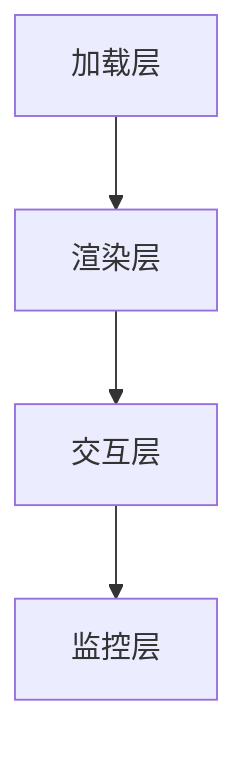
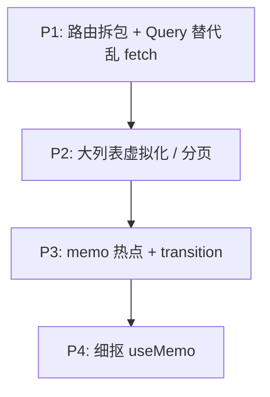

# 性能优化实践要点

上线前或 Code Review 时，可按 **加载 → 渲染 → 交互 → 监控** 四层系统过一遍，避免遗漏常见性能坑。

---

## 总览



加载层解决「进页面慢」，渲染层解决「render 多/重」，交互层解决「操作卡」，监控层保证「可观测、可回归」。

---

## 加载层

| 项 | 说明 |
|-----|------|
| 路由 lazy | 非首屏 `React.lazy` |
| 分析 bundle | visualizer / vite-bundle-analyzer |
| 树摇 | 按路径 import 图标/工具库 |
| 压缩与 CDN | 构建产物 gzip/brotli |
| 图片 WebP/AVIF | 合适尺寸，LCP 图优先 |
| 第三方脚本 defer | analytics 不阻塞 |

```tsx
// ❌ 整库
import _ from 'lodash';

// ✅
import debounce from 'lodash/debounce';
```

首屏 bundle 是 LCP 和 FCP 的主要敌人。路由级代码分割、按需 import、压缩和 CDN 是投入产出比最高的加载优化。

---

## 渲染层

| 项 | 说明 |
|-----|------|
| 状态下沉 | 输入不拖垮整页 |
| Context 拆分 | 按关注点拆 Provider |
| memo 热点行 | 大列表行组件 |
| 虚拟列表 | 万级 DOM |
| 避免 index key | 列表用稳定 id |
| Strict Mode 双调用 | 开发态 effect 跑两次是预期 |

渲染层优化要先 Profiler 定位。状态下沉和 Context 拆分往往比全文件 memo 更有效；万级 DOM 才考虑虚拟化。

---

## 交互层

| 项 | 说明 |
|-----|------|
| startTransition | 重过滤/大 setState |
| useDeferredValue | 延迟展示重结果 |
| 防抖搜索 | 减 API + render |
| Query staleTime | 减重复请求 |
| 大表单分步 | 减单页字段数 |

交互卡顿对应 INP 指标。重计算用 transition 让路给输入，搜索防抖减 API 和 render 双重压力。

---

## 数据层

| 项 | 说明 |
|-----|------|
| TanStack Query | 服务端 state 不手写 effect |
| select 派生 | 减不必要 re-render |
| prefetch | 悬停预取详情 |
| 分页 / 无限滚动 | 勿一次拉全量 |

服务端数据用 Query 类库统一管理缓存、重试和 staleTime，比手写 useEffect + fetch 更可控，也减少重复请求带来的 render。

---

## 监控层

| 项 | 说明 |
|-----|------|
| web-vitals 上报 | LCP / INP / CLS |
| Error Boundary | 局部崩溃不白屏 |
| Profiler 抽检 | 核心路径录制 |
| 慢 API 告警 | 后端与前端分离看 |

没有监控的优化无法验证效果。web-vitals RUM 上报真实用户体验，Profiler 抽检核心交互路径，Error Boundary 防止局部错误拖垮整页。

---

## 优先级（资源有限时）



**先做影响面大的**，勿一上来全文件 memo。P1 路由拆包和规范化数据请求通常能立刻改善 LCP 和代码可维护性；P4 细抠 useMemo 是最后一步。

---

## 面试常问串联

| 问题 | 答点 |
|------|------|
| React 如何优化？ | 减 render、减 DOM、拆包、并发 |
| memo 和 useCallback 关系？ | 子 memo 才需要稳引用 |
| 虚拟列表原理？ | 窗口化 + 占位 |
| LCP / INP？ | 加载、交互、布局三类 Core Web Vitals |

---

## 小结

按加载→渲染→交互→监控四层系统排查；资源有限时优先路由拆包和 Query，再上大列表虚拟化和 memo 热点。

加载层：路由 lazy、bundle 分析、树摇、压缩 CDN、图片格式、第三方 defer。渲染层：状态下沉、Context 拆分、memo 热点行、万级虚拟列表、稳定 key。交互层：startTransition、防抖、Query staleTime、大表单分步。数据层：TanStack Query 替代手写 effect、select 派生、prefetch、分页。监控层：web-vitals、Error Boundary、Profiler 抽检。优先级 P1 路由拆包和 Query → P2 虚拟化/分页 → P3 memo + transition → P4 细抠 useMemo。优化要有测量和监控闭环，避免无证据地全文件 memo。
