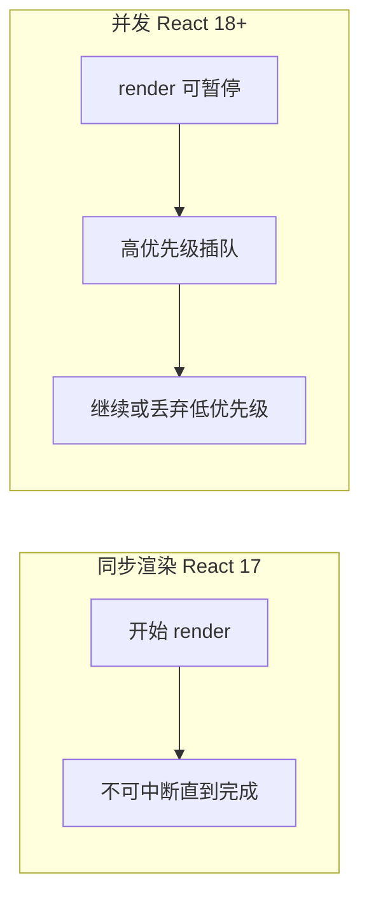

# 并发渲染概述

> **Concurrent React**（React 18+）让渲染可**中断、分优先级**，避免长时间计算阻塞输入。对用户：打字更跟手、Tab 切换更顺。

---

## 一、同步 vs 并发



| 同步 | 并发 |
|------|------|
| 一次 render 跑完 | 可分段、可重来 |
| 长任务阻塞输入 | 输入优先 |
| — | 需 Fiber 架构 |

Fiber 见 [06-Fiber](../06-渲染与调和/03-Fiber架构与可中断渲染.md)。

---

## 二、并发特性一览

| 特性 | API / 组件 | 作用 |
|------|------------|------|
| **Transitions** | `useTransition` | 标记低优先级更新 |
| **Deferred** | `useDeferredValue` | 延迟展示值 |
| **Suspense** | `<Suspense>` | 等待异步 UI |
| **Streaming SSR** | 服务端流式 HTML | 首屏更快 |

---

## 三、Lane 优先级（概念）

React 内部用 **lane** 区分更新紧急程度：

| 高优先级 | 低优先级 |
|----------|----------|
| 输入、点击 | 大列表过滤结果 |
| hover 反馈 | 后台 tab 数据 |

开发者通过 `startTransition` 声明「这段可以慢」。

---

## 四、启用方式

```tsx
import { createRoot } from 'react-dom/client';

createRoot(document.getElementById('root')!).render(<App />);
```

`createRoot` 即并发根；**无需**再开 `ConcurrentMode` 实验 flag（旧 API 已废弃）。

---

## 五、Suspense 与并发

Suspense 让组件 **「等待数据/代码」时挂起**，不阻塞兄弟树（配合边界）。

```tsx
<Suspense fallback={<Spinner />}>
  <Comments />
</Suspense>
```

详见 [03-Suspense与数据加载](./03-Suspense与数据加载.md)。

---

## 六、与 Strict Mode

开发态 **Strict Mode 双 mount** 帮助发现 effect 清理问题，与并发无直接冲突。见 [06-StrictMode](../06-渲染与调和/06-StrictMode与开发态行为.md)。

---

## 七、常见误解

| 误解 | 事实 |
|------|------|
| 并发 = 多线程 | 仍主要单线程 JS，是可中断调度 |
| 开了就自动快 | 需配合 transition / Suspense 等 |
| 所有 setState 都并发 | 仅 transition 包裹等为低优先级 |

---

## 八、小结

| 关键词 | |
|--------|--|
| 可中断 render | |
| 优先级 | |
| React 18 createRoot | |

**下一篇**：[02-useTransition与useDeferredValue](./02-useTransition与useDeferredValue.md)
