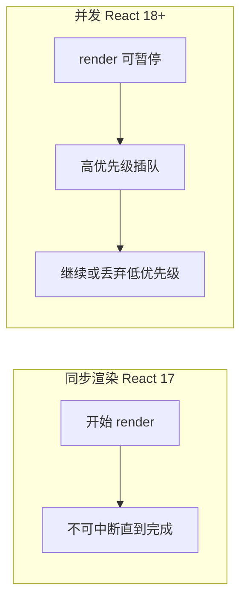

# 并发渲染概述

**Concurrent React**（React 18+）让渲染可**中断、分优先级**，避免长时间计算阻塞输入。对用户：打字更跟手、Tab 切换更顺。

---

## 同步 vs 并发



| 同步 | 并发 |
|------|------|
| 一次 render 跑完 | 可分段、可重来 |
| 长任务阻塞输入 | 输入优先 |
| — | 需 Fiber 架构 |

同步模式下，一次 render 从开始到结束不可中断，长任务会占满主线程。并发模式下 Fiber 让 React 可以暂停低优先级工作、先处理输入等高优先级更新，必要时丢弃过时的低优先级 render。

---

## 并发特性一览

| 特性 | API / 组件 | 作用 |
|------|------------|------|
| **Transitions** | `useTransition` | 标记低优先级更新 |
| **Deferred** | `useDeferredValue` | 延迟展示值 |
| **Suspense** | `<Suspense>` | 等待异步 UI |
| **Streaming SSR** | 服务端流式 HTML | 首屏更快 |

这些特性建立在 Fiber 可中断调度之上，需要开发者主动使用才能发挥价值，开启 `createRoot` 不会自动让所有更新变快。

---

## Lane 优先级（概念）

React 内部用 **lane** 区分更新紧急程度：

| 高优先级 | 低优先级 |
|----------|----------|
| 输入、点击 | 大列表过滤结果 |
| hover 反馈 | 后台 tab 数据 |

开发者通过 `startTransition` 声明「这段可以慢」，React 就会在调度时给这些更新更低的优先级。

---

## 启用方式

```tsx
import { createRoot } from 'react-dom/client';

createRoot(document.getElementById('root')!).render(<App />);
```

`createRoot` 即并发根；**无需**再开 `ConcurrentMode` 实验 flag（旧 API 已废弃）。React 17 的 `ReactDOM.render` 是同步根，升级 18 时应迁移到 `createRoot`。

---

## Suspense 与并发

Suspense 让组件 **「等待数据/代码」时挂起**，不阻塞兄弟树（配合边界）。

```tsx
<Suspense fallback={<Spinner />}>
  <Comments />
</Suspense>
```

Suspense 边界内的子树挂起时显示 fallback，就绪后一次性展示。与并发调度配合，可以让未就绪的部分不阻塞已就绪的 UI。

---

## 与 Strict Mode

开发态 **Strict Mode 双 mount** 帮助发现 effect 清理问题，与并发无直接冲突。Strict Mode 是开发辅助，不影响生产环境的并发行为。

---

## 常见误解

| 误解 | 事实 |
|------|------|
| 并发 = 多线程 | 仍主要单线程 JS，是可中断调度 |
| 开了就自动快 | 需配合 transition / Suspense 等 |
| 所有 setState 都并发 | 仅 transition 包裹等为低优先级 |

并发在单线程内通过 Fiber 做可中断的优先级调度，不是 Web Worker 多线程。

---

## 小结

Concurrent React 让渲染可中断、分优先级；createRoot 即启用，需配合 transition 和 Suspense 才能发挥价值。

React 18 起用 `createRoot` 启用并发根，Fiber 架构让 render 可暂停、高优先级可插队、低优先级可丢弃。核心 API 包括 `useTransition`（标记低优先级更新）、`useDeferredValue`（延迟展示值）、Suspense（等待异步 UI）和 Streaming SSR。内部用 lane 区分紧急程度，开发者通过 `startTransition` 主动声明可慢更新的部分。并发仍是单线程 JS 的可中断调度，不是多线程；开启后需配合 transition 和 Suspense 才有体感提升，普通 setState 仍是高优先级。
