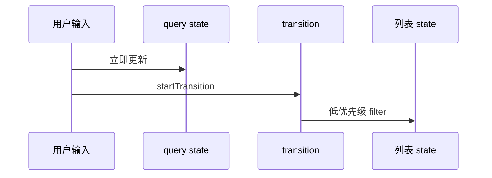
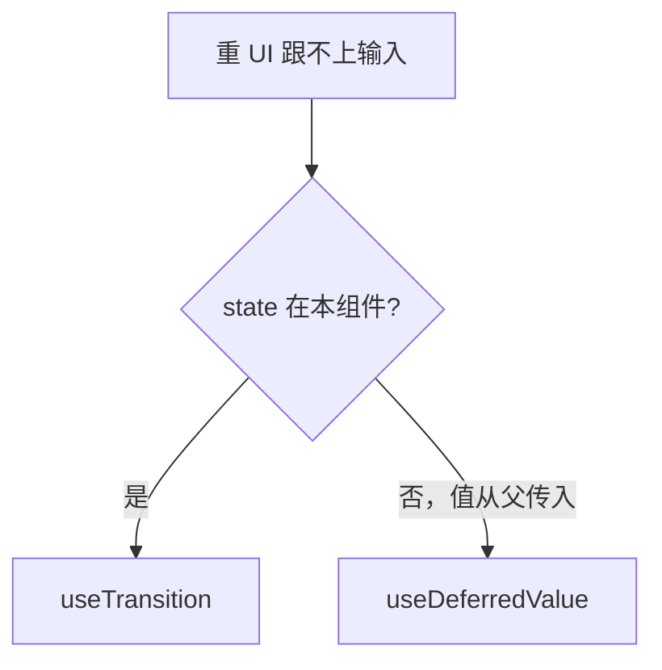

# useTransition 与 useDeferredValue

> 搜索过滤、Tab 切换大面板等场景：**输入要即时，结果可以稍晚**——用 `useTransition` / `useDeferredValue` 把重更新降为低优先级。

---

## 一、useTransition

```tsx
import { useState, useTransition } from 'react';

function SearchPage({ items }: { items: Item[] }) {
  const [query, setQuery] = useState('');
  const [filtered, setFiltered] = useState(items);
  const [isPending, startTransition] = useTransition();

  function onChange(value: string) {
    setQuery(value);  //  urgent：输入框立即更新

    startTransition(() => {
      setFiltered(items.filter(i => i.name.includes(value)));
    });
  }

  return (
    <>
      <input value={query} onChange={e => onChange(e.target.value)} />
      {isPending && <span aria-live="polite">筛选中…</span>}
      <HeavyList items={filtered} />
    </>
  );
}
```



| 返回值 | 含义 |
|--------|------|
| `isPending` | transition 内更新进行中 |
| `startTransition(fn)` | 包裹低优先级 setState |

---

## 二、useDeferredValue

延迟**某个值**在渲染中的使用（不改 state 来源时 handy）：

```tsx
function SearchResults({ query, items }: Props) {
  const deferredQuery = useDeferredValue(query);
  const isStale = query !== deferredQuery;

  const results = useMemo(
    () => items.filter(i => i.name.includes(deferredQuery)),
    [items, deferredQuery],
  );

  return (
    <div style={{ opacity: isStale ? 0.7 : 1 }}>
      <HeavyList items={results} />
    </div>
  );
}
```

| useTransition | useDeferredValue |
|---------------|------------------|
| 主动包 setState | 延迟使用 props/state |
| 有 isPending | 可对比原值 vs deferred |

---

## 三、选型



---

## 四、与 debounce 区别

| | transition | debounce |
|---|------------|----------|
| 机制 | React 调度优先级 | 时间延迟 |
| 最后一次 | 总会 render 最终态 | 停止输入后才跑 |
| 适用 | 大 React 树更新 | API 请求 |

可组合：transition 管 UI，debounce 管 fetch。

---

## 五、Tab 切换

```tsx
const [tab, setTab] = useState('home');
const [isPending, startTransition] = useTransition();

function selectTab(id: string) {
  startTransition(() => setTab(id));
}

{isPending && <TabBarSkeleton />}
<Panel tab={tab} />
```

---

## 六、注意

| 点 | 说明 |
|----|------|
| 只解决 **React render** 阻塞 | 纯 CPU 计算仍占主线程，可 Web Worker |
| transition 内 state 仍会被处理 | 只是可被打断 |
| 配合 memo | 减少 transition 期间工作量 |

---

## 七、小结

| API | 场景 |
|-----|------|
| `startTransition` | 本组件 setState 降优 |
| `useDeferredValue` | 延迟消费快变值 |

**上一篇**：[01-并发渲染概述](./01-并发渲染概述.md)  
**下一篇**：[03-Suspense与数据加载](./03-Suspense与数据加载.md)
