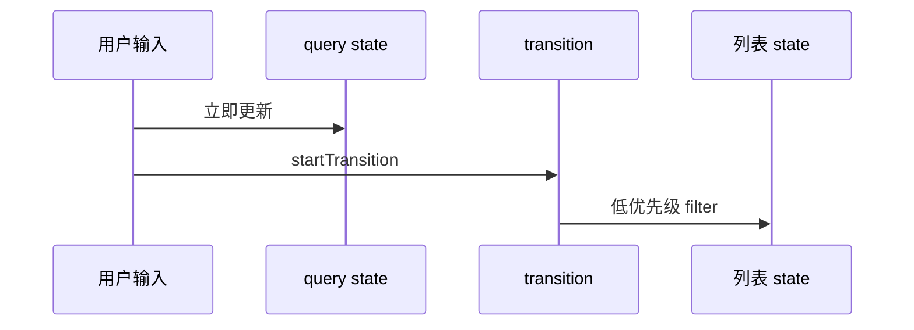
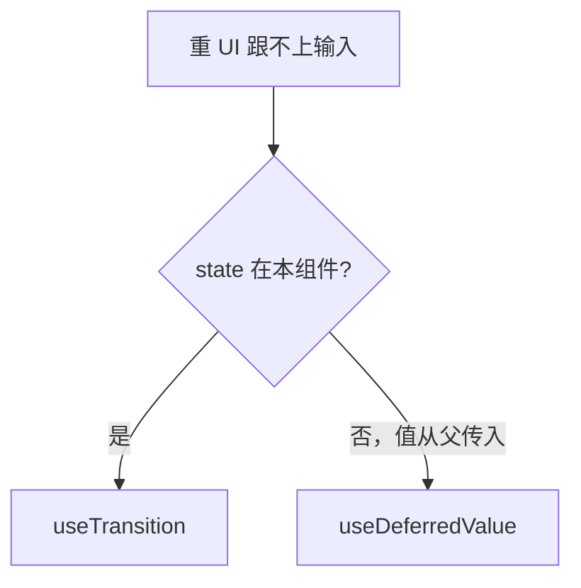

# useTransition 与 useDeferredValue

搜索过滤、Tab 切换大面板等场景：**输入要即时，结果可以稍晚**，用 `useTransition` / `useDeferredValue` 把重更新降为低优先级。

---

## useTransition

```tsx
import { useState, useTransition } from 'react';

function SearchPage({ items }: { items: Item[] }) {
  const [query, setQuery] = useState('');
  const [filtered, setFiltered] = useState(items);
  const [isPending, startTransition] = useTransition();

  function onChange(value: string) {
    setQuery(value);  //  urgent：输入框立即更新

    startTransition(() => {
      setFiltered(items.filter(i => i.name.includes(value)));
    });
  }

  return (
    <>
      <input value={query} onChange={e => onChange(e.target.value)} />
      {isPending && <span aria-live="polite">筛选中…</span>}
      <HeavyList items={filtered} />
    </>
  );
}
```



| 返回值 | 含义 |
|--------|------|
| `isPending` | transition 内更新进行中 |
| `startTransition(fn)` | 包裹低优先级 setState |

`setQuery` 高优先级，输入框即时响应；`setFiltered` 包在 `startTransition` 里，大列表过滤可被打断，不阻塞输入。

---

## useDeferredValue

延迟**某个值**在渲染中的使用（state 来源不在本组件时 handy）：

```tsx
function SearchResults({ query, items }: Props) {
  const deferredQuery = useDeferredValue(query);
  const isStale = query !== deferredQuery;

  const results = useMemo(
    () => items.filter(i => i.name.includes(deferredQuery)),
    [items, deferredQuery],
  );

  return (
    <div style={{ opacity: isStale ? 0.7 : 1 }}>
      <HeavyList items={results} />
    </div>
  );
}
```

| useTransition | useDeferredValue |
|---------------|------------------|
| 主动包 setState | 延迟使用 props/state |
| 有 isPending | 可对比原值 vs deferred |

`useDeferredValue` 不修改 state 来源，只是让渲染侧使用稍旧版本的值，适合 query 从父组件传入的场景。

---

## 选型



本组件控制 setState 用 `useTransition`；值从父传入、子组件负责重渲染时用 `useDeferredValue`。

---

## 与 debounce 区别

| | transition | debounce |
|---|------------|----------|
| 机制 | React 调度优先级 | 时间延迟 |
| 最后一次 | 总会 render 最终态 | 停止输入后才跑 |
| 适用 | 大 React 树更新 | API 请求 |

可组合：transition 管 UI，debounce 管 fetch。debounce 会丢弃中间态，transition 最终会 render 最后一次过滤结果。

---

## Tab 切换

```tsx
const [tab, setTab] = useState('home');
const [isPending, startTransition] = useTransition();

function selectTab(id: string) {
  startTransition(() => setTab(id));
}

{isPending && <TabBarSkeleton />}
<Panel tab={tab} />
```

Tab 切换可能触发大面板 render，用 transition 让 Tab 栏先响应，`isPending` 可显示加载态。

---

## 注意

| 点 | 说明 |
|----|------|
| 只解决 **React render** 阻塞 | 纯 CPU 计算仍占主线程，可 Web Worker |
| transition 内 state 仍会被处理 | 只是可被打断 |
| 配合 memo | 减少 transition 期间工作量 |

transition 不能替代 Web Worker，纯 JS 重计算仍占主线程。配合 memo 减少 transition 期间实际需要 render 的组件数。

---

## 小结

输入要即时、重结果可稍晚：本组件 setState 用 startTransition，父传快变值用 useDeferredValue。

`useTransition` 返回 `[isPending, startTransition]`，把重 setState 包在 `startTransition` 里降为低优先级，输入保持即时。`useDeferredValue` 延迟消费快变 props/state，用 `query !== deferredQuery` 判断是否在追赶。选型：state 在本组件用 transition，值从父传入用 deferredValue。与 debounce 不同，transition 基于 React 调度优先级，最终会 render 最终态；debounce 基于时间延迟，适合 API 请求。Tab 切换等场景可配合 isPending 显示 skeleton。注意 transition 只解决 React render 阻塞，纯 CPU 计算仍需 Worker；配合 memo 效果更好。
