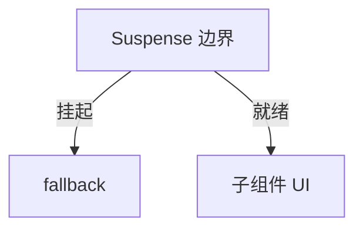

# Suspense 与数据加载

**Suspense** 在子树「还没准备好」时显示 `fallback`，准备好后一次性展示。可用于 **lazy 代码** 与 **async 数据源**（需支持 Suspense 的库或框架）。

---

## 基本用法

```tsx
import { Suspense, lazy } from 'react';

const Settings = lazy(() => import('./Settings'));

function App() {
  return (
    <Suspense fallback={<PageSkeleton />}>
      <Settings />
    </Suspense>
  );
}
```



| 状态 | UI |
|------|-----|
| 子组件 throw Promise（挂起） | fallback |
| Promise resolve | 子组件 |

`React.lazy` 加载代码块时会挂起，Suspense 边界捕获挂起状态并显示 fallback，加载完成后展示真实组件。

---

## 嵌套 Suspense

```tsx
<Suspense fallback={<LayoutSkeleton />}>
  <Header />
  <Suspense fallback={<ChartSkeleton />}>
    <HeavyChart />
  </Suspense>
</Suspense>
```

**内层先就绪先显示**，外层 fallback 可只包未就绪部分（取决于结构）。嵌套让不同区域有独立的 loading UI，避免整页被一个 spinner 占满。

---

## 与 TanStack Query

Query v5 可选 ` suspense: true`：

```tsx
function UserProfile({ id }: { id: string }) {
  const { data } = useQuery({
    queryKey: ['users', id],
    queryFn: () => fetchUser(id),
    suspense: true,
  });
  return <div>{data.name}</div>;
}

// 外层
<Suspense fallback={<Spinner />}>
  <ErrorBoundary fallback={<Error />}>
    <UserProfile id="1" />
  </ErrorBoundary>
</Suspense>
```

| 传统 isPending | Suspense |
|----------------|----------|
| 组件内分支 | 边界统一 fallback |
| 细粒度控制 | 声明式加载 UI |

团队未统一 Error Boundary 前，**isPending 更常见**。Suspense 模式把 loading 逻辑提到边界，组件内只写成功态。

---

## React Router defer + Await

```tsx
function Page() {
  const { slow } = useLoaderData() as { slow: Promise<Data> };
  return (
    <Suspense fallback={<Spinner />}>
      <Await resolve={slow} errorElement={<Error />}>
        {data => <Content data={data} />}
      </Await>
    </Suspense>
  );
}
```

Data Router 的 loader 可以 defer 慢数据，页面 shell 先渲染，慢块在 Suspense 内 resolve 后展示。

---

## RSC（概览）

Next.js App Router 中 Server Component 异步，框架用 Suspense 包 streaming：

```tsx
// Next.js 示意
<Suspense fallback={<Skeleton />}>
  <ServerPosts />
</Suspense>
```

Server Component 在服务端异步获取数据，框架通过 Streaming 边生成边发送，Suspense 边界控制各块的 fallback 和就绪时机。

---

## 规则与限制

| 规则 | 说明 |
|------|------|
| fallback 在边界内 | 不会显示边界外内容 |
| 需 Error Boundary 配错误 | Suspense 不捕 JS 错误 |
| 数据层要支持 | 随意 throw Promise 不行 |

Suspense 只处理挂起（throw Promise），不处理 render 抛错，错误需要 Error Boundary。数据层必须实现 Suspense 协议（如 Query suspense 模式），不能随意 throw Promise。

---

## 与 startTransition

Suspense 触发的更新可被 transition 包裹，避免替换 fallback 时抢输入优先级。大段 UI 从 fallback 切换到内容时，用 transition 可以让交互不被打断。

---

## 小结

Suspense 在子树未就绪时显示 fallback；配合 Error Boundary 处理错误，数据层须支持挂起语义。

Suspense 边界在子树挂起（throw Promise）时显示 fallback，就绪后展示真实 UI。`React.lazy` 是最常见场景；嵌套 Suspense 实现分级 skeleton。TanStack Query 的 suspense 模式把 loading 提到边界，但需配合 Error Boundary。React Router 的 defer + Await 让慢数据异步 resolve。RSC/Next.js 用 Suspense 控制 Streaming 各块。规则：Suspense 不捕 JS 错误（需 Boundary）、数据层须支持挂起协议、fallback 只在边界内生效。可与 startTransition 组合，避免 fallback 切换抢输入优先级。
