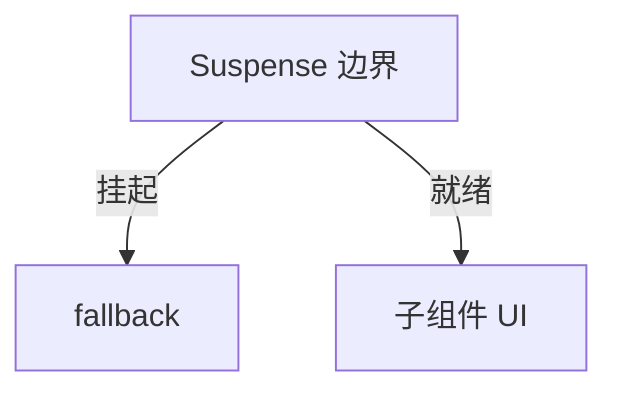

# Suspense 与数据加载

> **Suspense** 在子树「还没准备好」时显示 `fallback`，准备好后一次性展示。可用于 **lazy 代码** 与 **async 数据源**（需支持 Suspense 的库或框架）。

---

## 一、基本用法

```tsx
import { Suspense, lazy } from 'react';

const Settings = lazy(() => import('./Settings'));

function App() {
  return (
    <Suspense fallback={<PageSkeleton />}>
      <Settings />
    </Suspense>
  );
}
```



| 状态 | UI |
|------|-----|
| 子组件 throw Promise（挂起） | fallback |
| Promise resolve | 子组件 |

---

## 二、嵌套 Suspense

```tsx
<Suspense fallback={<LayoutSkeleton />}>
  <Header />
  <Suspense fallback={<ChartSkeleton />}>
    <HeavyChart />
  </Suspense>
</Suspense>
```

**内层先就绪先显示**，外层 fallback 可只包未就绪部分（取决于结构）。

---

## 三、与 TanStack Query

Query v5 可选 ` suspense: true`：

```tsx
function UserProfile({ id }: { id: string }) {
  const { data } = useQuery({
    queryKey: ['users', id],
    queryFn: () => fetchUser(id),
    suspense: true,
  });
  return <div>{data.name}</div>;
}

// 外层
<Suspense fallback={<Spinner />}>
  <ErrorBoundary fallback={<Error />}>
    <UserProfile id="1" />
  </ErrorBoundary>
</Suspense>
```

| 传统 isPending | Suspense |
|----------------|----------|
| 组件内分支 | 边界统一 fallback |
| 细粒度控制 | 声明式加载 UI |

团队未统一 Error Boundary 前，**isPending 更常见**。

---

## 四、React Router defer + Await

```tsx
function Page() {
  const { slow } = useLoaderData() as { slow: Promise<Data> };
  return (
    <Suspense fallback={<Spinner />}>
      <Await resolve={slow} errorElement={<Error />}>
        {data => <Content data={data} />}
      </Await>
    </Suspense>
  );
}
```

见 [10-Data-Router](../10-路由/03-Data-Router与Loader-Action.md)。

---

## 五、RSC（概览）

Next.js App Router 中 Server Component 异步，框架用 Suspense 包 streaming：

```tsx
// Next.js 示意
<Suspense fallback={<Skeleton />}>
  <ServerPosts />
</Suspense>
```

详见 [14-服务端与元框架](../14-服务端与元框架/)（P2）。

---

## 六、规则与限制

| 规则 | 说明 |
|------|------|
| fallback 在边界内 | 不会显示边界外内容 |
| 需 Error Boundary 配错误 | Suspense 不捕 JS 错误 |
| 数据层要支持 | 随意 throw Promise 不行 |

---

## 七、与 startTransition

Suspense 触发的更新可被 transition 包裹，避免替换 fallback 时抢输入优先级。

---

## 八、小结

| 用途 | |
|------|--|
| lazy 组件 loading | |
| async 数据 + 边界 | |
| 嵌套分级 skeleton | |

**上一篇**：[02-useTransition与useDeferredValue](./02-useTransition与useDeferredValue.md)  
**下一篇**：[04-Streaming-SSR与hydration](./04-Streaming-SSR与hydration.md)
