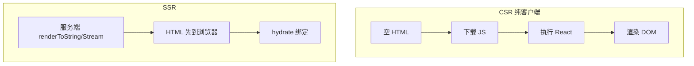
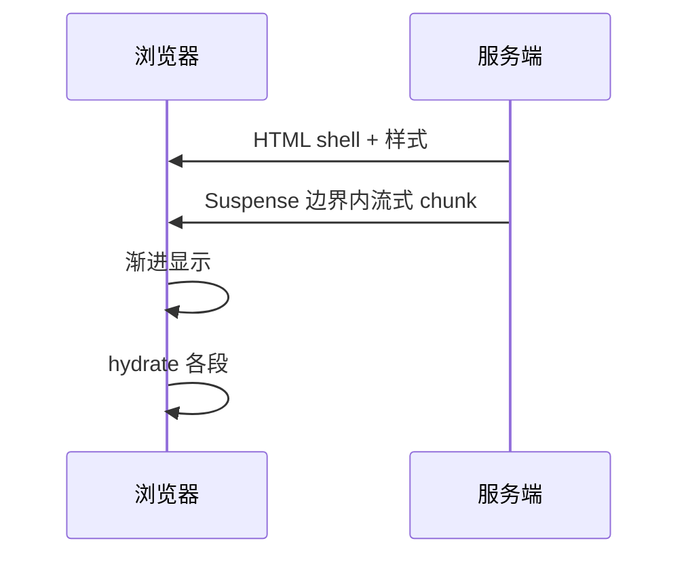

# Streaming SSR 与 Hydration

> **SSR** 在服务端生成 HTML，浏览器 **hydration** 把事件与 state 绑到已有 DOM。**Streaming** 边生成边发送，让用户更早看到内容。

---

## 一、CSR vs SSR



| | CSR | SSR |
|---|-----|-----|
| 首屏 HTML | 空壳 | 有内容 |
| SEO | 弱 | 好 |
| 服务器负载 | 低 | 有 |
| TTFB | — | 可能略增 |

---

## 二、hydration 是什么？

```tsx
// 客户端
hydrateRoot(document.getElementById('root')!, <App />);
// React 19+ 推荐 hydrateRoot 与 createRoot 同 API 族
```

React 对比服务端 HTML 与客户端首次 render，**对齐**并附加事件监听。

| 失败 | 原因 |
|------|------|
| **Hydration mismatch** | 服务端与客户端输出不一致 |
| 常见坑 | `Date.now()`、`Math.random()`、错误 useId |

---

## 三、Streaming SSR



| 好处 | 说明 |
|------|------|
| 更快 FCP/LCP | 不必等整页数据 |
| Suspense 友好 | 慢块晚到 |

Node API 示意：

```tsx
pipeToNodeWritable(
  <App />,
  res,
  { bootstrapScripts: ['/client.js'] },
);
```

实际多用 **Next.js / Remix** 封装。

---

## 四、Selective Hydration

并发模式下，用户可在**未完全 hydrate** 前交互；React 优先 hydrate 交互区域。

| 体验 | |
|------|--|
| 点击先响应 | 相关子树优先 hydrate |

---

## 五、避免 mismatch Checklist

| ☐ | 项 |
|---|-----|
| ☐ | 用 `useId` 代替 random id |
| ☐ | 仅客户端 API 放 `useEffect` |
| ☐ | 时区/语言 SSR 与 CSR 一致 |
| ☐ | 勿 `typeof window` 分支渲染不同结构 |

```tsx
// ❌ mismatch
const time = new Date().toLocaleString();

// ✅
const [time, setTime] = useState<string | null>(null);
useEffect(() => setTime(new Date().toLocaleString()), []);
return <span>{time ?? '...'}</span>;
```

---

## 六、与 RSC

**React Server Components** 在服务端跑，默认不 hydrate；Client Component 才 hydrate。

```
Server Component → HTML 片段，无 JS
Client Component → 需 hydrate
```

见 P2 模块 14。

---

## 七、小结

| 术语 | |
|------|--|
| SSR | 服务端出 HTML |
| Streaming | 分块发送 |
| Hydration | 客户端接管 DOM |
| mismatch | 输出不一致报错 |

**上一篇**：[03-Suspense与数据加载](./03-Suspense与数据加载.md)  
**下一篇**：[05-Error-Boundary与错误恢复](./05-Error-Boundary与错误恢复.md)
