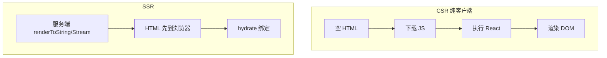
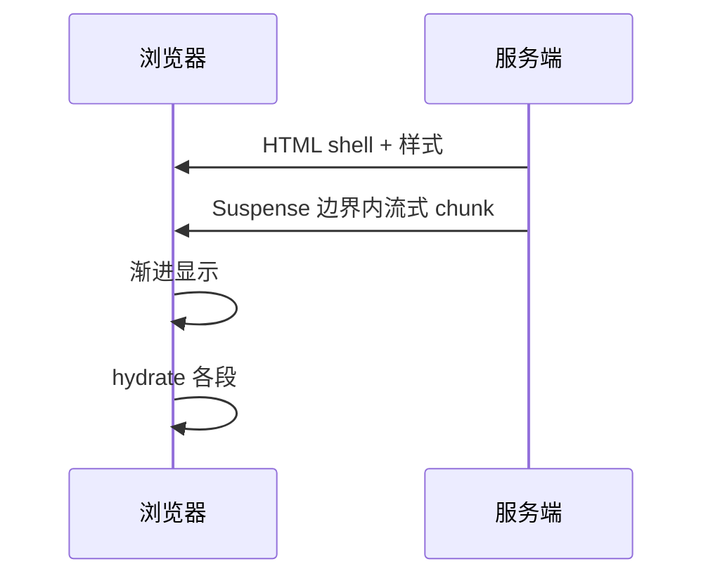

# Streaming SSR 与 Hydration

**SSR** 在服务端生成 HTML，浏览器 **hydration** 把事件与 state 绑到已有 DOM。**Streaming** 边生成边发送，让用户更早看到内容。

---

## CSR vs SSR



| | CSR | SSR |
|---|-----|-----|
| 首屏 HTML | 空壳 | 有内容 |
| SEO | 弱 | 好 |
| 服务器负载 | 低 | 有 |
| TTFB | — | 可能略增 |

CSR 首屏要等 JS 下载执行才有内容；SSR 服务端先出 HTML，浏览器可更早 FCP/LCP，再用 hydration 绑定交互。

---

## hydration 是什么

```tsx
// 客户端
hydrateRoot(document.getElementById('root')!, <App />);
// React 19+ 推荐 hydrateRoot 与 createRoot 同 API 族
```

React 对比服务端 HTML 与客户端首次 render，**对齐**并附加事件监听。

| 失败 | 原因 |
|------|------|
| **Hydration mismatch** | 服务端与客户端输出不一致 |
| 常见坑 | `Date.now()`、`Math.random()`、错误 useId |

hydration 要求服务端和客户端首次 render 输出一致。不一致时 React 会警告甚至重新 render，影响性能和体验。

---

## Streaming SSR



| 好处 | 说明 |
|------|------|
| 更快 FCP/LCP | 不必等整页数据 |
| Suspense 友好 | 慢块晚到 |

Node API 示意：

```tsx
pipeToNodeWritable(
  <App />,
  res,
  { bootstrapScripts: ['/client.js'] },
);
```

实际多用 **Next.js / Remix** 封装。Streaming 不必等所有数据就绪才发送 HTML，Suspense 边界内的慢块可以后续 chunk 到达。

---

## Selective Hydration

并发模式下，用户可在**未完全 hydrate** 前交互；React 优先 hydrate 交互区域。

| 体验 | |
|------|，|
| 点击先响应 | 相关子树优先 hydrate |

Selective Hydration 让用户不必等整页 hydrate 完成就能交互，React 会优先处理用户点击区域的 hydration。

---

## 避免 hydration mismatch

| 项 | 说明 |
|-----|------|
| 用 `useId` 代替 random id | SSR/CSR id 一致 |
| 仅客户端 API 放 `useEffect` | window、localStorage 等 |
| 时区/语言 SSR 与 CSR 一致 | 格式化时间要注意 |
| 勿 `typeof window` 分支渲染不同结构 | 结构必须一致 |

```tsx
// ❌ mismatch
const time = new Date().toLocaleString();

// ✅
const [time, setTime] = useState<string | null>(null);
useEffect(() => setTime(new Date().toLocaleString()), []);
return <span>{time ?? '...'}</span>;
```

服务端没有 `window`，依赖浏览器 API 的值应在 `useEffect` 里读取，首次 render 用占位符。

---

## 与 RSC

**React Server Components** 在服务端跑，默认不 hydrate；Client Component 才 hydrate。

```
Server Component → HTML 片段，无 JS
Client Component → 需 hydrate
```

RSC 把服务端组件和客户端组件分开：Server Component 输出 HTML 片段无需 hydration，只有带 `'use client'` 的组件才需要在客户端 hydrate。

---

## 小结

Streaming SSR 边生成边发送 HTML；hydration 对齐服务端与客户端输出，useId 和 effect 读 window 是防 mismatch 关键。

SSR 服务端出 HTML，浏览器用 `hydrateRoot` 绑定事件和 state；Streaming 分块发送，Suspense 边界控制慢块到达时机，改善 FCP/LCP。Selective Hydration 让用户在完全 hydrate 前就能交互，优先处理点击区域。防 mismatch：`useId` 代替随机 id、浏览器 API 放 useEffect、时区语言一致、避免 window 分支渲染不同结构。RSC 中 Server Component 不 hydrate，Client Component 才需要。实际 Streaming SSR 多用 Next.js/Remix 封装，不必手写 pipeToNodeWritable。
