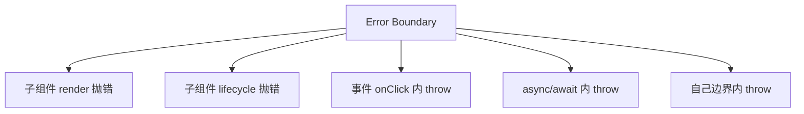

# Error Boundary 与错误恢复

> **Error Boundary** 捕获子树 **render / 生命周期** 中的 JS 错误，展示降级 UI，避免整页白屏。它不捕事件 handler、异步、SSR 本身错误。

---

## 一、能捕 vs 不能捕



| ✅ 捕获 | ❌ 不捕获 |
|---------|-----------|
| 子组件 render | 事件处理器 |
| 子 lifecycle | setTimeout / Promise |
| 子 constructor | 边界自身 |

事件错误用 try/catch；异步用 `.catch` 或 Query error state。

---

## 二、类组件实现（当前唯一官方方式）

```tsx
import { Component, ErrorInfo, ReactNode } from 'react';

interface Props {
  fallback?: ReactNode;
  onError?: (error: Error, info: ErrorInfo) => void;
  children: ReactNode;
}

interface State {
  hasError: boolean;
  error: Error | null;
}

export class ErrorBoundary extends Component<Props, State> {
  state: State = { hasError: false, error: null };

  static getDerivedStateFromError(error: Error): State {
    return { hasError: true, error };
  }

  componentDidCatch(error: Error, info: ErrorInfo) {
    this.props.onError?.(error, info);
    // 上报 Sentry 等
  }

  render() {
    if (this.state.hasError) {
      return this.props.fallback ?? (
        <div role="alert">
          <h2>出错了</h2>
          <button type="button" onClick={() => this.setState({ hasError: false, error: null })}>
            重试
          </button>
        </div>
      );
    }
    return this.props.children;
  }
}
```

---

## 三、放置策略

```tsx
<ErrorBoundary fallback={<AppCrash />}>
  <RouterProvider router={router} />
</ErrorBoundary>

// 路由级
{
  path: 'dashboard',
  element: <Dashboard />,
  errorElement: <RouteErrorPage />,
}

// 功能级
<ErrorBoundary fallback={<ChartError />}>
  <Suspense fallback={<ChartSkeleton />}>
    <Chart />
  </Suspense>
</ErrorBoundary>
```

| 层级 | 粒度 |
|------|------|
| 根 | 最后防线 |
| 路由 | 整页错误 |
| 组件 | 图表/侧边栏局部挂 |

---

## 四、与 Suspense / Query

```tsx
<ErrorBoundary fallback={<QueryError onRetry={refetch} />}>
  <Suspense fallback={<Spinner />}>
    <UserPanel />
  </Suspense>
</ErrorBoundary>
```

Query `isError` 也可组件内处理，不必全靠 Boundary——**预期错误**（404）用 UI 分支，**意外崩溃**用 Boundary。

---

## 五、react-error-boundary 库

```bash
pnpm add react-error-boundary
```

```tsx
import { ErrorBoundary } from 'react-error-boundary';

<ErrorBoundary
  FallbackComponent={({ error, resetErrorBoundary }) => (
    <div>
      <p>{error.message}</p>
      <button type="button" onClick={resetErrorBoundary}>重试</button>
    </div>
  )}
  onReset={() => queryClient.invalidateQueries()}
>
  <App />
</ErrorBoundary>
```

---

## 六、恢复策略

| 策略 | 说明 |
|------|------|
| reset state | 点重试清 `hasError` |
| 改 key  remount | `<ErrorBoundary key={location.key}>` |
| invalidate 数据 | 配合 Query refetch |
| 跳安全路由 | Navigate to home |

---

## 七、生产上报

```tsx
componentDidCatch(error, info) {
  reportError({
    message: error.message,
    stack: error.stack,
    componentStack: info.componentStack,
  });
}
```

勿把敏感 stack 直接展示给用户。

---

## 八、小结

| 要点 | |
|------|--|
| 类组件 Boundary | |
| 分层放置 | |
| 配合 Suspense / 路由 errorElement | |
| 预期错误 vs 意外崩溃分开处理 | |

**上一篇**：[04-Streaming-SSR与hydration](./04-Streaming-SSR与hydration.md)  
**下一模块**：[13-React与TypeScript](../13-React与TypeScript/01-组件Props与Children类型.md)
