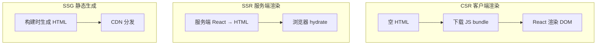
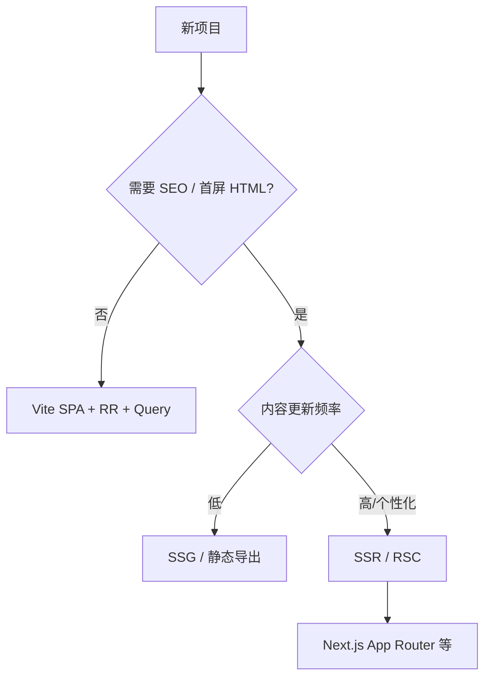

# SSR、CSR 与元框架选型

> **CSR** 在浏览器跑 React；**SSR** 在服务端先出 HTML 再 hydrate。**元框架**（Next.js、Remix 等）把路由、SSR、数据层打包成开箱方案——选型取决于 SEO、首屏、团队栈。

---

## 一、三种渲染模式



| 模式 | HTML 何时产生 | 典型场景 |
|------|---------------|----------|
| **CSR** | 浏览器执行 JS 后 | 后台、强交互 SPA |
| **SSR** | 每次请求在服务端 | SEO、个性化首屏 |
| **SSG** | 构建时 | 文档、营销页 |
| **ISR** | SSG + 定时/按需重建 | 内容站、电商列表 |

---

## 二、对比表

| 维度 | CSR (Vite SPA) | SSR (Next.js 等) |
|------|----------------|------------------|
| 首屏 | 依赖 JS 下载执行 | HTML 先到，内容可见早 |
| SEO | 爬虫需执行 JS（改善中仍弱于 SSR） | 服务端 HTML 友好 |
| 服务器 | 静态托管即可 | 需 Node/Edge 运行时 |
| 复杂度 | 低 | 中高（hydration、边界） |
| 数据 | 客户端 Query | loader / RSC / Server Action |

---

## 三、何时选 SPA（CSR）

| ✅ 适合 | 说明 |
|---------|------|
| 登录后中后台 | SEO 不重要 |
| 重交互、长会话 | 路由 lazy、Query cache 成熟 |
| 静态托管 + CDN | 成本低 |

```bash
pnpm create vite my-app --template react-ts
```

见 [01-开发环境](../01-认知与生态/03-开发环境与项目结构.md)。

---

## 四、何时选元框架（SSR/RSC）

| ✅ 适合 | 说明 |
|---------|------|
| 营销页、博客、电商详情 | SEO、分享预览 |
| 首屏 LCP 敏感 | 流式 SSR |
| 全栈同仓 | API + UI 一体 |
| 需要 Server Component | 减客户端 JS |

| 框架 | 特点 |
|------|------|
| **Next.js** | App Router、RSC、生态最大 |
| **Remix** | Web 标准、loader/action 贴近 RR |
| **TanStack Start** | 新兴，Query 同源 |

---

## 五、决策流程



---

## 六、混合架构

| 模式 | 例子 |
|------|------|
| SPA + 预渲染 shell | 仅 landing SSR |
| 微前端 | 主应用 CSR，子应用独立 |
| BFF | 前端 SPA，Node BFF 聚合 API |

---

## 七、与已有模块关系

| 话题 | 文档 |
|------|------|
| Streaming / hydrate | [12-Streaming-SSR](../12-并发与Suspense/04-Streaming-SSR与hydration.md) |
| 客户端数据 | [09-Query](../09-数据获取与缓存/) |
| 路由 | [10-React Router](../10-路由/) |

---

## 八、小结

| 记住 | |
|------|--|
| CSR = 简单、托管便宜 | |
| SSR/SSG = SEO + 首屏 | |
| 元框架 = 集成路由与数据 | |

**下一篇**：[02-SSR基础与请求生命周期](./02-SSR基础与请求生命周期.md)
