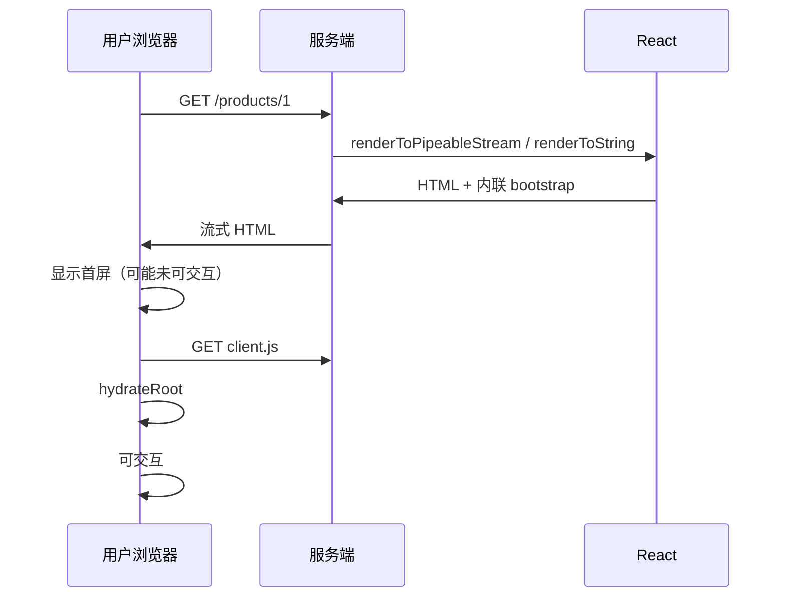

# SSR 基础与请求生命周期

一次 **SSR 请求**：服务端执行 React → 输出 HTML + 序列化数据 → 浏览器加载 JS → **hydrate** 绑定事件。理解这条链，才能排查 hydration 与数据不一致。

---

## 请求生命周期



| 阶段 | 用户看到 |
|------|----------|
| HTML 到达 | 内容（可能无交互） |
| JS 加载完 | hydrate |
| hydrate 完成 | 点击、输入正常 |

HTML 先到用户可见内容，但交互要等 JS 加载和 hydrate 完成。Streaming 可以让 shell 更早到达。

---

## renderToString vs Streaming

| API | 特点 |
|-----|------|
| `renderToString` | 整页 HTML 一次返回，简单 |
| `renderToPipeableStream` | 分块发送，配合 Suspense |

```tsx
// Node 示意（React 18+）
import { renderToPipeableStream } from 'react-dom/server';

const { pipe } = renderToPipeableStream(<App />, {
  bootstrapScripts: ['/assets/client.js'],
  onShellReady() {
    res.setHeader('Content-Type', 'text/html');
    pipe(res);
  },
});
```

实际项目用 **Next.js / Remix** 封装，少手写。Streaming 配合 Suspense 不必等慢数据就绪才发送 HTML。

---

## 脱水与注水（Dehydrate / Hydrate）

| 术语 | 含义 |
|------|------|
| **Dehydrate** | 服务端把需客户端恢复的状态序列化进 HTML |
| **Hydrate** | 客户端 React 对齐已有 DOM，挂事件 |

```html
<!-- 示意：内联 JSON -->
<script id="__NEXT_DATA__" type="application/json">
  {"props":{"pageProps":{"user":{...}}}}
</script>
```

客户端读此数据避免重复 fetch（框架各异）。脱水数据让 SSR 和 CSR 首次 render 使用同一份数据。

---

## SSR 数据加载方式

| 方式 | 框架 |
|------|------|
| getServerSideProps | Next Pages（旧） |
| loader | Remix / RR Data Router |
| async Server Component | Next App Router |
| 手动 fetch + render | 自建 Node |

**原则**：服务端用的数据与客户端首次 render **必须一致**。不一致会导致 hydration mismatch 或双倍 fetch。

---

## 常见坑

| 坑 | 原因 | 处理 |
|----|------|------|
| Hydration mismatch | 服务端/客户端输出不同 | useId、effect 里读 window |
| 双倍 fetch | SSR 拉一次，客户端又拉 | 脱水数据或 cache |
| 慢 TTFB | 服务端 render 阻塞 | Streaming、并行 fetch |
| 内存泄漏 | 每请求新 store 未隔离 | 每请求创建 QueryClient |

---

## 每请求隔离状态

```tsx
// ❌ 模块级单例 — 请求间串数据
const cache = new Map();

// ✅ 每请求创建
export function createRequestContext() {
  return {
    queryClient: new QueryClient(),
    user: null as User | null,
  };
}
```

SSR 每请求独立，模块级单例会导致请求间数据串扰。QueryClient、用户 session 等应每请求创建。

---

## CSR 降级

部分场景 SSR 失败可降级 CSR：

```tsx
onShellError(error) {
  // 记录日志，返回 CSR fallback 或 500 页
}
```

Streaming SSR 的 `onShellError` 可捕获 shell 渲染失败，降级 CSR 或返回错误页。

---

## 小结

SSR 请求链：服务端 render → HTML → hydrate → 可交互；每请求隔离 state，脱水数据对齐防双倍 fetch。

SSR 生命周期：请求 → 服务端 render（renderToString 或 Streaming）→ HTML + 脱水数据 → 浏览器显示 → 加载 client.js → hydrateRoot → 可交互。Streaming 配合 Suspense 分块发送，改善 TTFB 和 FCP。Dehydrate 序列化状态进 HTML，Hydrate 对齐 DOM 并挂事件。数据加载方式因框架而异，核心原则是 SSR 与 CSR 首次 render 数据一致。常见坑：hydration mismatch（useId、effect 读 window）、双倍 fetch（脱水对齐）、慢 TTFB（Streaming）、请求间串数据（每请求隔离 QueryClient）。SSR 失败可降级 CSR。
