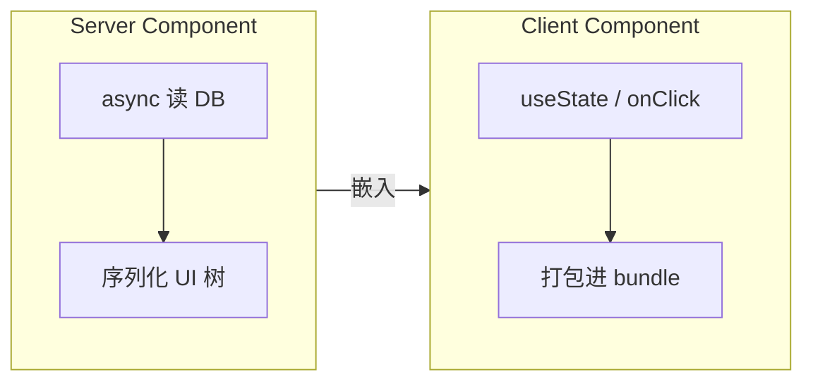

# React Server Components（RSC）

**Server Component** 只在服务端运行，产物是 **UI 描述（非 JS bundle）**，默认不能 useState/useEffect。用来**减客户端 JS、直连数据库**，与 Client Component 组合成现代全栈 React。

---

## Server vs Client



| | Server Component | Client Component |
|---|------------------|------------------|
| 运行位置 | 仅服务端 | 浏览器（+ SSR 时在服务端跑一次出 HTML） |
| Hooks | ❌ 无 | ✅ |
| 事件 | ❌ | ✅ |
| 包体积 | **不**进客户端 bundle | 进 bundle |
| 异步组件 | ✅ `async function` | 需 Suspense 等 |

Server Component 不进客户端 bundle，适合大列表渲染和直连数据库；Client Component 处理交互和 Hooks。

---

## 'use client' 边界

Client Component 文件**顶部**声明：

```tsx
'use client';

import { useState } from 'react';

export function Counter() {
  const [n, setN] = useState(0);
  return <button onClick={() => setN(n + 1)}>{n}</button>;
}
```

```tsx
// Server Component（默认，无指令）
import { Counter } from './Counter';

export default async function Page() {
  const posts = await db.post.findMany();
  return (
    <div>
      <h1>文章</h1>
      <ul>{posts.map(p => <li key={p.id}>{p.title}</li>)}</ul>
      <Counter />
    </div>
  );
}
```

| 规则 | 说明 |
|------|------|
| Server 可 import Client | Client 作为子节点 |
| Client **不可** import Server | 只能作为 children 传入 |
| 边界宜**尽量下推** | 少 `'use client'` 整页 |

`'use client'` 边界尽量下推到真正需要交互的组件，避免整页变成 Client Component 失去 RSC 收益。

---

## 为何用 RSC

| 收益 | 例子 |
|------|------|
| 零客户端成本的大列表 | 服务端 map 成 HTML |
| 直连后端 | `await db.user.find()` 无 API 层 |
| 秘密不进 bundle | API key、连接串留服务端 |
| 与 Suspense 流式 | 慢块晚到 |

RSC 是另一种组件类型，不是「在服务器跑的 useEffect」，输出并入 UI 流，默认不增加客户端 JS。

---

## 数据模式

```tsx
// Server Component
async function UserProfile({ id }: { id: string }) {
  const user = await fetchUser(id); // 或直接 db
  return <Card name={user.name} />;
}
```

客户端交互部分拆出去：

```tsx
'use client';
function FollowButton({ userId }: { userId: string }) {
  const [following, setFollowing] = useState(false);
  ...
}
```

Server Component 负责数据获取和静态展示，Client Component 负责交互 state。

---

## Context 限制

Server Component **不能** `useContext` 读 Client 的 Context Provider。

```tsx
// ✅ Provider 在 Client 子树
'use client';
export function ThemeProvider({ children }) { ... }

// Server Page
export default function Page() {
  return (
    <ThemeProvider>
      <ClientChild />
    </ThemeProvider>
  );
}
```

Context Provider 必须是 Client Component；Server Page 可以包裹 Client Provider，但 Server 自身不能 useContext。

---

## 序列化 props

Server → Client 的 props 必须 **可序列化**（JSON 类）。

| ✅ | ❌ |
|----|-----|
| string、number、plain object | 函数 |
| Date（框架可能转 string） | class 实例 |
| JSX children | Symbol |

Server 传给 Client 的 props 不能含函数或 class 实例，只能传可 JSON 序列化的数据。

---

## 与 TanStack Query

| 场景 | 建议 |
|------|------|
| 首屏 | Server Component fetch |
| 客户端 refetch、mutation | Client + Query |
| 勿重复 | Server 数据作初始，Query `initialData` |

首屏用 RSC fetch，客户端 refetch 和 mutation 用 Query；Server 数据作为 Query 的 initialData 避免双倍请求。

---

## 小结

RSC 默认在服务端运行、不进客户端 bundle；交互部分用 use client 边界下推，props 须可序列化。

Server Component 只在服务端运行，无 Hooks 和事件，不进客户端 bundle，支持 async 直接读 DB。Client Component 用 `'use client'` 标记，处理 useState、onClick 等。规则：Server 可 import Client 作为子节点，Client 不可 import Server；边界尽量下推。收益：减 bundle、直连后端、秘密留服务端、配合 Suspense 流式。Server→Client props 须可序列化。与 Query 分工：首屏 RSC fetch，客户端 refetch/mutation 用 Query + initialData。
