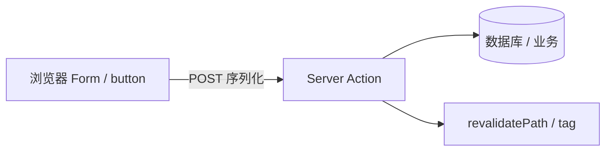

# Server Actions 与表单变更

**Server Actions** 是跑在服务端的异步函数，可从表单或事件调用，用于 **mutation** 而不必手写 `fetch` API Route。React 19 起与 **useActionState** 等深度集成。

---

## 是什么



| 对比 | REST API Route | Server Action |
|------|----------------|---------------|
| 定义 | `pages/api` 等 | 同文件 `'use server'` 函数 |
| 调用 | fetch | 框架序列化调用 |
| 类型 | 需手写 | 端到端 TS（Next 等） |

Server Action 把 mutation 变成一等公民，框架负责序列化调用和类型传递，不必单独写 API Route + fetch。

---

## Next.js App Router 示例

```tsx
// app/actions.ts
'use server';

import { revalidatePath } from 'next/cache';

export async function createTodo(formData: FormData) {
  const title = formData.get('title') as string;
  if (!title?.trim()) return { error: '标题不能为空' };

  await db.todo.create({ data: { title } });
  revalidatePath('/todos');
  return { success: true };
}
```

```tsx
// app/todos/CreateForm.tsx
'use client';

import { useActionState } from 'react';
import { createTodo } from '../actions';

export function CreateForm() {
  const [state, formAction, isPending] = useActionState(createTodo, null);

  return (
    <form action={formAction}>
      <input name="title" disabled={isPending} />
      {state?.error && <p role="alert">{state.error}</p>}
      <button type="submit" disabled={isPending}>
        {isPending ? '提交中…' : '添加'}
      </button>
    </form>
  );
}
```

| API | 作用 |
|-----|------|
| `'use server'` | 标记服务端函数 |
| `useActionState` | pending + 返回 state |
| `revalidatePath` | 刷新 RSC 缓存 |

`'use server'` 标记服务端函数；`useActionState` 管理 pending 和返回 state；`revalidatePath` 刷新 RSC 缓存让列表更新。

---

## 与 React 19 Actions

React 19 原生 `<form action={fn}>`：

```tsx
async function submit(formData: FormData) {
  'use server';
  ...
}

<form action={submit}>...</form>
```

`useFormStatus` 读 pending（在 form 子组件内）。React 19 把 form action 和 Server Action 深度集成，pending 状态用 useFormStatus 读取。

---

## 安全

| 项 | 必须 |
|----|------|
| 鉴权 | action 内校验 session |
| 校验 | zod 校验 FormData |
| CSRF | 框架内置 token（Next） |
| 幂等 | 重复提交处理 |

```tsx
'use server';
export async function deleteUser(id: string) {
  const session = await getSession();
  if (!session?.isAdmin) throw new Error('Forbidden');
  await db.user.delete({ where: { id } });
}
```

Server Action 是公开端点，必须在 action 内做鉴权和输入校验，不能假设调用方可信。

---

## 与 TanStack Query

| 场景 | 方案 |
|------|------|
| 全 RSC 应用 | Action + revalidate |
| 重客户端交互 | Query mutation 仍可用 |
| 混合 | Action 写 + invalidate Query |

全 RSC 应用用 Action + revalidate 刷新；重客户端交互仍可用 Query mutation；混合场景 Action 写完后 invalidate Query。

---

## Progressive enhancement

无 JS 时原生 form POST 仍可工作（Server Action 设计目标之一），利于 a11y 与弱网。form action 绑定 Server Action，不依赖客户端 JS 也能提交。

---

## 小结

Server Actions 把 mutation 变成一等公民；鉴权与校验不可省，revalidate 刷新 RSC 缓存。

Server Action 是跑在服务端的异步函数，用 `'use server'` 标记，框架序列化调用，替代 REST API Route + fetch。Next.js 示例：action 读 FormData、写 DB、revalidatePath；Client 表单用 useActionState 管理 pending 和 error。React 19 原生 form action + useFormStatus。安全不可省：action 内鉴权、zod 校验、框架 CSRF token、幂等处理。与 Query 混合：全 RSC 用 revalidate，重交互用 Query mutation，或 Action 写 + invalidate Query。支持 progressive enhancement，无 JS 也能 form POST。
