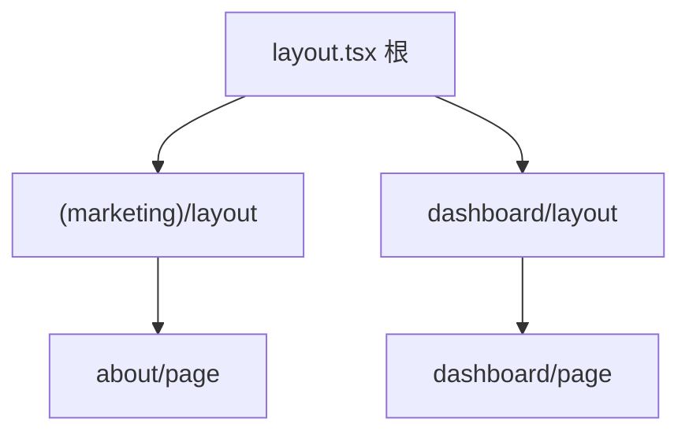

# Next.js App Router 架构

> **App Router**（`app/` 目录）是 Next.js 13+ 默认路由：**文件系统路由 + RSC + Layout + Server Action**。理解目录约定即可快速定位页面与数据逻辑。

---

## 一、目录结构

```
app/
├── layout.tsx          # 根布局
├── page.tsx            # /
├── loading.tsx         # Suspense fallback
├── error.tsx           # 错误边界
├── not-found.tsx
├── (marketing)/        # 路由组，不影响 URL
│   ├── about/page.tsx  # /about
│   └── layout.tsx
├── dashboard/
│   ├── layout.tsx      # /dashboard/*
│   └── page.tsx        # /dashboard
└── users/[id]/
    └── page.tsx        # /users/:id
```



---

## 二、特殊文件

| 文件 | 作用 |
|------|------|
| `layout.tsx` | 共享 UI，保留 state |
| `page.tsx` | 路由 UI |
| `loading.tsx` | 自动 Suspense 边界 |
| `error.tsx` | Client 错误 UI |
| `template.tsx` | 类似 layout 但 remount |
| `route.ts` | API Route Handler |

---

## 三、Server / Client 默认

| 文件 | 默认 |
|------|------|
| `app/**/*.tsx`（无指令） | **Server Component** |
| 需 hooks / 事件 | 文件顶 `'use client'` |

```tsx
// app/users/[id]/page.tsx — Server
export default async function UserPage({ params }: { params: { id: string } }) {
  const user = await getUser(params.id);
  return <UserView user={user} />;
}
```

---

## 四、数据获取

```tsx
// 直接 async Server Component
async function getPosts() {
  const res = await fetch('https://api.example.com/posts', {
    next: { revalidate: 60 }, // ISR 60s
  });
  return res.json();
}

export default async function BlogPage() {
  const posts = await getPosts();
  return <PostList posts={posts} />;
}
```

| 缓存 | 写法 |
|------|------|
| 静态 | `fetch(..., { cache: 'force-cache' })` |
| 动态 | `{ cache: 'no-store' }` |
| 定时 | `{ next: { revalidate: N } }` |

---

## 五、与 Pages Router 对比

| | Pages (`pages/`) | App (`app/`) |
|---|------------------|--------------|
| 默认组件 | Client | Server |
| 数据 | getServerSideProps 等 | async 组件 / fetch |
| 布局 | `_app.tsx` 手写 | `layout.tsx` 嵌套 |
| 推荐 | 维护旧项目 | **新项目** |

---

## 六、Metadata 与 SEO

```tsx
export const metadata = {
  title: '用户详情',
  description: '...',
};

// 或动态
export async function generateMetadata({ params }) {
  const user = await getUser(params.id);
  return { title: user.name };
}
```

---

## 七、部署

| 模式 | 平台 |
|------|------|
| Node server | Vercel、自托管 `next start` |
| Static export | `output: 'export'` 纯静态 |
| Edge | Middleware、部分 Route |

---

## 八、与 SPA 协作

| 模式 | 说明 |
|------|------|
| Next 全栈 | 主应用 |
| Next + 微前端 | 子应用 CSR |
| 仅 Next 做 marketing | 产品 SPA 子域 |

---

## 九、小结

| 记住 | |
|------|--|
| app/ 文件即路由 | |
| layout 嵌套 | |
| 默认 Server，交互加 use client | |
| loading/error 约定式 | |

**上一篇**：[04-Server-Actions与表单变更](./04-Server-Actions与表单变更.md)  
**下一篇**：[06-Remix与其它元框架简览](./06-Remix与其它元框架简览.md)
