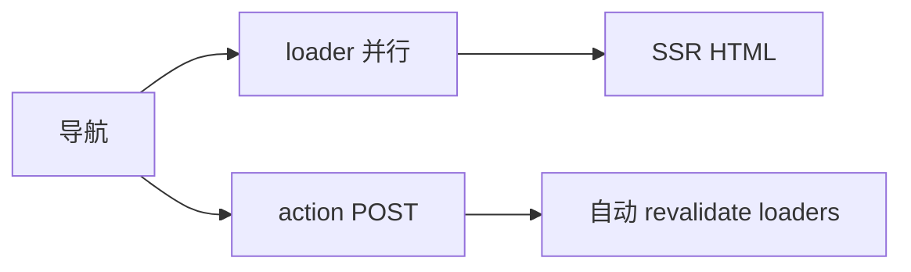
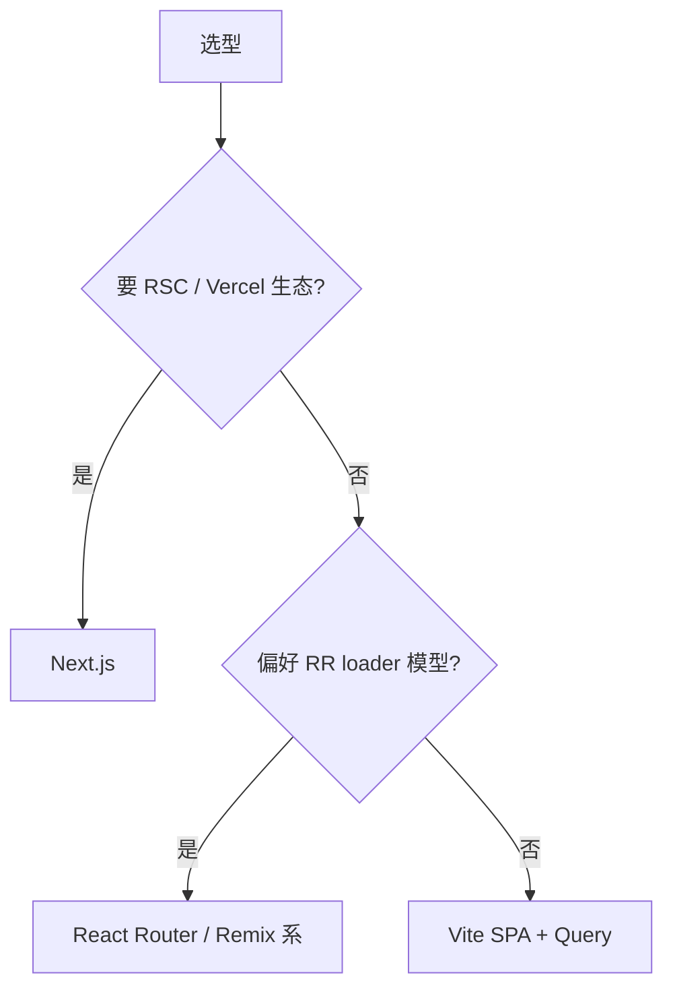

# Remix 与其它元框架简览

> **Next.js** 占主流，但 **Remix**、**Expo Router** 等在不同场景有优势。了解差异，避免「只会一种框架」。

---

## 一、元框架对比

| | Next.js App | Remix | TanStack Start |
|---|-------------|-------|----------------|
| 路由 | 文件系统 app/ | 文件系统 routes/ | 文件 + RR |
| 数据 | RSC fetch / Action | loader + action | loader + Query |
| 默认 UI | RSC 为主 | Client 友好 SSR | 新兴 |
| 部署 | Vercel 优化 | 多平台 | 早期 |
| 心智 | React 官方 RSC 路线 | Web Fetch API | 全栈 TS |

---

## 二、Remix 核心

```tsx
// routes/users.$id.tsx
import { json, type LoaderFunctionArgs } from '@remix-run/node';
import { useLoaderData } from '@remix-run/react';

export async function loader({ params }: LoaderFunctionArgs) {
  const user = await getUser(params.id!);
  return json({ user });
}

export default function UserRoute() {
  const { user } = useLoaderData<typeof loader>();
  return <h1>{user.name}</h1>;
}
```



| 概念 | 类似 |
|------|------|
| loader | RR Data Router loader |
| action | RR action |
| Form | 原生 form + progressive enhancement |

**Remix 已合并进 React Router v7** 路线，loader/action 与 RR 趋同。

---

## 三、选型建议



---

## 四、其它

| 框架 | 场景 |
|------|------|
| **Gatsby** | 内容站、GraphQL 源 |
| **Expo Router** | React Native 文件路由 |
| **Astro + React islands** |  mostly 静态 + 交互岛 |

React 作 **岛屿**：

```astro
---
// Astro 页面 mostly HTML
---
<ReactCounter client:visible />
```

---

## 五、从 SPA 迁移

| 步骤 | |
|------|--|
| 路由对照 pages → app 或 routes | |
| getServerSideProps → loader/async | |
| API Routes → Server Action 或 route handler | |
| 客户端-only 库标记 `'use client'` | |

---

## 六、小结

| 结论 | |
|------|--|
| 默认推荐 Next App Router（RSC 生态） | |
| Remix/RR 适合 loader 思维团队 | |
| 纯后台仍可用 Vite SPA | |

**上一篇**：[05-Nextjs-App-Router架构](./05-Nextjs-App-Router架构.md)  
**下一模块**：[15-测试](../15-测试/01-测试策略与金字塔.md)
