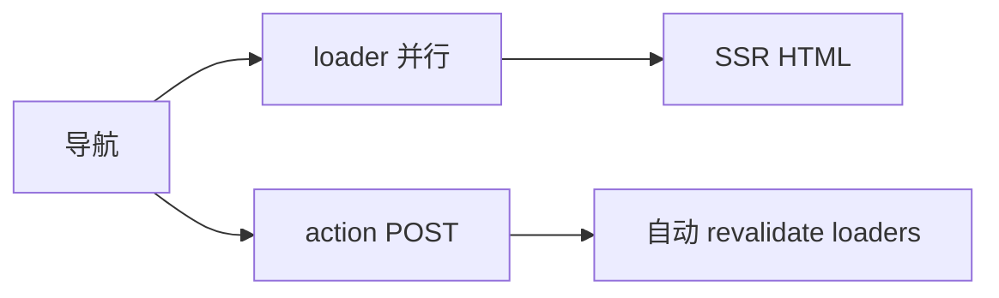
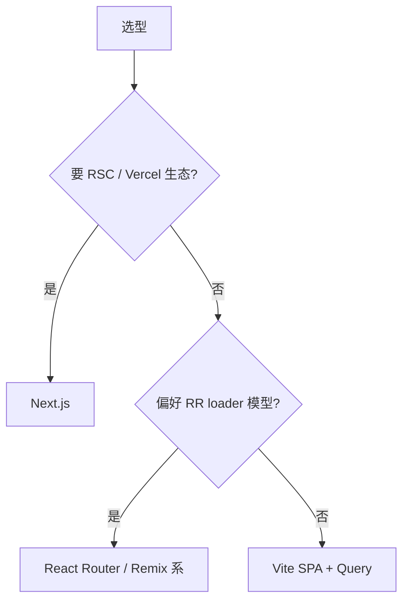

# Remix 与其它元框架简览

**Next.js** 占主流，但 **Remix**、**Expo Router** 等在不同场景有优势。了解差异，避免「只会一种框架」。

---

## 元框架对比

| | Next.js App | Remix | TanStack Start |
|---|-------------|-------|----------------|
| 路由 | 文件系统 app/ | 文件系统 routes/ | 文件 + RR |
| 数据 | RSC fetch / Action | loader + action | loader + Query |
| 默认 UI | RSC 为主 | Client 友好 SSR | 新兴 |
| 部署 | Vercel 优化 | 多平台 | 早期 |
| 心智 | React 官方 RSC 路线 | Web Fetch API | 全栈 TS |

Next.js 走 RSC 路线，Remix 走 loader/action 贴近 React Router，TanStack Start 新兴且与 Query 同源。

---

## Remix 核心

```tsx
// routes/users.$id.tsx
import { json, type LoaderFunctionArgs } from '@remix-run/node';
import { useLoaderData } from '@remix-run/react';

export async function loader({ params }: LoaderFunctionArgs) {
  const user = await getUser(params.id!);
  return json({ user });
}

export default function UserRoute() {
  const { user } = useLoaderData<typeof loader>();
  return <h1>{user.name}</h1>;
}
```



| 概念 | 类似 |
|------|------|
| loader | RR Data Router loader |
| action | RR action |
| Form | 原生 form + progressive enhancement |

**Remix 已合并进 React Router v7** 路线，loader/action 与 RR 趋同。Remix 心智模型贴近 Web 标准和 React Router。

---

## 选型建议



要 RSC 和 Vercel 生态 → Next.js；偏好 loader/action 模型 → React Router / Remix；纯后台 → Vite SPA + Query。

---

## 其它框架

| 框架 | 场景 |
|------|------|
| **Gatsby** | 内容站、GraphQL 源 |
| **Expo Router** | React Native 文件路由 |
| **Astro + React islands** | mostly 静态 + 交互岛 |

React 作 **岛屿**：

```astro
---
// Astro 页面 mostly HTML
---
<ReactCounter client:visible />
```

Astro 页面 mostly 静态 HTML，React 组件作为交互岛按需 hydrate。

---

## 从 SPA 迁移

| 步骤 | |
|------|，|
| 路由对照 pages → app 或 routes | |
| getServerSideProps → loader/async | |
| API Routes → Server Action 或 route handler | |
| 客户端-only 库标记 `'use client'` | |

迁移时逐路由对照，数据获取从 getServerSideProps 迁到 loader 或 async Server Component，API Route 迁到 Server Action 或 route handler。

---

## 小结

Next 占 RSC 主流，Remix/RR 适合 loader 思维；纯后台仍可用 Vite SPA。

元框架对比：Next.js（RSC + App Router + Vercel 生态）、Remix（loader/action + Web 标准，已合并进 RR v7）、TanStack Start（新兴，Query 同源）。Remix 核心 loader 取数 + action 变更 + 自动 revalidate，贴近 React Router Data Router。选型：要 RSC → Next；偏好 loader 模型 → RR/Remix；纯后台 → Vite SPA。其它：Gatsby（内容站）、Expo Router（RN）、Astro（静态 + React 岛）。从 SPA 迁移：路由对照、数据获取迁 loader/async、API 迁 Action/route handler、客户端库标 `'use client'`。
