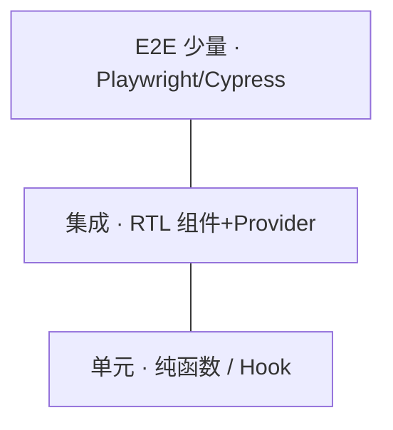

# 测试策略与金字塔

> React 项目测试不是「全写 E2E」。按 **测试金字塔** 分配：单元多、集成适中、E2E 少而精——**RTL 测行为**为主，少测实现细节。

---

## 一、测试金字塔



| 层级 | 测什么 | 工具 |
|------|--------|------|
| **单元** | util、reducer、纯 hook 逻辑 | Vitest |
| **集成** | 组件 + 用户交互 | **RTL** |
| **E2E** | 关键业务流程 | Playwright |
| **视觉** | UI 回归 | Storybook、Chromatic |

与 [代码规范与质量保障](../../前端工程化体系/04-代码规范与质量保障.md) 衔接。

---

## 二、测行为不测实现

| ❌ 实现细节 | ✅ 用户行为 |
|-------------|-------------|
| `wrapper.state()` | 点击后是否出现「成功」 |
| 快照整棵 DOM 树 | 关键文案 / role |
| 测私有方法 | 通过 UI 触发 |

```tsx
// ✅
expect(screen.getByRole('button', { name: '提交' })).toBeEnabled();
await user.click(screen.getByRole('button', { name: '提交' }));
expect(await screen.findByText('保存成功')).toBeInTheDocument();
```

---

## 三、工具链（Vite 项目）

```bash
pnpm add -D vitest @testing-library/react @testing-library/jest-dom @testing-library/user-event jsdom
```

```tsx
// vitest.config.ts
import { defineConfig } from 'vitest/config';
import react from '@vitejs/plugin-react';

export default defineConfig({
  plugins: [react()],
  test: {
    environment: 'jsdom',
    setupFiles: ['./src/test/setup.ts'],
  },
});
```

```tsx
// src/test/setup.ts
import '@testing-library/jest-dom/vitest';
```

---

## 四、测什么 / 不测什么

| 优先测 | 可少测 |
|--------|--------|
| 表单校验、提交 | 第三方 UI 库内部 |
| 权限显示/隐藏 | CSS 像素级 |
| 错误态、空态 | 简单 presentational |
| 自定义 Hook 核心逻辑 | 每行 JSX |

---

## 五、与 Query / Router

| 依赖 | 测试方式 |
|------|----------|
| TanStack Query | `QueryClientProvider` + 测试 client |
| React Router | `MemoryRouter` / `createMemoryRouter` |
| Zustand | 测试前 `setState` 重置 |

详见 [04-Hooks与Provider测试](./04-Hooks与Provider测试.md)。

---

## 六、CI 集成

```yaml
# 示意
- run: pnpm test --run
- run: pnpm test:e2e  # 可选 nightly
```

PR 跑 unit + integration；E2E 可 nightly。

---

## 七、小结

| 原则 | |
|------|--|
| RTL + Vitest 为主 | |
| 金字塔分配 | |
| 测用户可见结果 | |

**下一篇**：[02-React-Testing-Library基础](./02-React-Testing-Library基础.md)
