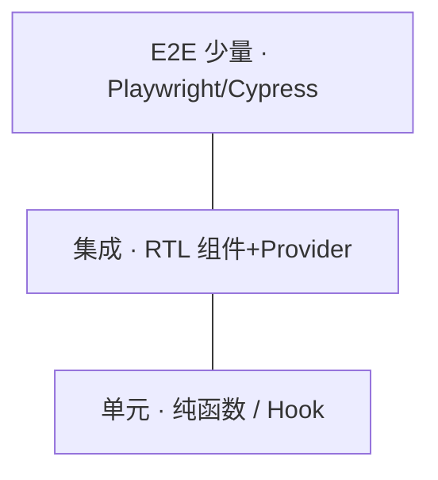

# 测试策略与金字塔

React 项目测试不是「全写 E2E」。按 **测试金字塔** 分配：单元多、集成适中、E2E 少而精，**RTL 测行为**为主，少测实现细节。

---

## 测试金字塔



| 层级 | 测什么 | 工具 |
|------|--------|------|
| **单元** | util、reducer、纯 hook 逻辑 | Vitest |
| **集成** | 组件 + 用户交互 | **RTL** |
| **E2E** | 关键业务流程 | Playwright |
| **视觉** | UI 回归 | Storybook、Chromatic |

底层单元测试多且快，中层 RTL 集成测组件行为，顶层 E2E 少而精覆盖关键路径。

---

## 各层代码示例

### 单元层：纯函数

```typescript
// src/utils/formatPrice.test.ts
import { describe, it, expect } from 'vitest';
import { formatPrice } from './formatPrice';

describe('formatPrice', () => {
  it('formats CNY', () => {
    expect(formatPrice(1999)).toBe('¥1,999.00');
  });

  it('handles invalid input', () => {
    expect(formatPrice(NaN)).toBe('—');
  });
});
```

### 单元层：自定义 Hook

```typescript
// src/hooks/useCounter.test.ts
import { renderHook, act } from '@testing-library/react';
import { useCounter } from './useCounter';

it('increments', () => {
  const { result } = renderHook(() => useCounter(0));
  act(() => result.current.increment());
  expect(result.current.count).toBe(1);
});
```

### 集成层：组件 + Provider

```tsx
// src/features/LoginForm.test.tsx
import { render, screen } from '@testing-library/react';
import userEvent from '@testing-library/user-event';
import { QueryClient, QueryClientProvider } from '@tanstack/react-query';
import { MemoryRouter } from 'react-router-dom';
import { LoginForm } from './LoginForm';

function renderLogin() {
  const queryClient = new QueryClient({
    defaultOptions: { queries: { retry: false } },
  });
  return render(
    <QueryClientProvider client={queryClient}>
      <MemoryRouter>
        <LoginForm />
      </MemoryRouter>
    </QueryClientProvider>,
  );
}

it('shows error on empty submit', async () => {
  const user = userEvent.setup();
  renderLogin();
  await user.click(screen.getByRole('button', { name: '登录' }));
  expect(await screen.findByRole('alert')).toHaveTextContent('请输入邮箱');
});
```

### E2E 层：关键路径

```typescript
// e2e/login.spec.ts
import { test, expect } from '@playwright/test';

test('login redirects to dashboard', async ({ page }) => {
  await page.goto('/login');
  await page.getByLabel('邮箱').fill('demo@example.com');
  await page.getByLabel('密码').fill('secret');
  await page.getByRole('button', { name: '登录' }).click();
  await expect(page).toHaveURL('/dashboard');
});
```

---

## 测试分配建议（比例）

| 项目规模 | 单元 | 集成(RTL) | E2E |
|----------|------|-----------|-----|
| 小（<10 路由） | 60% | 30% | 10% |
| 中 | 50% | 35% | 15% |
| 大 / 金融 | 45% | 35% | 20% |

E2E 只覆盖**不可替代**的路径：登录、支付、权限；边界 case 留给单元与集成。

---

## Mock 策略速查

| 测什么 | Mock 什么 | 避免 |
|--------|-----------|------|
| 组件提交逻辑 | MSW mock HTTP | mock 整个 fetch 实现 |
| 路由跳转 | MemoryRouter | mock react-router 内部 |
| 子组件 | 仅 presentational 桩 | mock 业务子组件导致测空壳 |
| 时间 | `vi.useFakeTimers()` | 真实 `setTimeout` 拖慢 CI |

通识 Mock 与 MSW 详见 [13-前端测试方法论](../../前端工程化体系/13-前端测试方法论.md)。

---

## 测行为不测实现

| ❌ 实现细节 | ✅ 用户行为 |
|-------------|-------------|
| `wrapper.state()` | 点击后是否出现「成功」 |
| 快照整棵 DOM 树 | 关键文案 / role |
| 测私有方法 | 通过 UI 触发 |

```tsx
// ✅
expect(screen.getByRole('button', { name: '提交' })).toBeEnabled();
await user.click(screen.getByRole('button', { name: '提交' }));
expect(await screen.findByText('保存成功')).toBeInTheDocument();
```

RTL 哲学是测用户可见的行为和结果，不测组件内部 state 或私有方法。

---

## 工具链（Vite 项目）

```bash
pnpm add -D vitest @testing-library/react @testing-library/jest-dom @testing-library/user-event jsdom
```

```tsx
// vitest.config.ts
import { defineConfig } from 'vitest/config';
import react from '@vitejs/plugin-react';

export default defineConfig({
  plugins: [react()],
  test: {
    environment: 'jsdom',
    setupFiles: ['./src/test/setup.ts'],
  },
});
```

```tsx
// src/test/setup.ts
import '@testing-library/jest-dom/vitest';
```

Vite 项目用 Vitest + RTL + jsdom，setup 文件引入 jest-dom matchers。

---

## 测什么 / 不测什么

| 优先测 | 可少测 |
|--------|--------|
| 表单校验、提交 | 第三方 UI 库内部 |
| 权限显示/隐藏 | CSS 像素级 |
| 错误态、空态 | 简单 presentational |
| 自定义 Hook 核心逻辑 | 每行 JSX |

优先覆盖表单校验、权限逻辑、错误/空态和自定义 Hook；简单展示组件和第三方库内部不必深测。

---

## 与 Query / Router

| 依赖 | 测试方式 |
|------|----------|
| TanStack Query | `QueryClientProvider` + 测试 client |
| React Router | `MemoryRouter` / `createMemoryRouter` |
| Zustand | 测试前 `setState` 重置 |

依赖 Context/Query/Router 的组件需要包 Provider 测试壳，每测新建 QueryClient 隔离 cache。

---

## CI 集成

```yaml
# 示意
- run: pnpm test --run
- run: pnpm test:e2e  # 可选 nightly
```

PR 跑 unit + integration；E2E 可 nightly 或合并前跑关键路径。

---

## 小结

单元多、集成适中、E2E 少而精；RTL 测行为不测实现，getByRole 优先。

测试金字塔：单元（Vitest 测 util/reducer/hook）多、集成（RTL 测组件+交互）适中、E2E（Playwright 关键流程）少而精、视觉（Storybook/Chromatic）补充。RTL 测用户可见行为，不测 state/私有方法/整树 snapshot。Vite 工具链：Vitest + RTL + jsdom + jest-dom。优先测表单校验、权限、错误/空态、Hook 逻辑；少测第三方库内部和 CSS 像素。Query/Router/Zustand 需 Provider 测试壳。CI：PR 跑 unit+integration，E2E 可 nightly。
