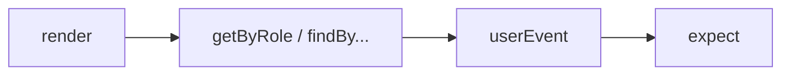

# React Testing Library 基础

**RTL** 通过 **role、label、text** 查询 DOM，模拟真实用户操作。核心：**render → query → userEvent → assert**。

---

## 基本流程

```tsx
import { render, screen } from '@testing-library/react';
import userEvent from '@testing-library/user-event';
import { describe, it, expect } from 'vitest';
import { Counter } from './Counter';

describe('Counter', () => {
  it('点击后计数增加', async () => {
    const user = userEvent.setup();
    render(<Counter />);

    await user.click(screen.getByRole('button', { name: '加一' }));
    expect(screen.getByText('计数: 1')).toBeInTheDocument();
  });
});
```



render 组件 → 用 screen 查询 → userEvent 模拟操作 → expect 断言结果。

---

## 查询优先级

| 优先级 | 方法 | 场景 |
|--------|------|------|
| 1 | `getByRole` | button、heading、textbox |
| 2 | `getByLabelText` | 表单 |
| 3 | `getByPlaceholderText` | 无 label 时 |
| 4 | `getByText` | 非交互文本 |
| 5 | `getByTestId` | 最后手段 |

```tsx
screen.getByRole('button', { name: /提交/i });
screen.getByLabelText('邮箱');
```

**避免** `container.querySelector('.btn-primary')`。getByRole 最接近用户和辅助技术的访问方式。

---

## getBy vs queryBy vs findBy

| API | 找不到 | 异步 |
|-----|--------|------|
| `getBy*` | **抛错** | 否 |
| `queryBy*` | 返回 null | 否 |
| `findBy*` | 超时抛错 | **是**（waitFor） |

```tsx
// 元素不应存在
expect(screen.queryByText('错误')).not.toBeInTheDocument();

// 异步出现
expect(await screen.findByText('加载完成')).toBeInTheDocument();
```

getBy 用于元素必须存在；queryBy 用于断言不存在；findBy 用于异步出现的元素。

---

## userEvent vs fireEvent

| | userEvent | fireEvent |
|---|-----------|-----------|
| 仿真 | 更接近真实（focus、hover 链） | 单事件 |
| 推荐 | ✅ 默认 | 特殊低层场景 |

```tsx
await user.type(screen.getByRole('textbox'), 'hello');
await user.keyboard('{Enter}');
```

userEvent 模拟完整交互链（focus → type → blur），比 fireEvent 更接近真实用户。

---

## within 缩小范围

```tsx
const dialog = screen.getByRole('dialog');
const submit = within(dialog).getByRole('button', { name: '确定' });
```

Modal 等场景用 within 限定查询范围，避免匹配到页面其他同名按钮。

---

## 异步与 waitFor

```tsx
import { waitFor } from '@testing-library/react';

await waitFor(() => {
  expect(screen.getByText('已保存')).toBeInTheDocument();
});
```

`findBy*` 等价于 `waitFor + getBy*`。复杂异步条件用 waitFor 包多个断言。

---

## 常见 matcher（jest-dom）

| matcher | 含义 |
|---------|------|
| `toBeInTheDocument()` | 在 document 中 |
| `toBeDisabled()` | disabled |
| `toHaveValue('x')` | input 值 |
| `toHaveAccessibleName()` | 可访问名 |

jest-dom 扩展了 Vitest/Jest 的 expect matchers，语义化断言 DOM 状态。

---

## 反模式

| ❌ | ✅ |
|----|-----|
| `wrapper.find('Button')` Enzyme 风格 | getByRole |
| 测组件 state | 测 UI 结果 |
| 过多 snapshot | 关键结构 snapshot |

---

## 小结

render → getByRole → userEvent → assert；findBy 等异步，queryBy 断言不存在。

RTL 核心流程：render → screen 查询 → userEvent 操作 → expect 断言。查询优先级：getByRole > getByLabelText > getByPlaceholderText > getByText > getByTestId。getBy 必须存在、queryBy 断言不存在、findBy 等异步。userEvent 比 fireEvent 更接近真实交互。within 缩小 Modal 等范围。waitFor/findBy 处理异步。jest-dom 提供 toBeInTheDocument、toHaveValue 等 matcher。避免 Enzyme 风格、测 state、过多 snapshot。
