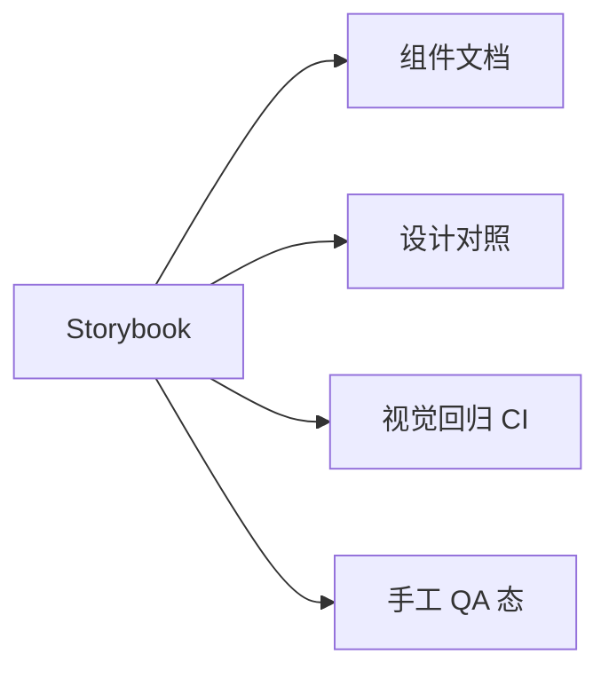

# Storybook 与视觉回归

**Storybook** 在隔离环境展示组件各 **state / variant**，用于文档、设计对齐和**视觉回归测试**（Chromatic 等）。

---

## Storybook 解决什么



| 价值 | 说明 |
|------|------|
| 隔离开发 | 不跑整应用 |
| 状态矩阵 | primary/disabled/loading |
| 设计协作 | 设计师可点 |

Storybook 让组件在隔离环境展示各种状态，不必启动整应用。

---

## 安装与 Story

```bash
pnpm dlx storybook@latest init
```

```tsx
// Button.stories.tsx
import type { Meta, StoryObj } from '@storybook/react';
import { Button } from './Button';

const meta: Meta<typeof Button> = {
  title: 'UI/Button',
  component: Button,
  tags: ['autodocs'],
};
export default meta;

type Story = StoryObj<typeof Button>;

export const Primary: Story = {
  args: { variant: 'primary', children: '确定' },
};

export const Disabled: Story = {
  args: { variant: 'primary', disabled: true, children: '确定' },
};
```

Meta 定义组件和文档，Story 用 args 描述各 variant 状态。

---

## Decorator 包 Provider

```tsx
const meta: Meta<typeof Dashboard> = {
  decorators: [
    Story => (
      <QueryClientProvider client={new QueryClient()}>
        <MemoryRouter>
          <Story />
        </MemoryRouter>
      </QueryClientProvider>
    ),
  ],
};
```

全局 decorator 在 `.storybook/preview.tsx` 配置，为需要 Provider 的 story 包 Query/Router。

---

## Controls 与 Args

```tsx
export const Playground: Story = {
  args: {
    size: 'md',
    variant: 'secondary',
  },
  argTypes: {
    size: { control: 'select', options: ['sm', 'md', 'lg'] },
  },
};
```

侧边栏 Controls 动态改 props，快速验边界和 variant 组合。

---

## 交互测试（Storybook Test）

```tsx
import { expect, userEvent, within } from '@storybook/test';

export const Submit: Story = {
  play: async ({ canvasElement }) => {
    const canvas = within(canvasElement);
    await userEvent.click(canvas.getByRole('button', { name: '提交' }));
    await expect(canvas.getByText('成功')).toBeInTheDocument();
  },
};
```

play 函数在 story 内跑交互断言，与 Vitest 集成可 CI 跑 story tests。

---

## 视觉回归

| 工具 | 方式 |
|------|------|
| **Chromatic** | 云端截图 diff |
| **lost-pixel** | 自托管 |
| Storybook + Playwright | 截图对比 |

流程：PR → 自动截图 → 与 baseline diff → 人工 approve。

---

## 与 RTL 分工

| Storybook | RTL |
|-----------|-----|
| 视觉、文档、设计态 | 逻辑、交互断言 |
| 组件矩阵 | 业务流程 |

**互补**，非替代。Storybook 管视觉和状态矩阵，RTL 管逻辑和业务流程断言。

---

## 最佳实践

| 实践 | |
|------|，|
| 每个 UI 组件至少 1 story | |
| 覆盖 empty / error / loading | |
| 与 Figma 同名 variant | |
| 大页面用 **feature story** 而非整 app | |

---

## 小结

Storybook 展示组件态矩阵，与 RTL 互补；Chromatic 做视觉回归 CI。

Storybook 在隔离环境展示组件各 state/variant，用于文档、设计对齐和手工 QA。Meta + Story + args 描述组件态；decorator 包 Query/Router 等 Provider。Controls 动态验边界。play 函数做 story 级交互测试。视觉回归用 Chromatic（云端 diff）或 lost-pixel/Playwright 截图对比。与 RTL 互补：Storybook 管视觉和状态矩阵，RTL 管逻辑断言。最佳实践：每组件至少 1 story，覆盖 empty/error/loading，variant 与 Figma 对齐。
