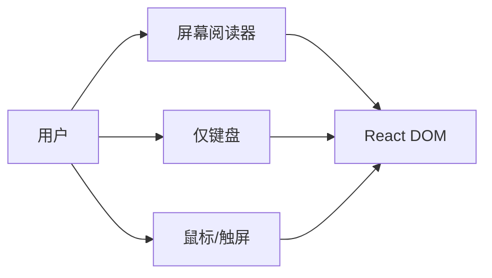

# 可访问性基础与 ARIA

**可访问性（a11y）** 让视障、键盘用户、认知障碍用户也能用 React 应用。**语义 HTML 优先**，不够时再补 **ARIA**，且 ARIA 不能替代错误语义。

---

## 为什么 React 项目要关心 a11y



| 动机 | 说明 |
|------|------|
| **合规** | 各国无障碍法规（如 WCAG 2.1 AA） |
| **用户面** | 约 15%+ 人口有某种形式障碍 |
| **SEO/体验** | 语义化利于爬虫与语音助手 |
| **工程质量** | label、focus 清晰 → 测试也更稳（RTL `getByRole`） |

React 只是生成 DOM，**浏览器和读屏器看的是 DOM**。a11y 好意味着 RTL 的 getByRole 也能稳定工作。

---

## WCAG 四原则（POUR）

| 原则 | 英文 | 例子 |
|------|------|------|
| **可感知** | Perceivable | 图片有 alt、对比度够 |
| **可操作** | Operable | 键盘能完成所有操作 |
| **可理解** | Understandable | 错误提示清晰 |
| **健壮** | Robust | 辅助技术能解析 |

目标级别：**AA** 为常见上线标准。

---

## 语义 HTML 优先

```tsx
// ❌ div 冒充按钮
<div onClick={save}>保存</div>

// ✅
<button type="button" onClick={save}>保存</button>
```

| 场景 | 语义标签 |
|------|----------|
| 主标题 | `<h1>`～`<h6>` 层级 |
| 导航 | `<nav>` |
| 主内容 | `<main>` |
| 列表 | `<ul>` / `<ol>` |
| 表单 | `<label>` + `<input>` |

---

## ARIA 是什么

**Accessible Rich Internet Applications**：用属性补充语义。

| 属性 | 用途 |
|------|------|
| `role` | 声明角色（如 `dialog`） |
| `aria-label` | 无可见文本时的名称 |
| `aria-labelledby` | 指向标题元素 id |
| `aria-describedby` | 指向说明/错误 id |
| `aria-expanded` | 折叠是否展开 |
| `aria-hidden="true"` | 对读屏隐藏装饰性内容 |

```tsx
<button
  type="button"
  aria-expanded={open}
  aria-controls="menu-panel"
  onClick={() => setOpen(!open)}
>
  菜单
</button>
<ul id="menu-panel" role="menu" hidden={!open}>
  ...
</ul>
```

---

## 第一规则：能用原生就不乱用 ARIA

> **No ARIA is better than bad ARIA.**

| ❌ | ✅ |
|----|-----|
| `<div role="button">` | `<button>` |
| `role="heading" aria-level="1"` | `<h1>` |
| 重复 role | 一个元素一个主 role |

---

## React 中的常见模式

### 图标按钮

```tsx
<button type="button" aria-label="关闭">
  <CloseIcon aria-hidden="true" />
</button>
```

### 表单错误

```tsx
const id = useId();

<>
  <label htmlFor={id}>邮箱</label>
  <input id={id} aria-invalid={!!error} aria-describedby={error ? `${id}-err` : undefined} />
  {error && <span id={`${id}-err`} role="alert">{error}</span>}
</>
```

useId 生成唯一 id，关联 label、input 和错误提示。

### 动态内容

```tsx
<div aria-live="polite" aria-atomic="true">
  {statusMessage}
</div>
```

| live | 场景 |
|------|------|
| `polite` | 非紧急提示 |
| `assertive` | 紧急错误 |

---

## 检测工具

| 工具 | 用途 |
|------|------|
| **eslint-plugin-jsx-a11y** | 静态规则 |
| **axe DevTools** | 浏览器扫描 |
| **Lighthouse** | 无障碍分数 |
| **读屏器** | VoiceOver / NVDA 真机测 |

---

## 小结

语义 HTML 优先，ARIA 补缺口；label、键盘、aria-live 是 React a11y 三板斧。

a11y 动机：合规（WCAG AA）、扩大用户面、SEO 和测试稳定性。WCAG 四原则 POUR：可感知、可操作、可理解、健壮。语义 HTML 优先于 div+role：button、h1-h6、nav、main、label+input。ARIA 补充语义：role、aria-label、aria-expanded、aria-live 等；规则是 No ARIA is better than bad ARIA。React 常见模式：图标按钮 aria-label、表单 useId+aria-invalid+role="alert"、动态内容 aria-live。检测：eslint-jsx-a11y、axe、Lighthouse、读屏器真机测。
