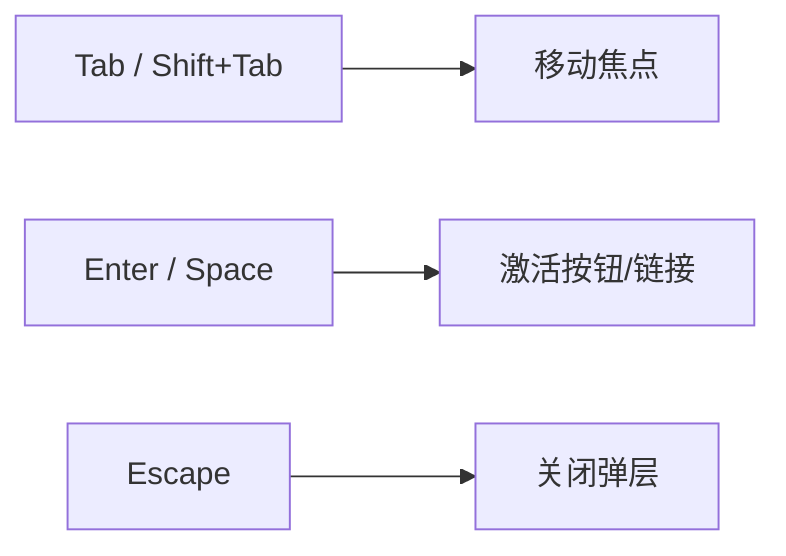
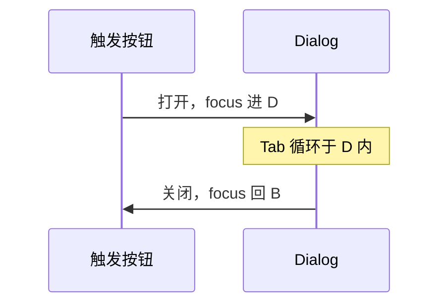

# 键盘导航与焦点管理

> 不少用户**只用键盘**（或 Switch 设备模拟键盘）。Tab 顺序合理、焦点可见、Modal 不「困住」焦点——是 a11y 的核心体验之一。

---

## 一、键盘基础



| 键 | 典型行为 |
|----|----------|
| **Tab** | 下一个可聚焦元素 |
| **Shift+Tab** | 上一个 |
| **Enter / Space** | 按钮、checkbox |
| **Esc** | 关闭 dialog、dropdown |
| **方向键** | 菜单、tabs、radio 组（看组件规范） |

---

## 二、可聚焦元素

| 默认可 focus | 需 tabindex |
|--------------|-------------|
| button、a[href]、input、select、textarea | 自定义 div 按钮（不推荐） |

```tsx
// ❌ div 无键盘激活
<div onClick={onClick}>点我</div>

// ✅
<button type="button" onClick={onClick}>点我</button>
```

---

## 三、tabIndex

| 值 | 含义 |
|----|------|
| `0` | 按文档顺序参与 Tab |
| `-1` | 可 programmatic focus，Tab 跳过 |
| `>0` | **避免**——破坏自然顺序 |

```tsx
// 错误恢复后把焦点移到标题
headingRef.current?.focus(); // 元素需 tabIndex={-1}
```

---

## 四、焦点样式

```css
/* 勿全局 outline: none 不设替代 */
:focus-visible {
  outline: 2px solid var(--focus-ring);
  outline-offset: 2px;
}
```

| ❌ | ✅ |
|----|-----|
| `outline: none` 无替代 | `:focus-visible` 仅键盘显示 |
| 仅 hover 样式 | focus 同样清晰 |

---

## 五、Modal 焦点陷阱（Focus Trap）

打开 Dialog 时：

1. 焦点移入 Dialog  
2. Tab 只在 Dialog 内循环  
3. 关闭后焦点回到触发按钮  

```tsx
import { Dialog } from '@radix-ui/react-dialog';
// 或 @headlessui/react — 内置 focus trap
```

手写时可查 **focus-trap-react** 或 WAI-ARIA Dialog 模式。



---

## 六、跳过链接（Skip Link）

```tsx
<a href="#main-content" className="skip-link">
  跳到主内容
</a>
<main id="main-content" tabIndex={-1}>...</main>
```

首屏 Tab 一次直达主内容，少扫整页导航。

---

## 七、React 中的坑

| 坑 | 处理 |
|----|------|
| 条件渲染丢焦点 | 关闭时 `triggerRef.focus()` |
| autoFocus 滥用 | 仅 Modal 首项或明确场景 |
| 路由切换 | 新页 `h1` focus 或 announce |
| 下拉未关 | Esc + 点击外部 |

---

## 八、测试

```tsx
await user.tab();
expect(screen.getByRole('button', { name: '下一步' })).toHaveFocus();
await user.keyboard('{Enter}');
```

RTL + userEvent 可测焦点链。

---

## 九、小结

| 清单 | |
|------|--|
| 全功能键盘可达 | |
| focus 可见 | |
| Modal trap + 归还焦点 | |
| 少 tabindex>0 | |

**上一篇**：[01-可访问性基础与ARIA](./01-可访问性基础与ARIA.md)  
**下一篇**：[03-XSS-安全与dangerouslySetInnerHTML](./03-XSS-安全与dangerouslySetInnerHTML.md)
