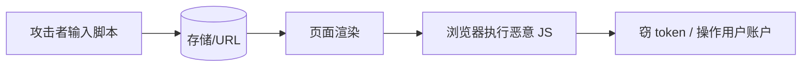

# XSS 安全与 dangerouslySetInnerHTML

React 默认 **转义** JSX 文本，防 **XSS**。一旦用 **`dangerouslySetInnerHTML`** 或把用户 HTML 塞进 DOM，就要自己负责消毒，否则一条评论就能偷 cookie。

---

## XSS 是什么



| 类型 | 例子 |
|------|------|
| **存储型** | 评论区存 `<script>` |
| **反射型** | URL 参数回显 |
| **DOM 型** | 前端 `innerHTML = userInput` |

---

## React 默认防护

```tsx
const userInput = '';
return <div>{userInput}</div>;
// DOM 显示为文本，不执行
```

| 安全 | 危险 |
|------|------|
| `{text}` | `dangerouslySetInnerHTML` |
| `{number}` | 未消毒 HTML 字符串 |
| 属性 `{href}` 仍要校验 | `javascript:` URL |

JSX 插值自动转义 HTML 实体，script 不会执行。但 href 等属性仍需白名单校验。

---

## dangerouslySetInnerHTML

```tsx
// ⚠️ 仅 trusted / 已消毒 HTML
<div dangerouslySetInnerHTML={{ __html: sanitizedHtml }} />
```

**命名故意吓人**，提醒开发者承担安全责任。

| 场景 | 做法 |
|------|------|
| CMS 富文本 | 服务端 + 客户端 **DOMPurify** |
| Markdown | `react-markdown` 默认不执行 raw HTML |
| 代码高亮 | 高亮库输出消毒 |

```tsx
import DOMPurify from 'dompurify';

function RichContent({ html }: { html: string }) {
  const clean = DOMPurify.sanitize(html, {
    USE_PROFILES: { html: true },
  });
  return <div dangerouslySetInnerHTML={{ __html: clean }} />;
}
```

---

## 富文本编辑器

| 方案 | 安全 |
|------|------|
| **TipTap / Slate** | 结构化文档，非任意 HTML |
| **Quill** | 配置 whitelist |
| 直接存 innerHTML | 必须消毒入库 |

结构化编辑器比存 raw HTML 更安全；若存 HTML 必须入库前消毒。

---

## 其它 XSS 入口

| 入口 | 防护 |
|------|------|
| `href={userUrl}` | 只允许 `http(s):`、`mailto:` |
| `target="_blank"` | 加 `rel="noopener noreferrer"` |
| JSON 注入 script 标签 | CSP、不拼接 script |
| `eval` / `new Function` | 禁止 |
| 第三方 CDN script | SRI、可信源 |

```tsx
function SafeLink({ href, children }: { href: string; children: React.ReactNode }) {
  const safe = href.startsWith('https://') || href.startsWith('/');
  if (!safe) return <span>{children}</span>;
  return (
    <a href={href} rel="noopener noreferrer" target="_blank">
      {children}
    </a>
  );
}
```

---

## CSP（Content-Security-Policy）

HTTP 头限制脚本来源：

```
Content-Security-Policy: default-src 'self'; script-src 'self'
```

即使注入 inline script 也难执行。CSP 在部署层配置，与 React 无冲突。

---

## Secrets 不进前端

| ❌ | ✅ |
|----|-----|
| API secret 写进 bundle | 环境变量 **仅** `VITE_*` 公开项 |
| 把 token 放 localStorage 且无 HttpOnly 保护 | 敏感 session 用 HttpOnly Cookie |

React 代码**全部可被用户查看**。

---

## 上线前安全要点

| 项 | 说明 |
|-----|------|
| 无未消毒 dangerouslySetInnerHTML | DOMPurify 消毒 |
| 用户 URL 白名单 | 禁止 javascript: |
| CSP 配置 | 限制 script 来源 |
| 依赖漏洞扫描 | npm audit |

---

## 小结

JSX 默认转义安全；用户 HTML 必须 DOMPurify 消毒，链接白名单 + CSP 一并考虑。

XSS 分存储型、反射型、DOM 型。React JSX 插值默认转义安全；dangerouslySetInnerHTML 和未消毒 HTML 是主要风险。用户 HTML 必须 DOMPurify 消毒；Markdown 用 react-markdown；富文本编辑器优先结构化方案。其它入口：href 白名单、target="_blank" 加 rel、禁止 eval、CSP 限制 script。Secrets 不进前端 bundle，敏感 session 用 HttpOnly Cookie。上线前：消毒 innerHTML、URL 白名单、CSP、npm audit。
