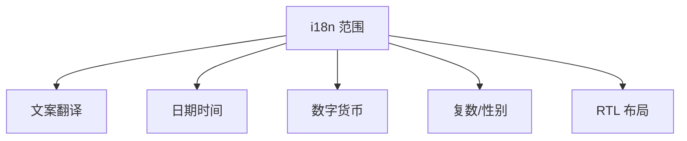

# 国际化（i18n）实践

**国际化（i18n）** 让界面支持多语言与 locale；**本地化（l10n）** 是具体翻译与格式。React 本身无 i18n，常用 **react-i18next**、**FormatJS（react-intl）** 等库。

---

## 要处理什么



| 项 | 例子 |
|----|------|
| 文案 | 「保存」→ "Save" |
| 日期 | `2026/6/17` vs `17.06.2026` |
| 数字 | `1,234.5` vs `1.234,5` |
| 复数 | 1 item / 2 items |
| 方向 | 阿拉伯语 RTL |

i18n 不只是翻译文案，还包括日期、数字、复数和 RTL 布局。

---

## react-i18next 基础

```bash
pnpm add i18next react-i18next
```

```tsx
// i18n.ts
import i18n from 'i18next';
import { initReactI18next } from 'react-i18next';

i18n.use(initReactI18next).init({
  lng: 'zh',
  fallbackLng: 'en',
  resources: {
    zh: { translation: { save: '保存', welcome: '你好，{{name}}' } },
    en: { translation: { save: 'Save', welcome: 'Hello, {{name}}' } },
  },
});
```

```tsx
import { useTranslation } from 'react-i18next';

function Toolbar() {
  const { t, i18n } = useTranslation();

  return (
    <>
      <button type="button">{t('save')}</button>
      <button type="button" onClick={() => i18n.changeLanguage('en')}>EN</button>
      <p>{t('welcome', { name: 'Li' })}</p>
    </>
  );
}
```

---

## JSON 资源与命名空间

```
locales/
├── zh/
│   ├── common.json
│   └── dashboard.json
└── en/
    ├── common.json
    └── dashboard.json
```

```tsx
const { t } = useTranslation('dashboard');
t('title');
```

| 实践 | 说明 |
|------|------|
| 按模块拆 namespace | 避免单文件巨大 |
| key 用 dot 路径 | `user.profile.title` |
| 避免 key 即英文句子 | 改 copy 时不改 key |

---

## 复数与插值

```json
{
  "itemCount": "{{count}} 项",
  "itemCount_plural": "{{count}} 项"
}
```

i18next 按 `count` 选 plural 形式（各语言规则不同）。

```tsx
t('itemCount', { count: 5 });
```

---

## 日期与数字（Intl API）

```tsx
function Price({ amount }: { amount: number }) {
  const { i18n } = useTranslation();
  const formatted = new Intl.NumberFormat(i18n.language, {
    style: 'currency',
    currency: 'CNY',
  }).format(amount);
  return <span>{formatted}</span>;
}
```

| API | 用途 |
|-----|------|
| `Intl.DateTimeFormat` | 日期 |
| `Intl.NumberFormat` | 数字、货币 |
| `Intl.RelativeTimeFormat` | 「3 天前」 |

**优先 Intl**，少手写格式。

---

## 与 SSR / Next.js

服务端读 cookie / Accept-Language 定 lng；Next.js 用 next-i18next 或 app/ 路由 `[locale]`。

| 注意 | |
|------|，|
| SSR 与 CSR 同一 lng | 防 hydration 文案不一致 |
| 按 locale 拆 bundle | 动态 import 语言包 |

---

## RTL

```tsx
// html dir
document.documentElement.dir = i18n.dir(); // 'rtl' | 'ltr'
```

CSS 用逻辑属性：

```css
margin-inline-start: 1rem; /* 替代 margin-left */
```

---

## 选型

| 库 | 特点 |
|----|------|
| **react-i18next** | 生态大、JSON 资源 |
| **react-intl** | FormatJS、ICU 消息 |
| **Lingui** | 编译期提取文案 |

---

## 小结

文案外置 JSON 资源，Intl API 处理日期数字，SSR 语言须与 CSR 一致。

i18n 范围：文案、日期、数字、复数、RTL。react-i18next：init 配置 lng/fallbackLng/resources，useTranslation 的 t() 翻译、i18n.changeLanguage 切换。JSON 资源按 namespace 拆分，key 用 dot 路径。复数用 i18next plural 规则。日期数字优先 Intl API（DateTimeFormat、NumberFormat、RelativeTimeFormat）。SSR 须与 CSR 同一 lng，防 hydration 文案不一致；按 locale 动态 import 语言包。RTL 设 html dir 和 CSS 逻辑属性。选型：react-i18next（生态大）、react-intl（ICU）、Lingui（编译期提取）。
