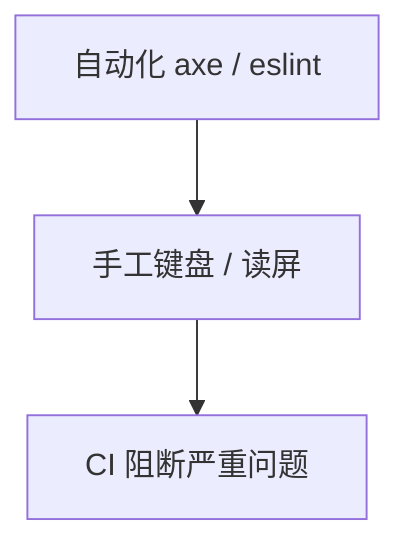

# 可访问性测试与 Review 要点

a11y 不能靠感觉。**自动化扫描 + 键盘手工 + 读屏抽检 + PR Review** 组合，才能稳定达标。

---

## 三层测试



| 层 | 工具 |
|----|------|
| 开发时 | eslint-plugin-jsx-a11y |
| 单测 | jest-axe |
| E2E | @axe-core/playwright |
| 审计 | Lighthouse、axe DevTools |

自动化覆盖约 30～50%，必须配合手工键盘和读屏测试。

---

## eslint-plugin-jsx-a11y

```bash
pnpm add -D eslint-plugin-jsx-a11y
```

常见规则：

| 规则 | 含义 |
|------|------|
| `alt-text` | img 有 alt |
| `anchor-is-valid` | a 有 href |
| `click-events-have-key-events` | 非按钮 clickable 有键盘 |
| `label-has-associated-control` | label 关联控件 |

---

## jest-axe 示例

```tsx
import { render } from '@testing-library/react';
import { axe, toHaveNoViolations } from 'jest-axe';
import { LoginForm } from './LoginForm';

expect.extend(toHaveNoViolations);

it('无 a11y 违规', async () => {
  const { container } = render(<LoginForm />);
  const results = await axe(container);
  expect(results).toHaveNoViolations();
});
```

**不能**替代手工，axe 约覆盖 30～50% 问题。

---

## 手工测试要点

| 项 | 说明 |
|-----|------|
| 全程 Tab 完成主流程 | 键盘可达 |
| focus 环可见 | :focus-visible |
| Esc 关 Modal，焦点回退 | focus trap 归还 |
| 200% zoom 可用 | 响应式 |
| 色对比度 AA（文本 4.5:1） | 设计 token |
| 读屏朗读表单 label 与错误 | VoiceOver/NVDA |

---

## PR Review 要点（React）

| 项 | 说明 |
|-----|------|
| 交互用 button/a，非 div onClick | 语义 HTML |
| 图标按钮有 aria-label | 可访问名 |
| 表单 field 有 label / aria | 关联控件 |
| 动态错误 role="alert" 或 aria-live | 错误通知 |
| 无未消毒 dangerouslySetInnerHTML | XSS |
| Modal 用成熟库或 focus trap | 焦点管理 |
| 图片 alt 有意义或 alt="" 装饰图 | 可感知 |

---

## 与 RTL 对齐

a11y 好的组件，测试通常：

```tsx
getByRole('button', { name: '提交' });
getByLabelText('邮箱');
```

**测 role = 促 a11y**。RTL 的 getByRole 查询方式与 a11y 最佳实践一致。

---

## 常见违规与修复

| 违规 | 修复 |
|------|------|
| Empty button | aria-label 或文本 |
| Missing form label | label htmlFor |
| Low contrast | 设计 token 调整 |
| Positive tabindex | 改 DOM 顺序 |

---

## 文档与 Storybook

Storybook **a11y addon** 实时报违规；每个 variant 扫一遍。

---

## 小结

eslint-jsx-a11y + axe 自动化，键盘/读屏手工抽检，PR review 与 RTL getByRole 对齐。

a11y 测试三层：开发时 eslint-jsx-a11y、单测 jest-axe、E2E @axe-core/playwright、审计 Lighthouse/axe DevTools。自动化不能替代手工：Tab 完成主流程、focus 可见、Esc 关 Modal、200% zoom、对比度 AA、读屏测 label/错误。PR Review：button/a 非 div、图标 aria-label、表单 label、错误 aria-live、无未消毒 innerHTML、Modal focus trap、图片 alt。RTL getByRole/getByLabelText 与 a11y 对齐。Storybook a11y addon 实时扫描各 variant。
