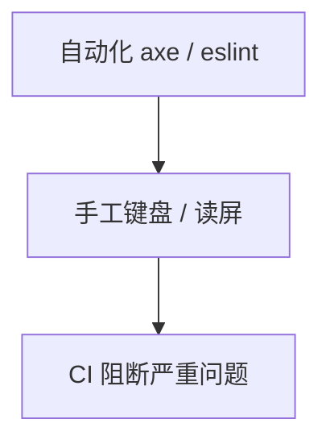

# 可访问性测试与 Review 清单

> a11y 不能靠感觉。**自动化扫描 + 键盘手工 + 读屏抽检 + PR Checklist** 组合，才能稳定达标。

---

## 一、三层测试



| 层 | 工具 |
|----|------|
| 开发时 | eslint-plugin-jsx-a11y |
| 单测 | jest-axe |
| E2E | @axe-core/playwright |
| 审计 | Lighthouse、axe DevTools |

---

## 二、eslint-plugin-jsx-a11y

```bash
pnpm add -D eslint-plugin-jsx-a11y
```

常见规则：

| 规则 | 含义 |
|------|------|
| `alt-text` | img 有 alt |
| `anchor-is-valid` | a 有 href |
| `click-events-have-key-events` | 非按钮 clickable 有键盘 |
| `label-has-associated-control` | label 关联控件 |

---

## 三、jest-axe 示例

```tsx
import { render } from '@testing-library/react';
import { axe, toHaveNoViolations } from 'jest-axe';
import { LoginForm } from './LoginForm';

expect.extend(toHaveNoViolations);

it('无 a11y 违规', async () => {
  const { container } = render(<LoginForm />);
  const results = await axe(container);
  expect(results).toHaveNoViolations();
});
```

**不能**替代手工——axe 约覆盖 30～50% 问题。

---

## 四、手工测试清单

| ☐ | 项 |
|---|-----|
| ☐ | 全程 Tab 完成主流程 |
| ☐ | focus 环可见 |
| ☐ | Esc 关 Modal，焦点回退 |
| ☐ | 200%  zoom 可用 |
| ☐ | 色对比度 AA（文本 4.5:1） |
| ☐ | 读屏朗读表单 label 与错误 |

---

## 五、PR Review 清单（React）

| ☐ | 项 |
|---|-----|
| ☐ | 交互用 button/a，非 div onClick |
| ☐ | 图标按钮有 aria-label |
| ☐ | 表单 field 有 label / aria |
| ☐ | 动态错误 role="alert" 或 aria-live |
| ☐ | 无未消毒 dangerouslySetInnerHTML |
| ☐ | Modal 用成熟库或 focus trap |
| ☐ | 图片 alt 有意义或 alt="" 装饰图 |

---

## 六、与 RTL 对齐

a11y 好的组件，测试通常：

```tsx
getByRole('button', { name: '提交' });
getByLabelText('邮箱');
```

**测 role = 促 a11y**。

见 [15-测试](../15-测试/)。

---

## 七、常见违规与修复

| 违规 | 修复 |
|------|------|
| Empty button | aria-label 或文本 |
| Missing form label | label htmlFor |
| Low contrast | 设计 token 调整 |
| Positive tabindex | 改 DOM 顺序 |

---

## 八、文档与 Storybook

Storybook **a11y addon** 实时报违规；每个 variant 扫一遍。

---

## 九、小结

| 原则 | |
|------|--|
| 自动化 + 手工 | |
| PR checklist | |
| 与 eslint/RTL 集成 | |

**上一篇**：[04-国际化i18n实践](./04-国际化i18n实践.md)  
**下一模块**：[17-类组件与迁移](../17-类组件与迁移/01-类组件语法与生命周期.md)
