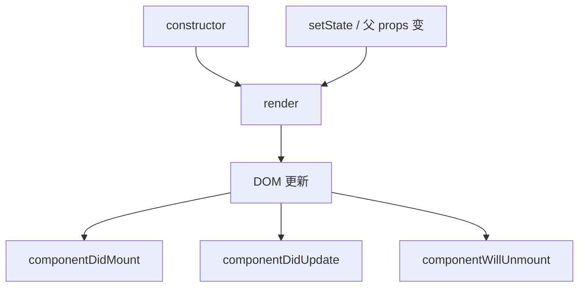

# 类组件语法与生命周期

**类组件**是 React 早期写法：`class extends React.Component`，用 **`this.state` / `this.setState`** 和**生命周期方法**。React 18+ 仍支持，但**新代码应写函数组件 + Hooks**。

---

## 最小类组件

```tsx
import { Component } from 'react';

interface Props {
  initial: number;
}

interface State {
  count: number;
}

class Counter extends Component<Props, State> {
  state: State = { count: this.props.initial };

  render() {
    return (
      <button
        type="button"
        onClick={() => this.setState({ count: this.state.count + 1 })}
      >
        {this.state.count}
      </button>
    );
  }
}
```

| 对比函数组件 | 类组件 |
|--------------|--------|
| `useState` | `this.state` + `setState` |
| `useEffect` | `componentDidMount` 等 |
| 无 this | 注意 this 绑定 |

---

## 生命周期全景



| 阶段 | 方法 | 类比 Hooks |
|------|------|------------|
| 挂载 | `componentDidMount` | `useEffect(fn, [])` |
| 更新 | `componentDidUpdate` | `useEffect(fn, [deps])` |
| 卸载 | `componentWillUnmount` | effect cleanup |
| 错误 | `componentDidCatch` | Error Boundary（仍常用 class） |

**已废弃**：`componentWillMount`、`componentWillReceiveProps` 等 UNSAFE 前缀。

---

## 常用生命周期示例

### 挂载拉数据（旧写法）

```tsx
class UserList extends Component {
  state = { users: [] as User[] };

  componentDidMount() {
    fetchUsers().then(users => this.setState({ users }));
  }

  render() {
    return (
      <ul>
        {this.state.users.map(u => <li key={u.id}>{u.name}</li>)}
      </ul>
    );
  }
}
```

现代等价：`useQuery` 或 `useEffect + useState`。

### 卸载清理

```tsx
componentDidMount() {
  this.timer = setInterval(this.tick, 1000);
}

componentWillUnmount() {
  clearInterval(this.timer);
}
```

### props 变化

```tsx
componentDidUpdate(prevProps: Props) {
  if (prevProps.userId !== this.props.userId) {
    this.loadUser(this.props.userId);
  }
}
```

---

## this 绑定

```tsx
// 构造函数 bind（老代码常见）
constructor(props) {
  super(props);
  this.handleClick = this.handleClick.bind(this);
}

// 或 class field
handleClick = () => {
  this.setState({ ... });
};
```

箭头函数 class field 在 Babel 下常见，避免 this 丢失。

---

## PureComponent

```tsx
class Row extends PureComponent<Props> {
  render() { ... }
}
```

浅比较 props/state，类似 `memo`。仍可能因新对象 props 失效。

---

## 为何不再推荐

| 原因 | |
|------|，|
| 逻辑难复用 | 无等价自定义 Hook |
| this 心智负担 | |
| 并发特性面向函数组件 | |
| 生态示例 / 文档以 Hooks 为主 | |

**Error Boundary** 目前仍常用 class 实现。

---

## 小结

类组件用 this.state/setState 和生命周期；新代码写函数组件，Error Boundary 仍可保留 class。

类组件结构：extends Component，state 初始值，render 返回 JSX，setState 更新 state。生命周期：constructor → render → didMount/didUpdate/willUnmount；UNSAFE 前缀方法已废弃。didMount 拉数据、willUnmount 清理、didUpdate 比较 prevProps 是常见模式。this 绑定用 constructor bind 或 class field 箭头函数。PureComponent 浅比较类似 memo。新代码应写函数组件 + Hooks；Error Boundary 仍可保留 class。
