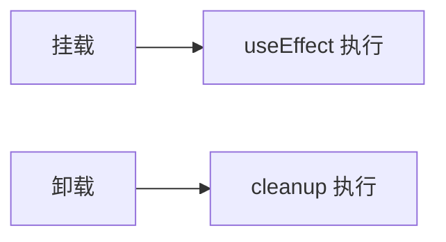

# 生命周期与 Hooks 对照表

> 维护遗留类组件或面试时，需要 **生命周期 ↔ Hooks** 的一一对照。本篇是速查表 + 迁移示例。

---

## 一、总对照表

| 类组件生命周期 | Hooks 等价 | 注意 |
|----------------|------------|------|
| `constructor` | `useState` 初值 | 勿重复算 derived state |
| `componentDidMount` | `useEffect(() => {}, [])` | |
| `componentDidUpdate` | `useEffect(() => {}, [dep])` | 比较 dep 替代 prevProps |
| `componentWillUnmount` | `useEffect(() => () => cleanup, [])` | cleanup 函数 |
| `shouldComponentUpdate` | `memo` + 自定义 compare | |
| `getDerivedStateFromProps` | 渲染时算 / key remount | 少用 derived state |
| `getSnapshotBeforeUpdate` | `useLayoutEffect` | DOM 测量 |
| `componentDidCatch` | **仍用 class** ErrorBoundary | |
| `this.setState` | `useState` / `useReducer` | |
| Context `static contextType` | `useContext` | |

---

## 二、挂载与卸载

```tsx
// 类
componentDidMount() {
  subscribe(this.handleChange);
}
componentWillUnmount() {
  unsubscribe(this.handleChange);
}

// Hooks
useEffect(() => {
  subscribe(handleChange);
  return () => unsubscribe(handleChange);
}, []);
```



---

## 三、props 变化

```tsx
// 类
componentDidUpdate(prevProps) {
  if (prevProps.id !== this.props.id) {
    fetchData(this.props.id);
  }
}

// Hooks
const { id } = props;
useEffect(() => {
  fetchData(id);
}, [id]);
```

**依赖数组即「何时相当于 didUpdate」**。

---

## 四、getDerivedStateFromProps 反模式

```tsx
// ❌ 旧：props → state 镜像
static getDerivedStateFromProps(props, state) {
  if (props.value !== state.prevValue) {
    return { value: props.value, prevValue: props.value };
  }
  return null;
}

// ✅ 受控：直接用 props.value
// ✅ 非受控 + key：key={props.id}  remount
```

见 [03-Props](../03-组件基础/02-Props与单向数据流.md)。

---

## 五、useLayoutEffect 对照

需要在 **浏览器绘制前** 读/写 DOM：

```tsx
useLayoutEffect(() => {
  const height = ref.current?.getBoundingClientRect().height;
  setTooltipPosition(height);
}, [open]);
```

对应 `getSnapshotBeforeUpdate` + `componentDidUpdate` 部分场景。

---

## 六、逻辑复用对照

| 类时代 | Hooks 时代 |
|--------|------------|
| HOC | 自定义 Hook |
| Render Props | 自定义 Hook |
| 生命周期复制粘贴 | `useXxx()` 一行 |

---

## 七、面试速记

| 问 | 答 |
|----|-----|
| didMount 对应？ | `useEffect(..., [])` |
| 卸载清理？ | effect return cleanup |
| 为何 Hooks 不能条件调用？ | 链表顺序稳定 |
| Error Boundary？ | 仍 class |

---

## 八、小结

| 文档 | |
|------|--|
| 本表作迁移速查 | |
| 详细 setState 见下一篇 | |

**上一篇**：[01-类组件语法与生命周期](./01-类组件语法与生命周期.md)  
**下一篇**：[03-setState机制与常见陷阱](./03-setState机制与常见陷阱.md)
