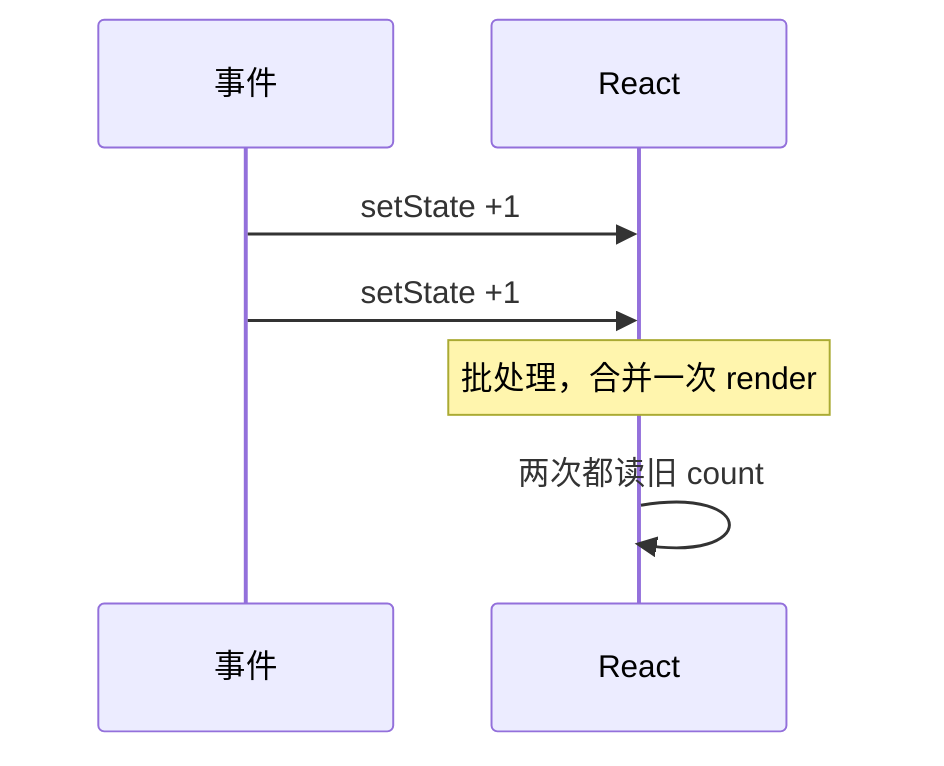

# setState 机制与常见陷阱

> 类组件的 **`this.setState`** 是**异步批量合并**的；函数组件的 **`useState`** 更新方式不同。读懂这些，才能解释「为什么连点两次只加 1」以及迁移时的行为差异。

---

## 一、setState 是合并，不是替换

```tsx
this.state = { a: 1, b: 2 };
this.setState({ a: 10 });
// 结果 { a: 10, b: 2 } — b 保留
```

| 误解 | 事实 |
|------|------|
| setState 替换整个 state | **浅合并** partial state |

---

## 二、异步与批处理

```tsx
handleClick = () => {
  this.setState({ count: this.state.count + 1 });
  this.setState({ count: this.state.count + 1 });
  // 可能只 +1：两次都基于同一 this.state.count
};
```



**函数式更新**：

```tsx
this.setState(prev => ({ count: prev.count + 1 }));
this.setState(prev => ({ count: prev.count + 1 }));
// 正确 +2
```

函数组件同理：

```tsx
setCount(c => c + 1);
setCount(c => c + 1);
```

见 [05-批处理](../06-渲染与调和/05-批处理与自动批处理.md)。

---

## 三、setState 回调（类专属）

```tsx
this.setState({ count: 1 }, () => {
  console.log(this.state.count); // 已更新
});
```

Hooks **无** 直接等价——用 `useEffect` 监听 state 或 `flushSync` 极少数场景。

---

## 四、常见陷阱

### 4.1 依赖旧 state 连调

```tsx
// ❌
this.setState({ value: this.state.value + 1 });
this.setState({ value: this.state.value + 1 });

// ✅
this.setState(s => ({ value: s.value + 1 }));
this.setState(s => ({ value: s.value + 1 }));
```

### 4.2 在 setState 后立即读

```tsx
this.setState({ open: true });
console.log(this.state.open); // 可能仍是 false
```

### 4.3 props + state 双源

```tsx
// ❌ props 变又 setState 镜像
componentDidUpdate(prev) {
  if (prev.id !== this.props.id) {
    this.setState({ data: fetch(...) }); // 应用 useEffect([id])
  }
}
```

### 4.4 可变 state 直接改

```tsx
// ❌
this.state.list.push(item);
this.setState({ list: this.state.list });

// ✅ 新引用
this.setState(s => ({ list: [...s.list, item] }));
```

---

## 五、与 useState 对比

| | class setState | useState |
|---|----------------|----------|
| 合并 | 自动浅合并 | 替换该 state 槽 |
| 多字段 | 一次对象 | 多个 useState 或 useReducer |
| 批处理 | React 18 自动批处理 | 同左 |
| 函数更新 | `setState(fn)` | `setState(fn)` |

```tsx
// useState 不合并多个字段到一个对象槽 — 每个 hook 独立
const [a, setA] = useState(1);
const [b, setB] = useState(2);
```

复杂对象用 `useReducer`。

---

## 六、forceUpdate

```tsx
this.forceUpdate(); // 跳过 shouldComponentUpdate
```

**避免使用**——找 root cause。Hooks 无等价物。

---

## 七、迁移提示

| 类模式 | Hook 模式 |
|--------|-----------|
| 多个 setState 字段 | `useReducer` |
| setState callback | `useEffect` |
| 连续依赖更新 | 函数式 setState |

---

## 八、小结

| 口诀 | |
|------|--|
| 合并非替换 | |
| 连改用函数式 | |
| 异步勿立刻读 | |

**上一篇**：[02-生命周期与Hooks对照表](./02-生命周期与Hooks对照表.md)  
**下一篇**：[04-类组件迁移策略与步骤](./04-类组件迁移策略与步骤.md)
