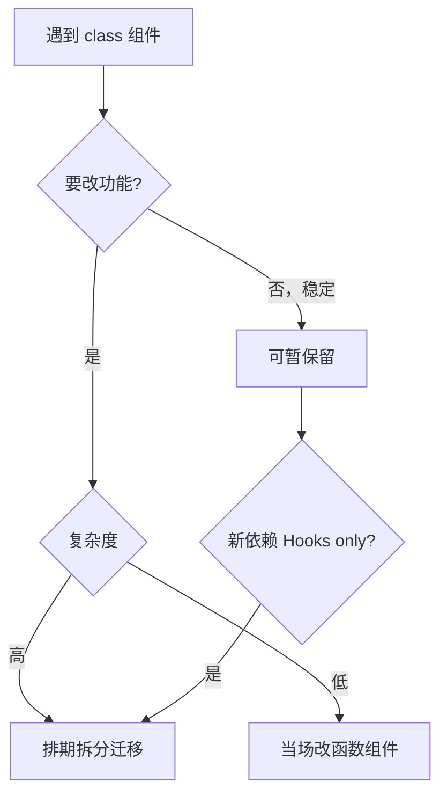
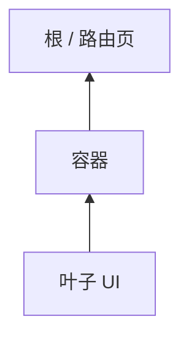

# 类组件迁移策略与步骤

遗留 **class** 不必一夜重写。按 **叶子优先、测试护航、codemod 辅助** 渐进迁移到函数组件 + Hooks。

---

## 何时迁移



| 迁移 | 可暂缓 |
|------|--------|
| 常改动的页面 | 稳定 Error Boundary class |
| 要用的新 Hook 库 | 第三方仅 class HOC 包装 |
| 团队规范禁止新 class | 纯展示、零 bug 的深层 leaf |

稳定不改的 class 可暂保留；要改功能或依赖 Hooks-only 库时应迁移。

---

## 迁移顺序

| 步骤 | 说明 |
|------|------|
| 1 | **补测试**（RTL）再动刀 |
| 2 | **叶子组件**先改（无子 class） |
| 3 | 提取 **自定义 Hook** 替代 lifecycle 逻辑 |
| 4 | 改 **容器组件** |
| 5 | 删除 dead code（UNSAFE 生命周期） |



**自底向上** 风险小。

---

## 单文件迁移模板

### Before（class）

```tsx
class UserCard extends Component<Props, State> {
  state = { expanded: false };

  componentDidMount() {
    trackView(this.props.userId);
  }

  toggle = () => this.setState(s => ({ expanded: !s.expanded }));

  render() {
    const { user } = this.props;
    const { expanded } = this.state;
    return (
      <div>
        <h3>{user.name}</h3>
        {expanded && <p>{user.bio}</p>}
        <button type="button" onClick={this.toggle}>展开</button>
      </div>
    );
  }
}
```

### After（函数 + Hooks）

```tsx
function UserCard({ user }: Props) {
  const [expanded, setExpanded] = useState(false);

  useEffect(() => {
    trackView(user.id);
  }, [user.id]);

  return (
    <div>
      <h3>{user.name}</h3>
      {expanded && <p>{user.bio}</p>}
      <button type="button" onClick={() => setExpanded(e => !e)}>展开</button>
    </div>
  );
}
```

state→useState，didMount→useEffect，class field→普通函数。

---

## 逻辑提取为 Hook

```tsx
function useUser(userId: string) {
  const [user, setUser] = useState<User | null>(null);

  useEffect(() => {
    let cancelled = false;
    fetchUser(userId).then(u => { if (!cancelled) setUser(u); });
    return () => { cancelled = true; };
  }, [userId]);

  return user;
}
```

多个 class 共享的生命周期逻辑 → 一个 Hook。

---

## codemod 工具

```bash
# react-codemod（Meta 官方集合，部分规则）
npx react-codemod class-to-function-component path/
```

| 工具 | 作用 |
|------|------|
| **react-codemod** | class → function 骨架 |
| **eslint ，fix** | 部分模式 |
| **TS 类型检查** | 改完 compile |

**codemod 后必人工 review + 测试**，生命周期语义不会 100% 自动对。

---

## Error Boundary 保留 class

```tsx
// 可单独保留 class 文件
class ErrorBoundary extends Component { ... }

// 其余全函数组件
export function App() {
  return (
    <ErrorBoundary>
      <Routes />
    </ErrorBoundary>
  );
}
```

或 `react-error-boundary` 包。

---

## 风险与回滚

| 风险 | 缓解 |
|------|------|
| effect 依赖错 | exhaustive-deps + 测试 |
| 双 mount Strict Mode | 清理函数 |
| 行为 subtle 差异 | 快照 + E2E 关键路径 |

小 PR、可回滚。

---

## 小结

测试先行、叶子优先、Hook 抽逻辑、codemod 辅助；小 PR 可回滚。

迁移决策：常改动或依赖 Hooks-only 库→迁移；稳定 Error Boundary→可暂缓。顺序：补测试→叶子组件→抽 Hook→容器组件→删 UNSAFE 生命周期。自底向上风险小。单文件：state→useState、didMount→useEffect、class field→函数。共享 lifecycle 逻辑抽自定义 Hook。react-codemod 辅助骨架，必人工 review。Error Boundary 可保留 class 或用 react-error-boundary。风险：effect 依赖错、Strict Mode 双 mount、行为差异，小 PR 可回滚。
