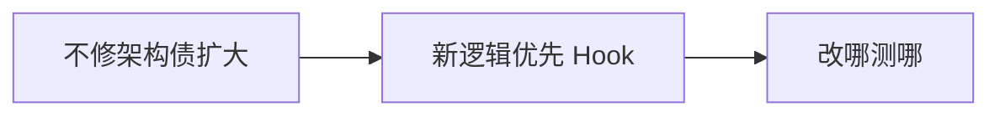

# 遗留类组件维护指南

短期内无法全部迁移时，如何在 **class 代码库** 里安全修 bug、加小需求，且**不扩大 class 面积**。

---

## 维护原则



| 原则 | 说明 |
|------|------|
| **不加新 class** | 新组件一律函数 |
| **最小 diff** | 修 bug 不顺手大重构 |
| **Hook 嵌入** | class 内无法直接用 Hook，抽子组件或 HOC |
| **文档标记** | `@deprecated migrate to UserCard.tsx fn` |

---

## 在 class 里用 Hooks

**不能**在 class 组件体内调用 Hooks。

| 需求 | 做法 |
|------|------|
| 用 Query | 子函数组件 `<UserListInner />` |
| 用自定义 Hook | 抽 `function UserListContainer()` 包 class 外 |
| 渐进替换 | class 变 thin wrapper |

```tsx
// 过渡：class 只包一层
class LegacyPage extends Component {
  render() {
    return <LegacyPageFn {...this.props} />;
  }
}

function LegacyPageFn(props: Props) {
  const data = useQuery(...);
  ...
}
```

class 变 thin wrapper，实际逻辑在子函数组件里用 Hooks。

---

## 读遗留生命周期

| 见到 | 小心 |
|------|------|
| `UNSAFE_*` | 并发下有问题，计划移除 |
| `componentWillReceiveProps` | 双源 state |
| 巨大 `componentDidUpdate` | 拆 effect 或 Query |
| `isMounted` flag | 用 cleanup 替代 |

---

## connect / mapStateToProps（Redux 旧）

```tsx
// 旧
export default connect(mapState)(UserList);

// 新：同文件或邻文件
function UserList() {
  const users = useAppSelector(s => s.users);
  ...
}
```

RTK 推荐 typed hooks，connect HOC 逐步替换为 useAppSelector/useAppDispatch。

---

## defaultProps 与 PropTypes

```tsx
// 旧
static defaultProps = { size: 'md' };
static propTypes = { size: PropTypes.string };

// TS 函数组件
interface Props {
  size?: 'sm' | 'md' | 'lg';
}
function Button({ size = 'md' }: Props) {}
```

PropTypes → **TypeScript**；defaultProps → 解构默认值。

---

## Code Review 要点

| 拒绝 | 允许 |
|------|------|
| 新 class 业务组件 | 修旧 class 一行 bug |
| class 里 copy 生命周期 | 抽 Hook 给新 fn 组件 |
| 新 HOC 层 | 自定义 Hook |

---

## 团队约定示例

```markdown
## Legacy React
- 禁止新增 extends Component（ErrorBoundary 除外）
- 修改 >50 行的 class 需评估迁移 ticket
- 新 feature 只用函数组件 + Hooks
```

---

## 与招聘/面试

维护遗留 ≠ 只会 class。能 **对照生命周期、安全迁移** 是资深表现。

---

## 小结

不扩大 class 面积；Hook 通过子函数组件桥接；修改>50 行 class 评估迁移 ticket。

遗留 class 维护原则：不加新 class（ErrorBoundary 除外）、最小 diff、Hook 通过子函数组件桥接、文档标记 @deprecated。class 内不能调 Hooks，抽子函数组件或 thin wrapper。识别 UNSAFE 生命周期、双源 state、巨大 didUpdate、isMounted flag。Redux connect→typed hooks。PropTypes→TypeScript，defaultProps→解构默认值。Code Review 拒绝新 class 业务组件和新 HOC。团队约定：禁止新 class、>50 行改动评估迁移 ticket、新 feature 只用函数组件。
