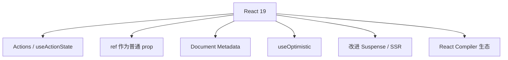

# React 19 要点

> **React 19**（2024 年底稳定）在 18 并发能力之上，强化 **Actions 表单**、**ref 作为 prop**、**Document Metadata** 等。本篇是总览地图，细节见本模块后续篇。

---

## 一、相对 React 18 的核心变化



| 特性 | 一句话 |
|------|--------|
| **Actions** | 表单 `action` 绑定异步函数，内置 pending |
| **useActionState** | action 的 state / error / pending |
| **useFormStatus** | 子组件读父 form pending |
| **ref as prop** | 少写 forwardRef |
| **`<title>` / `<meta>`** | 组件内声明文档元数据 |
| **useOptimistic** | 乐观 UI 官方 Hook |
| **hydration 改进** | 第三方 script 与流式更稳 |

---

## 二、升级注意

```bash
pnpm add react@^19 react-dom@^19
pnpm add -D @types/react@^19 @types/react-dom@^19
```

| 检查项 | |
|--------|--|
| `createRoot` 已用（非 legacy render） | |
| 第三方 UI 库是否支持 19 | |
| Next.js 15+ 与 React 19 对齐 | |
| Strict Mode 下 effect 双调用仍成立 | |

**破坏性变更**较少，但需跑测试与查依赖 peer。

---

## 三、Actions 预览

```tsx
async function createTodo(formData: FormData) {
  'use server'; // Next.js；纯 CSR 可为普通 async
  const title = formData.get('title');
  await saveTodo(title);
}

<form action={createTodo}>
  <input name="title" />
  <SubmitButton />
</form>
```

见 [02-Actions与useActionState](./02-Actions与useActionState.md)、[14-Server-Actions](../14-服务端与元框架/04-Server-Actions与表单变更.md)。

---

## 四、useActionState

```tsx
import { useActionState } from 'react';

const [state, formAction, isPending] = useActionState(submitAction, null);
```

替代手写 `useState(loading)` + `try/catch` 的表单提交模式。

---

## 五、ref 作为 prop（React 19）

```tsx
// 以前需要 forwardRef
function Input({ ref, ...props }: { ref?: React.Ref<HTMLInputElement> }) {
  return <input ref={ref} {...props} />;
}
```

逐步减少 `forwardRef` 样板；库迁移期可能双支持。

---

## 六、Document Metadata

```tsx
function BlogPost({ post }: { post: Post }) {
  return (
    <>
      <title>{post.title}</title>
      <meta name="description" content={post.summary} />
      <article>{post.body}</article>
    </>
  );
}
```

React 提升到 `document.head`（需框架或 react-dom 环境支持）。

---

## 七、useOptimistic

```tsx
const [optimisticTodos, addOptimistic] = useOptimistic(todos, (state, newTodo) => [
  ...state,
  { ...newTodo, pending: true },
]);
```

与 Server Action 配合做乐观列表更新。

---

## 八、与 Compiler 关系

React 19 **不强制** Compiler；Compiler 独立 babel 插件，自动 memo。见 [03-React-Compiler概览](./03-React-Compiler概览.md)。

---

## 九、时间线定位

| 版本 | 关键词 |
|------|--------|
| 16.8 | Hooks |
| 18 | Concurrent、Suspense、createRoot |
| 19 | Actions、ref、Metadata、Compiler 落地 |

见 [02-发展脉络](../01-认知与生态/02-React发展脉络与版本演进.md)。

---

## 十、小结

| 优先学 | |
|--------|--|
| Actions / useActionState | |
| 升级与依赖兼容 | |
| Compiler 作性能可选 | |

**下一篇**：[02-Actions与useActionState](./02-Actions与useActionState.md)
