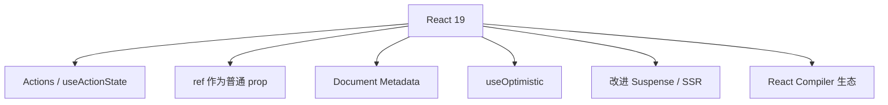

# React 19 要点

**React 19**（2024 年底稳定）在 18 并发能力之上，强化 **Actions 表单**、**ref 作为 prop**、**Document Metadata** 等。本篇是总览，细节见本模块后续篇。

---

## 相对 React 18 的核心变化



| 特性 | 一句话 |
|------|--------|
| **Actions** | 表单 `action` 绑定异步函数，内置 pending |
| **useActionState** | action 的 state / error / pending |
| **useFormStatus** | 子组件读父 form pending |
| **ref as prop** | 少写 forwardRef |
| **`<title>` / `<meta>`** | 组件内声明文档元数据 |
| **useOptimistic** | 乐观 UI 官方 Hook |
| **hydration 改进** | 第三方 script 与流式更稳 |

---

## 升级注意

```bash
pnpm add react@^19 react-dom@^19
pnpm add -D @types/react@^19 @types/react-dom@^19
```

| 检查项 | |
|--------|，|
| `createRoot` 已用（非 legacy render） | |
| 第三方 UI 库是否支持 19 | |
| Next.js 15+ 与 React 19 对齐 | |
| Strict Mode 下 effect 双调用仍成立 | |

**破坏性变更**较少，但需跑测试与查依赖 peer。

---

## Actions 预览

```tsx
async function createTodo(formData: FormData) {
  'use server'; // Next.js；纯 CSR 可为普通 async
  const title = formData.get('title');
  await saveTodo(title);
}

<form action={createTodo}>
  <input name="title" />
  <SubmitButton />
</form>
```

Actions 把表单提交变成声明式 `form action={fn}`，框架自动处理 pending。

---

## useActionState

```tsx
import { useActionState } from 'react';

const [state, formAction, isPending] = useActionState(submitAction, null);
```

替代手写 `useState(loading)` + `try/catch` 的表单提交模式。

---

## ref 作为 prop（React 19）

```tsx
// 以前需要 forwardRef
function Input({ ref, ...props }: { ref?: React.Ref<HTMLInputElement> }) {
  return <input ref={ref} {...props} />;
}
```

逐步减少 `forwardRef` 样板；库迁移期可能双支持。

---

## Document Metadata

```tsx
function BlogPost({ post }: { post: Post }) {
  return (
    <>
      <title>{post.title}</title>
      <meta name="description" content={post.summary} />
      <article>{post.body}</article>
    </>
  );
}
```

React 提升到 `document.head`（需框架或 react-dom 环境支持）。

---

## useOptimistic

```tsx
const [optimisticTodos, addOptimistic] = useOptimistic(todos, (state, newTodo) => [
  ...state,
  { ...newTodo, pending: true },
]);
```

与 Server Action 配合做乐观列表更新。

---

## 与 Compiler 关系

React 19 **不强制** Compiler；Compiler 独立 babel 插件，自动 memo。两者解耦发布。

---

## 时间线定位

| 版本 | 关键词 |
|------|--------|
| 16.8 | Hooks |
| 18 | Concurrent、Suspense、createRoot |
| 19 | Actions、ref、Metadata、Compiler 落地 |

---

## 小结

React 19 强化 Actions、ref as prop、Document Metadata；升级查依赖 peer，Compiler 独立可选。

React 19 在 18 并发基础上新增：Actions/useActionState（表单 pending 一等公民）、ref as prop（减少 forwardRef）、Document Metadata（组件内 title/meta）、useOptimistic（乐观 UI）、hydration 改进。升级：react@19 + @types@19，查 createRoot、第三方库 peer、Next.js 15+。Compiler 独立可选，不强制。版本线：16.8 Hooks → 18 Concurrent → 19 Actions + Compiler 生态。
