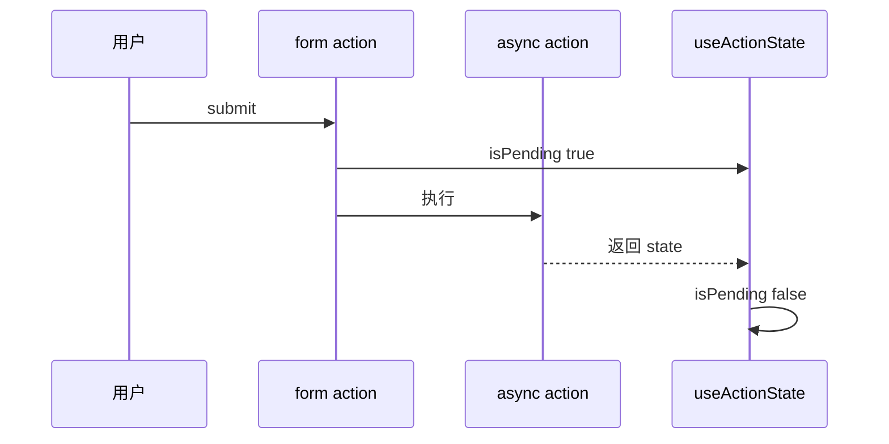

# Actions 与 useActionState

**Actions** 把「提交表单 / 调服务端」变成 React 一等公民：`form action={fn}` 自动处理 **pending**、**错误** 与 **渐进增强**。`useActionState` 把返回值绑到 UI。

---

## 数据流



| 传统 | Actions |
|------|---------|
| onSubmit preventDefault + fetch | 声明式 `action` |
| 手写 loading | pending 自动 |
| 错误 try/catch | action 返回或 throw |

---

## useActionState 基础

```tsx
import { useActionState } from 'react';

interface ActionState {
  error?: string;
  success?: boolean;
}

async function loginAction(
  _prev: ActionState | null,
  formData: FormData,
): Promise<ActionState> {
  const email = formData.get('email') as string;
  if (!email) return { error: '请输入邮箱' };

  try {
    await apiLogin(email, formData.get('password') as string);
    return { success: true };
  } catch {
    return { error: '登录失败' };
  }
}

function LoginForm() {
  const [state, formAction, isPending] = useActionState(loginAction, null);

  return (
    <form action={formAction}>
      <input name="email" type="email" disabled={isPending} />
      <input name="password" type="password" disabled={isPending} />
      {state?.error && <p role="alert">{state.error}</p>}
      {state?.success && <p>欢迎回来</p>}
      <button type="submit" disabled={isPending}>
        {isPending ? '登录中…' : '登录'}
      </button>
    </form>
  );
}
```

| 参数 | 含义 |
|------|------|
| 第 1 个参数 | `(prevState, formData) => newState` |
| 第 2 个参数 | 初始 state |
| 返回 `[state, action, isPending]` | |

---

## useFormStatus

在 **form 子组件** 读 pending，无需 props 下钻：

```tsx
import { useFormStatus } from 'react-dom';

function SubmitButton() {
  const { pending } = useFormStatus();
  return (
    <button type="submit" disabled={pending}>
      {pending ? '提交中…' : '提交'}
    </button>
  );
}

// 须在 <form> 内部使用
<form action={formAction}>
  ...
  <SubmitButton />
</form>
```

---

## 与 useTransition

| useActionState | useTransition |
|----------------|---------------|
| 表单 / action 专用 | 任意低优先级 setState |
| 内置 prevState | 无 form 语义 |
| 与 form action 绑定 | startTransition(fn) |

搜索过滤仍用 `startTransition`，表单提交优先 Actions。

---

## Server Action（Next.js）

```tsx
'use server';
export async function createItem(formData: FormData) {
  await db.item.create(...);
  revalidatePath('/items');
}
```

客户端：

```tsx
import { createItem } from './actions';
const [state, action, pending] = useActionState(createItem, null);
```

---

## 非表单 action

```tsx
<button formAction={deleteAction}>删除</button>
```

或 `action` 接受非 FormData（视环境 API）。

---

## 错误处理

```tsx
async function action(prev, formData) {
  try {
    ...
    return { ok: true };
  } catch (e) {
    return { error: e instanceof Error ? e.message : '失败' };
  }
}
```

严重错误可 `throw`，由 Error Boundary 捕（少用）。

---

## 与 React Hook Form

| RHF | Actions |
|-----|---------|
| 客户端校验、复杂字段 | 原生 form + Server Action |
| 可并存 | RHF handleSubmit 内调 action |

中后台复杂表单仍常 RHF；简单 CRUD 用 Actions 更短。

---

## 小结

form action 绑定异步函数，useActionState 管 state/pending，useFormStatus 读子组件 pending。

Actions 数据流：submit → isPending true → action 执行 → 返回 state → isPending false。useActionState 接收 `(prevState, formData) => newState` 和初始 state，返回 `[state, formAction, isPending]`。useFormStatus 在 form 子组件读 pending，无需 props 下钻。与 useTransition 分工：表单用 Actions，搜索过滤用 transition。Next.js Server Action 用 'use server' + revalidatePath。错误在 action 内 try/catch 返回；复杂表单可与 RHF 并存。
