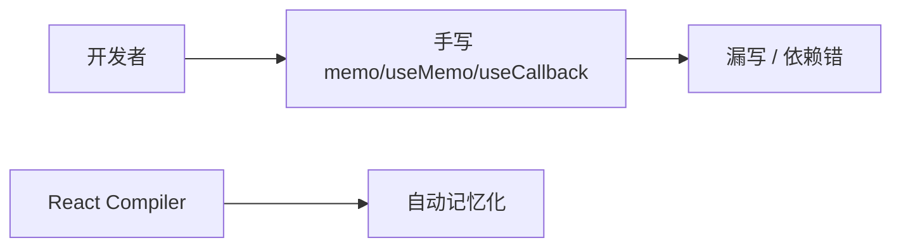

# React Compiler 概览

> **React Compiler**（原 React Forget）在**构建期**分析组件，自动插入 **memo / useMemo / useCallback** 等价优化，目标：**少手写性能 Hook，且不改变语义**。

---

## 一、解决什么问题？



| 痛点 | Compiler |
|------|----------|
| 不知何时 memo | 编译器分析数据流 |
| deps 数组错 | 自动推导 |
| 过度优化样板 | 减代码量 |

**仍建议**理解 [11-性能优化](../11-性能优化/)——未启用 Compiler 时要会手动优化。

---

## 二、工作原理（概念）

1. 分析组件与 Hooks 的**可变范围**  
2. 对「可缓存且有益」的 JSX / 计算插入 cache  
3. 生成等价但更少的 re-render  

| 不是 | 是 |
|------|-----|
| 运行时魔法 | **Babel 插件** 编译时 |
| 替代 Fiber | 配合现有 reconciler |

---

## 三、使用方式（概览）

```bash
pnpm add -D babel-plugin-react-compiler
```

```js
// babel.config.js 示意
module.exports = {
  plugins: [
    ['babel-plugin-react-compiler', { /* options */ }],
  ],
};
```

Next.js 15+ 可选 `experimental.reactCompiler: true`。

| 阶段 | 建议 |
|------|------|
| 试验 | 单模块 opt-in |
| 稳定后 | 全项目开启 + 回归测试 |

---

## 四、与手动 memo 对比

| | 手动 memo | Compiler |
|---|-----------|----------|
| 控制 | 精确 | 自动 |
| 风险 | deps 错 | 边界 case 需测 |
| 代码量 | 多 | 少 |
| 调试 | 熟悉 | 看编译产物 |

**规则不变**：状态下沉、虚拟列表、拆包仍需要。

---

## 五、opt-out

编译器支持跳过特定组件（注解或配置），用于：

| 场景 | |
|------|--|
| 与 imperative 第三方库冲突 | |
| 实测 Compiler 反而变慢 | |
| 调试期对比 | |

查阅官方 `use no memo` 等 pragma（随版本演进）。

---

## 六、与 React 19

- React 19 **核心库**与 Compiler **解耦发布**  
- Meta 长期目标：新代码默认开 Compiler  
- 类组件 **不** 是 Compiler 主要目标（函数组件）

---

## 七、团队采纳 Checklist

| ☐ | 项 |
|---|-----|
| ☐ | React 19 + 现代构建链 |
| ☐ | Profiler 基线对比 |
| ☐ | 关键路径 E2E |
| ☐ | 文档：新人少写 useMemo「习惯」 |

---

## 八、小结

| 记住 | |
|------|--|
| 构建期自动 memo | |
| 不替代架构级性能优化 | |
| 渐进启用 | |

**上一篇**：[02-Actions与useActionState](./02-Actions与useActionState.md)  
**下一篇**：[04-React19迁移与升级指南](./04-React19迁移与升级指南.md)
