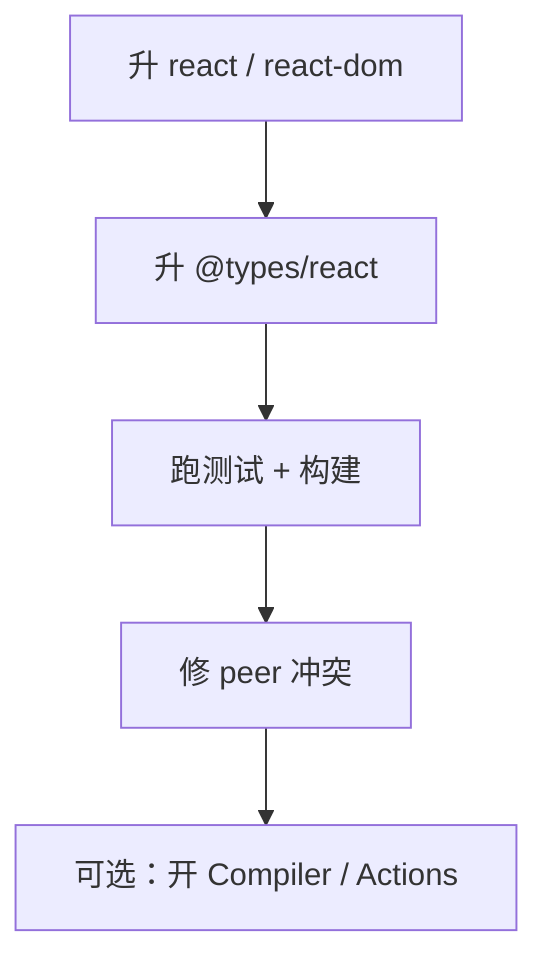

# React 19 迁移与升级指南

> 从 React 18 升到 **19** 多数项目**平滑**，重点在 **依赖兼容、类型、弃用 API 清理** 与 **Actions 渐进采纳**。

---

## 一、升级步骤



```bash
pnpm add react@^19 react-dom@^19
pnpm add -D @types/react@^19 @types/react-dom@^19
pnpm test --run
pnpm build
```

---

## 二、常见依赖问题

| 现象 | 处理 |
|------|------|
| peer dependency 警告 | 等库发版或 pnpm overrides（谨慎） |
| `@types/react` 冲突 | 统一 19 |
| Next.js 版本 | 用文档推荐的 15.x |
| 测试库 | @testing-library/react 新版本 |

---

## 三、API 变更速查

| 变更 | 迁移 |
|------|------|
| `forwardRef` 可选 | 新组件直接 `ref` prop |
| `useFormState` 重命名 | → `useActionState` |
| `ref` 清理回调 | 仍支持 |
| `defaultProps` 函数组件 | 用默认参数（已弃用多年） |
| String ref | 早已移除 |

---

## 四、行为差异注意

| 项 | 说明 |
|----|------|
| Strict Mode | effect 仍双调用（开发） |
| Suspense | 边界行为微调，测异步页 |
| hydrate | 错误信息更清晰 |
| `useId` | 前缀格式可能变，勿依赖具体字符串 |

---

## 五、渐进采纳 Actions

| 阶段 | 做法 |
|------|------|
| 1 | 保持现有 onSubmit + Query |
| 2 | 新简单表单用 `useActionState` |
| 3 | Next 项目 Server Action + revalidate |

不必一次改完全部表单。

---

## 六、Compiler 启用

1. 在 staging 开 Compiler  
2. Profiler 对比核心页  
3. 无回归再 production  

见 [03-Compiler](./03-React-Compiler概览.md)。

---

## 七、回滚策略

| | |
|--|--|
| lockfile 锁 18 | |
| 特性开关分 PR | |
| 监控错误率 | |

---

## 八、小结

| 优先级 | |
|--------|--|
| 依赖与测试绿 | |
| 新 API 按需采纳 | |
| Compiler 可选 | |

**上一篇**：[03-React-Compiler概览](./03-React-Compiler概览.md)  
**下一模块**：[19-跨端与集成](../19-跨端与集成/01-React-Native概览.md)
