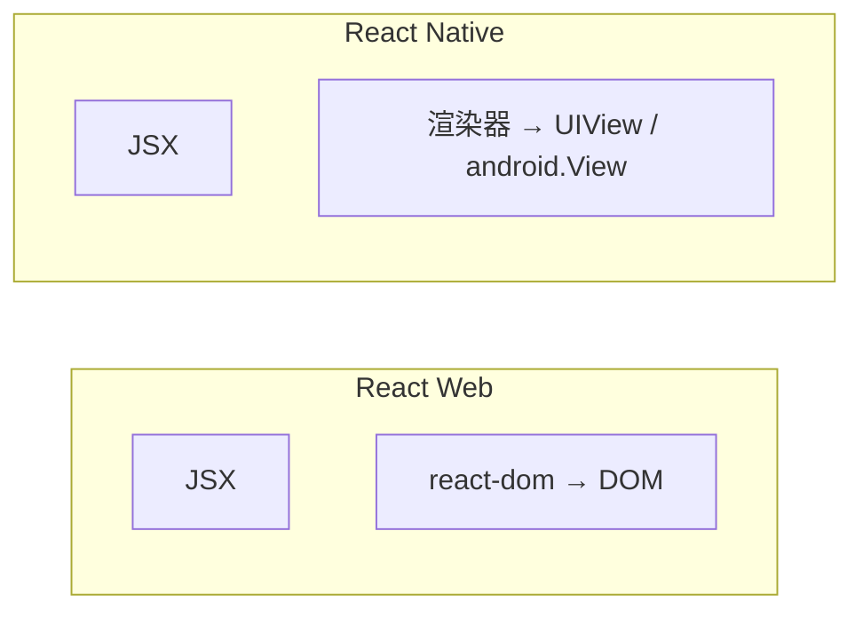

# React Native 概览

**React Native（RN）** 用 React 写 **iOS / Android**（及 Web）界面，渲染为**原生组件**而非 DOM。语法像 React，运行时与 Web 不同。

---

## Web React vs RN



| | Web | RN |
|---|-----|-----|
| 容器 | div、span | View、Text |
| 样式 | CSS 文件 | StyleSheet（类似 CSS 子集） |
| 路由 | React Router | React Navigation / Expo Router |
| 打包 | Vite/Webpack | Metro |

---

## 最小示例

```tsx
import { View, Text, Pressable, StyleSheet } from 'react-native';
import { useState } from 'react';

export function Counter() {
  const [n, setN] = useState(0);
  return (
    <View style={styles.box}>
      <Text>{n}</Text>
      <Pressable onPress={() => setN(n + 1)}>
        <Text>加一</Text>
      </Pressable>
    </View>
  );
}

const styles = StyleSheet.create({
  box: { padding: 16, alignItems: 'center' },
});
```

| Web | RN |
|-----|-----|
| `<div>` | `<View>` |
| `<button>` | `<Pressable>` / `<Button>` |
| `onClick` | `onPress` |
| `className` | `style` |

---

## Expo vs 裸 RN

| | Expo | 裸 RN |
|---|------|-------|
| 上手 | `npx create-expo-app` | 需 Xcode/Android Studio |
| 原生模块 | Expo SDK | 自行 link |
| OTA 更新 | EAS Update | 自建 |
| 适用 | 多数 App | 深度原生定制 |

**新项目**常从 **Expo** 开始。

---

## 与 Web 代码共享

| 可共享 | 需分叉 |
|--------|--------|
| 业务逻辑 Hook | JSX 组件（除非 react-native-web） |
| TanStack Query | 路由、布局 |
| TS 类型、utils | 样式 |
| Zustand | 部分 UI 库 |

Monorepo 结构：

```
packages/
├── app-mobile/     # RN
├── app-web/        # Vite
└── shared/         # hooks、api、types
```

---

## 导航

```tsx
// Expo Router 文件路由（类似 Next）
// app/(tabs)/index.tsx
// app/user/[id].tsx
```

或 **React Navigation** 声明式栈/Tab。

---

## 调试与性能

| 工具 | |
|------|，|
| Flipper / React Native DevTools | |
| Hermes 引擎 | 默认 JS 引擎 |
| 列表 | FlatList 虚拟化（类似 Web 虚拟列表） |

---

## 何时选 RN

| ✅ | ❌ |
|----|-----|
| 要原生体验 App | 纯 H5 够用 |
| 团队会 React | 强依赖 DOM/SEO |
| 一套逻辑移动+Web（+ RN Web） | 极简静态页 |

---

## 小结

RN 用 View/Text 替 div/span，Expo 降低门槛；业务 Hook 可 monorepo 共享，JSX 通常分叉。

React Native 用 React 语法写 iOS/Android，渲染原生组件而非 DOM。View/Text/Pressable 对应 div/span/button，StyleSheet 替代 CSS，Metro 打包。Expo 降低上手门槛，裸 RN 适合深度原生定制。与 Web 共享：Hook、Query、类型、utils；分叉：JSX、样式、路由。导航用 Expo Router 或 React Navigation。调试：Flipper、Hermes、FlatList 虚拟化。选型：要原生 App 且团队会 React → RN；纯 H5/SEO → Web。
