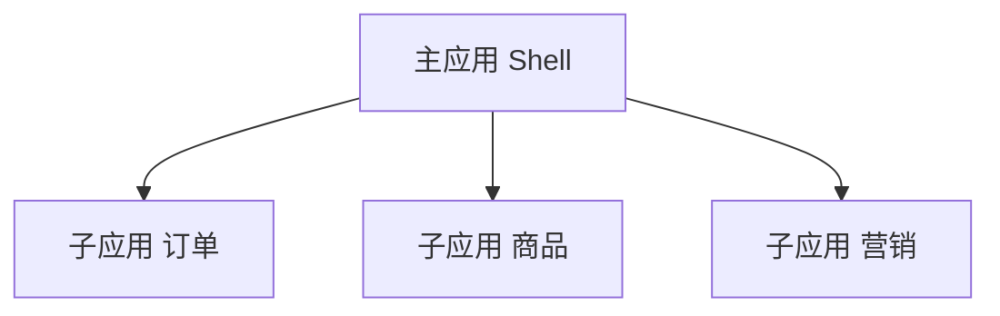
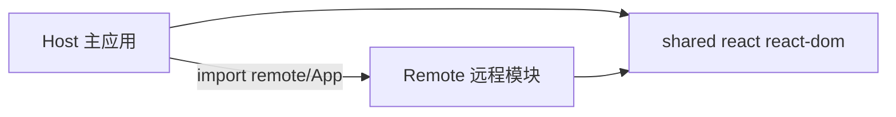
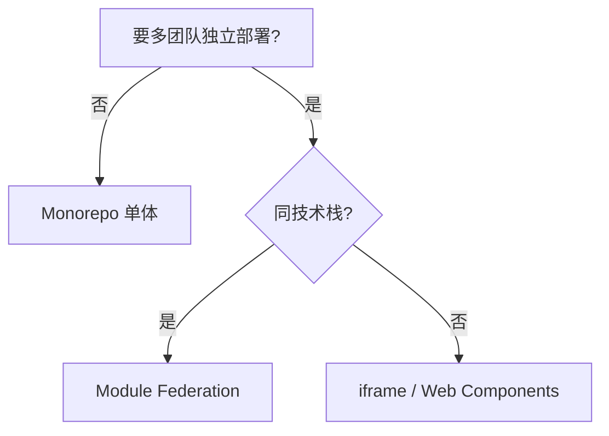

# 微前端与模块联邦

**微前端**把大前端拆成**可独立部署**的子应用；**模块联邦（Module Federation）**让运行时**动态加载**远程 bundle，共享 React 等依赖。

---

## 为什么微前端



| 动机 | 说明 |
|------|------|
| 团队自治 | 各组独立发版 |
| 技术异构 | 不同 React 版本（有代价） |
| 渐进迁移 | 老系统嵌入新 React 岛 |

| 代价 | 说明 |
|------|------|
| 复杂度、性能、一致性 | 运维与版本契约成本 |
| 样式/状态隔离难 | 需约定 CSS 前缀、通信边界 |

**默认单体**；确有多团队并行再考虑。

---

## React Host 集成实战

工程化层面的架构选型见 [09-微前端与模块联邦](../../前端工程化体系/09-微前端与模块联邦.md)；本节聚焦 **React 运行时集成**。

### Webpack / Rspack Module Federation

**Remote（子应用）**：

```javascript
// apps/order/webpack.config.js
const { ModuleFederationPlugin } = require('@module-federation/enhanced/webpack');

module.exports = {
  plugins: [
    new ModuleFederationPlugin({
      name: 'orderApp',
      filename: 'remoteEntry.js',
      exposes: {
        './OrderRoutes': './src/bootstrap',
      },
      shared: {
        react: { singleton: true, requiredVersion: '^19.0.0', eager: false },
        'react-dom': { singleton: true, requiredVersion: '^19.0.0' },
        'react-router-dom': { singleton: true },
      },
    }),
  ],
};
```

**Host（主应用）**：

```tsx
// apps/shell/src/App.tsx
import { lazy, Suspense } from 'react';

const OrderRoutes = lazy(() => import('orderApp/OrderRoutes'));

export function App() {
  return (
    <Suspense fallback={<div>加载订单模块…</div>}>
      <OrderRoutes basename="/order" />
    </Suspense>
  );
}
```

**子应用独立路由（MemoryRouter）**：

```tsx
// apps/order/src/bootstrap.tsx
import { MemoryRouter, Routes, Route } from 'react-router-dom';
import { OrderList } from './pages/OrderList';

export default function OrderRoutes({ basename = '/' }: { basename?: string }) {
  return (
    <MemoryRouter basename={basename}>
      <Routes>
        <Route path="/" element={<OrderList />} />
      </Routes>
    </MemoryRouter>
  );
}
```

### Vite + @originjs/vite-plugin-federation

```typescript
// host/vite.config.ts
import federation from '@originjs/vite-plugin-federation';

export default defineConfig({
  plugins: [
    react(),
    federation({
      name: 'host',
      remotes: {
        orderApp: 'https://cdn.example.com/order/assets/remoteEntry.js',
      },
      shared: ['react', 'react-dom', 'react-router-dom'],
    }),
  ],
});
```

---

## qiankun 加载 React 子应用

```tsx
// micro-app/src/index.tsx — 子应用入口
import React from 'react';
import { createRoot, Root } from 'react-dom/client';
import App from './App';

let root: Root | null = null;

export async function mount(props: { container?: HTMLElement }) {
  const el = props.container?.querySelector('#root') ?? document.getElementById('root')!;
  root = createRoot(el);
  root.render(<App basename={window.__POWERED_BY_QIANKUN__ ? '/order' : '/'} />);
}

export async function unmount() {
  root?.unmount();
  root = null;
}

if (!(window as any).__POWERED_BY_QIANKUN__) {
  mount({});
}
```

主应用 `registerMicroApps` + `start()` 后，子应用须保证 **unmount 时清理** Portal、全局监听器与 QueryClient，避免内存泄漏。

---

## 样式隔离（React 侧）

| 方案 | 做法 |
|------|------|
| CSS Modules | `import styles from './App.module.css'` |
| CSS-in-JS | styled-components 自动生成 scoped class |
| 约定前缀 | `.order-app__` BEM，主应用 `:global` 不污染 |
| Shadow DOM | 较少用，与 Portals 交互复杂 |

---

## 集成方式对比

| 方式 | 原理 | 特点 |
|------|------|------|
| **iframe** | 完全隔离 | 简单、SEO/路由差 |
| **Web Components** | 自定义元素 | 框架无关 |
| **Module Federation** | 共享运行时加载 remote | Webpack/Rspack/Vite 插件 |
| **qiankun** | 沙箱 + 生命周期 | 国内方案 |
| **单仓 Monorepo** | 非运行时拆分 | 推荐优先 |

---

## Module Federation 概念



| 角色 | 职责 |
|------|------|
| **Host** | 消费远程组件 |
| **Remote** | 暴露 `./App` 等 |
| **shared** | 单例 React，避免双实例 |

```js
// vite-plugin-federation 示意
federation({
  name: 'host',
  remotes: { remoteApp: 'http://localhost:5001/assets/remoteEntry.js' },
  shared: ['react', 'react-dom'],
});
```

---

## React 双实例问题

| 症状 | 原因 |
|------|------|
| Invalid hook call | 两套 React |
| Context 失效 | 不同 reconciler |

**必须** shared 配置 `singleton: true`，版本对齐。

---

## 路由与样式

| 话题 | 做法 |
|------|------|
| 路由 | 主应用分配 basename；子应用 MemoryRouter |
| CSS | CSS Modules、Shadow DOM、或约定前缀 |
| 全局状态 | 尽量少共享；事件总线或 URL |

---

## 选型建议



---

## 小结

微前端解决组织并行；Module Federation 须 React singleton，默认优先 Monorepo 单体。

微前端动机：多团队独立部署、技术异构、渐进迁移；代价是复杂度和隔离难。集成方式：iframe（隔离简单）、Web Components、Module Federation（动态加载 remote）、qiankun、Monorepo（推荐优先）。MF 角色：Host 消费、Remote 暴露、shared 单例 React。双 React 实例导致 Invalid hook call 和 Context 失效，shared 必须 singleton。路由用 basename + MemoryRouter，CSS 用 Modules/前缀。选型：不需独立部署→Monorepo；同技术栈→MF；异构→iframe/WC。
