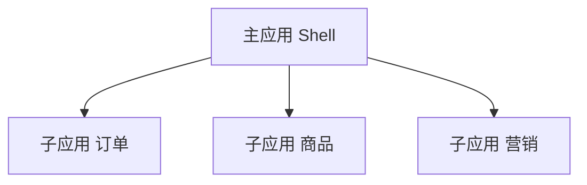
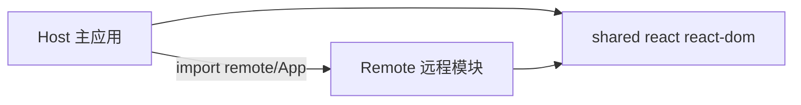
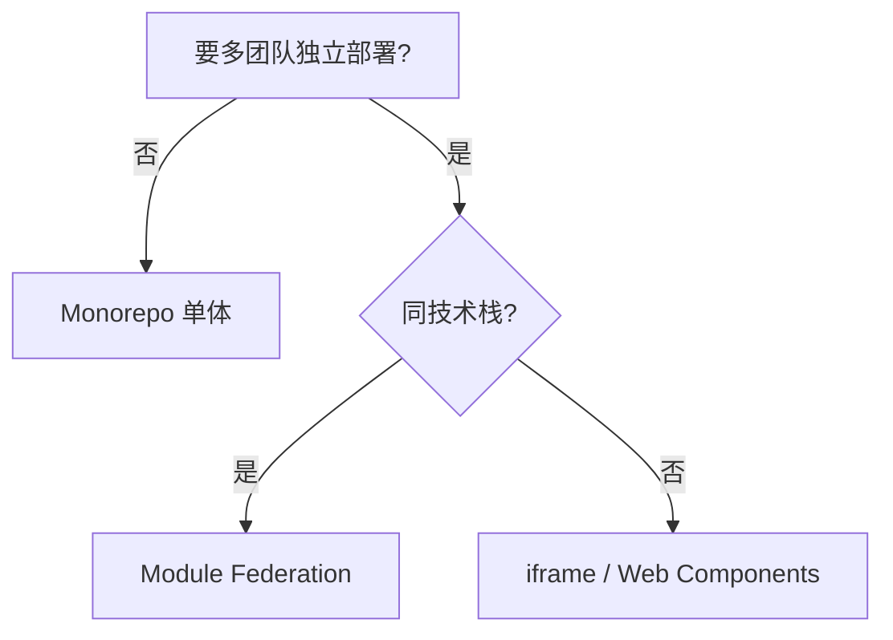

# 微前端与模块联邦

> **微前端**把大前端拆成**可独立部署**的子应用；**模块联邦（Module Federation）**让运行时**动态加载**远程 bundle，共享 React 等依赖。

---

## 一、为什么微前端？



| 动机 | 说明 |
|------|------|
| 团队自治 | 各组独立发版 |
| 技术异构 | 不同 React 版本（有代价） |
| 渐进迁移 | 老系统嵌入新 React 岛 |

| 代价 | |
|------|--|
| 复杂度、性能、一致性 | |
| 样式/状态隔离难 | |

**默认单体**；确有多团队并行再考虑。

---

## 二、集成方式对比

| 方式 | 原理 | 特点 |
|------|------|------|
| **iframe** | 完全隔离 | 简单、SEO/路由差 |
| **Web Components** | 自定义元素 | 框架无关 |
| **Module Federation** | 共享运行时加载 remote | Webpack/Rspack/Vite 插件 |
| **qiankun** | 沙箱 + 生命周期 | 国内方案 |
| **单仓 Monorepo** | 非运行时拆分 | 推荐优先 |

---

## 三、Module Federation 概念



| 角色 | 职责 |
|------|------|
| **Host** | 消费远程组件 |
| **Remote** | 暴露 `./App` 等 |
| **shared** | 单例 React，避免双实例 |

```js
// vite-plugin-federation 示意
federation({
  name: 'host',
  remotes: { remoteApp: 'http://localhost:5001/assets/remoteEntry.js' },
  shared: ['react', 'react-dom'],
});
```

---

## 四、React 双实例问题

| 症状 | 原因 |
|------|------|
| Invalid hook call | 两套 React |
| Context 失效 | 不同 reconciler |

**必须** shared 配置 `singleton: true`，版本对齐。

---

## 五、路由与样式

| 话题 | 做法 |
|------|------|
| 路由 | 主应用分配 basename；子应用 MemoryRouter |
| CSS | CSS Modules、Shadow DOM、或约定前缀 |
| 全局状态 | 尽量少共享；事件总线或 URL |

---

## 六、选型建议



---

## 七、小结

| 要点 | |
|------|--|
| 微前端是组织问题 | |
| Federation 动态加载 | |
| React 必须单例 | |

**上一篇**：[01-React-Native概览](./01-React-Native概览.md)  
**下一篇**：[03-嵌入非React页面与渐进迁移](./03-嵌入非React页面与渐进迁移.md)
