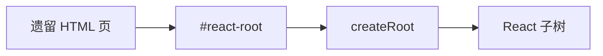

# 嵌入非 React 页面与渐进迁移

> 老项目（jQuery、Vue 页、PHP 模板）里**局部上 React**，或 **React 应用挂到单个 DOM 节点**——是多数团队的真实迁移路径，而非一夜重写。

---

## 一、挂载模式



```tsx
// entry.tsx
import { createRoot } from 'react-dom/client';
import { DashboardWidget } from './DashboardWidget';

const el = document.getElementById('dashboard-widget');
if (el) {
  createRoot(el).render(<DashboardWidget />);
}
```

| 场景 | 做法 |
|------|------|
| 单 widget | 一个 createRoot |
| 多岛 | 多个 root，互不影响 |
| 整页逐步替换 | 岛越来越大 |

---

## 二、与后端模板共存

```html
<!-- Rails / Django / PHP -->
<div id="user-panel"></div>
<script type="module" src="/assets/user-panel.js"></script>
```

| 注意 | |
|------|--|
| 构建产物独立 entry | |
| 避免污染全局 `$` | |
| CSRF token 从 meta 注入 props |

```tsx
createRoot(el).render(
  <UserPanel csrfToken={document.querySelector('meta[name=csrf]')?.content} />,
);
```

---

## 三、从 jQuery 迁出

| 步骤 | |
|------|--|
| 1 新功能用 React 岛 | |
| 2 旧 DOM 区域冻结，仅修 bug | |
| 3 抽数据层 API，岛消费同一 REST | |
| 4 岛合并为 SPA（可选） | |

**勿** jQuery 与 React 同时操作同一 DOM 子树。

---

## 四、与 Vue / Angular 并存

| 方式 | |
|------|--|
| 不同路由页不同框架 | |
| Web Components 包 React | |
| 微前端壳子切换 | |

React 岛内仍遵守 **单 root 单 React 树**。

---

## 五、样式隔离

| 手段 | |
|------|--|
| CSS Modules / scoped | |
| 前缀 `.react-app` 包一层 | |
| Shadow DOM（少用） | |

避免 Bootstrap 全局与 Tailwind preflight 冲突。

---

## 六、状态与通信

```tsx
// 自定义事件与遗留通信
window.addEventListener('legacy:cart-updated', (e) => {
  queryClient.invalidateQueries({ queryKey: ['cart'] });
});
```

| 方式 | 场景 |
|------|------|
| 自定义事件 | 与遗留脚本 |
| URL / localStorage | 简单共享 |
| 后端为真相 | 推荐 |

---

## 七、构建配置

```ts
// vite.config 多入口
build: {
  rollupOptions: {
    input: {
      main: 'index.html',
      widget: 'src/widget-entry.tsx',
    },
  },
},
```

---

## 八、小结

| 原则 | |
|------|--|
| createRoot 挂岛 | |
| 不双框架同 DOM | |
| 渐进扩大 React 范围 | |

**上一篇**：[02-微前端与模块联邦](./02-微前端与模块联邦.md)  
**下一篇**：[04-动画与手势](./04-动画与手势.md)
