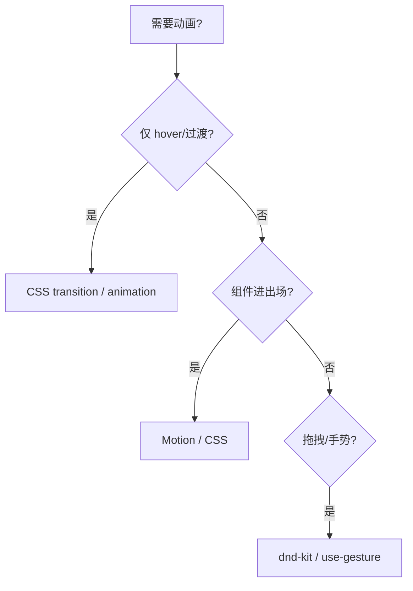

# 动画与手势

> React 里做动画：**CSS 优先**；复杂序列用 **Motion（Framer Motion）**；列表重排可用 **View Transitions**；手势与拖拽有专用库。原则：**不阻塞主线程、尊重 prefers-reduced-motion**。

---

## 一、选型地图



| 方案 | 场景 |
|------|------|
| **CSS** | 颜色、opacity、简单位移 |
| **Motion** | Modal、页面过渡、layout 动画 |
| **react-spring** | 物理弹簧 |
| **@dnd-kit** | 拖拽排序 |
| **View Transitions API** | 路由/主题切换（浏览器） |

---

## 二、CSS 动画（首选）

```tsx
function Card({ visible }: { visible: boolean }) {
  return (
    <div className={visible ? 'card card--in' : 'card card--out'}>
      ...
    </div>
  );
}
```

```css
.card {
  transition: opacity 0.2s, transform 0.2s;
}
.card--out {
  opacity: 0;
  transform: translateY(8px);
}
```

| 优点 | |
|------|--|
| 无额外 JS、GPU 友好 | |

---

## 三、Motion 基础

```bash
pnpm add motion
```

```tsx
import { motion, AnimatePresence } from 'motion/react';

function Modal({ open, children }: Props) {
  return (
    <AnimatePresence>
      {open && (
        <motion.div
          initial={{ opacity: 0, scale: 0.95 }}
          animate={{ opacity: 1, scale: 1 }}
          exit={{ opacity: 0, scale: 0.95 }}
          transition={{ duration: 0.2 }}
        >
          {children}
        </motion.div>
      )}
    </AnimatePresence>
  );
}
```

| 概念 | 说明 |
|------|------|
| `AnimatePresence` | 退出动画需包裹 |
| `layout` | 列表重排平滑 |

---

## 四、与 React 状态

动画跟 **state 走**，勿直接操作 DOM：

```tsx
const [open, setOpen] = useState(false);
// ✅ state → motion animate
// ❌ element.style.transform = ...
```

列表动画加 **稳定 key**。

---

## 五、拖拽 @dnd-kit

```tsx
import { DndContext, closestCenter } from '@dnd-kit/core';
import { SortableContext, useSortable, arrayMove } from '@dnd-kit/sortable';

// 与 React state 同步 items 顺序
function onDragEnd(event) {
  const { active, over } = event;
  if (over && active.id !== over.id) {
    setItems(items => arrayMove(items, oldIndex, newIndex));
  }
}
```

见 [04-复杂交互](../04-事件与表单/04-复杂交互-拖拽-上传-富文本.md)。

---

## 六、无障碍

```css
@media (prefers-reduced-motion: reduce) {
  *, *::before, *::after {
    animation-duration: 0.01ms !important;
    transition-duration: 0.01ms !important;
  }
}
```

Motion：`useReducedMotion()` 缩短或关闭动画。

---

## 七、性能

| ❌ | ✅ |
|----|-----|
| 动画 width/height top | transform、opacity |
| 长列表每项复杂 motion | 仅可见项或 CSS |
| 与 Concurrent 抢 | `startTransition` 包非紧急 |

---

## 八、小结

| 优先级 | |
|--------|--|
| CSS → Motion → 专用库 | |
| reduced-motion | |
| state 驱动 | |

**上一篇**：[03-嵌入非React页面与渐进迁移](./03-嵌入非React页面与渐进迁移.md)  
**下一篇**：[05-跨端选型与Monorepo实践](./05-跨端选型与Monorepo实践.md)
