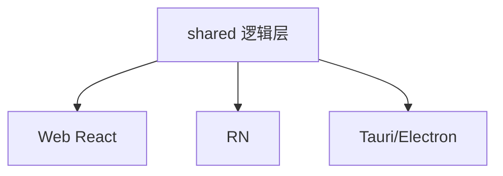
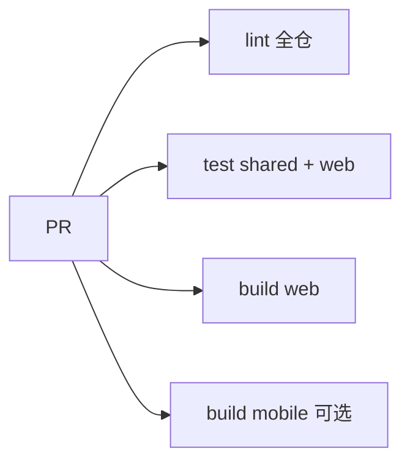

# 跨端选型与 Monorepo 实践

> **Web + 移动 + 桌面** 是否共用代码，取决于产品形态。本篇对比 **Tauri / Electron / RN / Capacitor**，并给出 **pnpm workspace** 目录建议。

---

## 一、跨端方案对比

| 方案 | 技术 | 适用 |
|------|------|------|
| **Web SPA** | React + Vite | 浏览器 |
| **React Native** | 原生渲染 | iOS/Android App |
| **Expo** | RN 工具链 | 快速 App |
| **Capacitor** | WebView 包 H5 | 轻 App、复用 Web |
| **Electron** | Chromium 壳 | 桌面（重） |
| **Tauri** | 系统 WebView + Rust | 桌面（轻） |



---

## 二、何时 WebView（Capacitor）？

| ✅ | ❌ |
|----|-----|
| 已有成熟 H5 | 要复杂原生动画 |
| 快速上架 | 极致性能 |
| 团队只会 Web | 大量原生 API |

RN 适合**要原生列表/手势**的 App。

---

## 三、Monorepo 结构

```
apps/
├── web/              # Vite
├── mobile/           # Expo
└── admin/            # 另一 SPA
packages/
├── ui-web/           # Web 组件
├── api-client/       # fetch + Query hooks
├── types/
└── utils/
pnpm-workspace.yaml
```

```yaml
# pnpm-workspace.yaml
packages:
  - 'apps/*'
  - 'packages/*'
```

| 包 | 内容 |
|----|------|
| `api-client` | `fetchUser`、`useUsers` |
| `types` | User、Order |
| `ui-web` | 仅 Web 的 Button |

---

## 四、共享 TanStack Query

```tsx
// packages/api-client/users.ts
export function useUsers() {
  return useQuery({ queryKey: ['users'], queryFn: fetchUsers });
}
```

Web 与 RN 各包一层 `QueryClientProvider`，**共享 hook 定义**。

---

## 五、样式策略

| 层 | Web | RN |
|----|-----|-----|
| 设计 token | CSS 变量 | 同一 JSON token |
| 组件 | Tailwind / shadcn | NativeWind 或独立 |

**完全共享 JSX** 需 react-native-web 或 Tamagui 等跨端 UI 库。

---

## 六、构建与 CI



Turborepo / Nx 可缓存 task（可选）。

---

## 七、选型决策

| 问题 | 倾向 |
|------|------|
| 只要浏览器 | 单体 Vite，不 monorepo |
| Web + App 业务一致 | monorepo + shared |
| 桌面内嵌现有 Web | Tauri/Capacitor |

---

## 八、小结

| 要点 | |
|------|--|
| 逻辑共享 > UI 强行共享 | |
| pnpm workspace | |
| RN vs WebView 按体验选 | |

**上一篇**：[04-动画与手势](./04-动画与手势.md)  
**下一模块**：[20-排障与生产实践](../20-排障与生产实践/01-常见运行时错误与修复.md)
