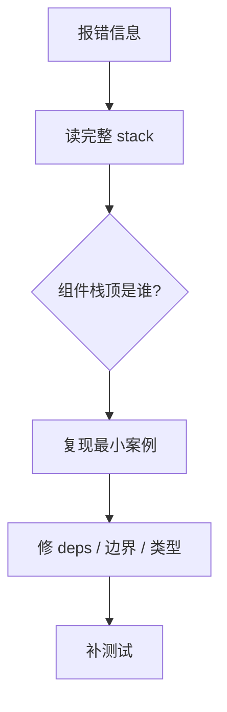

# 常见运行时错误与修复

> 控制台红字是 React 开发日常。本篇按**错误信息**分类：**原因 → 修复 → 预防**，便于搜索对照。

---

## 一、排障总流程



| 工具 | |
|------|--|
| React DevTools Components | |
| 错误栈 + Source map | |
| 最小复现 CodeSandbox | |

---

## 二、Invalid hook call

```
Invalid hook call. Hooks can only be called inside of the body of a function component...
```

| 原因 | 修复 |
|------|------|
| 违反 Hooks 规则（条件/循环里调用） | 提到顶层 |
| **两套 React**（微前端、link 错） | shared singleton |
| 非组件函数里调 Hook | 改成自定义 Hook |
| 误用 class 组件 | 改函数组件 |

---

## 三、Too many re-renders

```
Too many re-renders. React limits the number of renders...
```

| 原因 | 修复 |
|------|------|
| render 里直接 `setState` | 移到 event / effect |
| `useEffect` 无 deps 每次 setState | 加依赖或改条件 |
| 父传 `onClick={() => ...}` 子内又触发父 set | 状态下沉 / memo |

```tsx
// ❌
function Bad() {
  const [n, setN] = useState(0);
  setN(n + 1);
  return null;
}
```

---

## 四、Hydration mismatch

```
Text content does not match server-rendered HTML...
```

| 原因 | 修复 |
|------|------|
| `Date.now()` / `Math.random()` | 放 useEffect 或仅客户端 |
| 浏览器扩展改 DOM | 测无痕 / `suppressHydrationWarning` 慎用 |
| 服务端与客户端分支不一致 | 统一渲染 |
| 错误 `useId` 用法 | 用官方 useId |

见 [12-hydration](../12-并发与Suspense/04-Streaming-SSR与hydration.md)。

---

## 五、Cannot update a component while rendering

```
Cannot update a component (`A`) while rendering a different component (`B`)
```

| 原因 | 修复 |
|------|------|
| 子 render 里调父 setState | 移到 effect / event |
| Context value 在 render 里触发订阅更新 | 延迟更新 |

---

## 六、Each child in a list should have a unique key

| 原因 | 修复 |
|------|------|
| 用 index 作 key 且列表重排 | 用稳定 id |
| key 重复 | 保证唯一 |

见 [06-Key](../06-渲染与调和/04-Key与列表调和.md)。

---

## 七、Maximum update depth exceeded

常与 **effect ↔ setState 循环** 或 **ref callback 每次 setState** 相关。

```tsx
// ❌ dep 每次变
useEffect(() => {
  setX(compute());
}, [compute()]); // 新对象/新函数

// ✅ 稳定依赖
```

---

## 八、ChunkLoadError / lazy 失败

| 原因 | 修复 |
|------|------|
| 部署后旧 HTML 指向旧 chunk | CDN 缓存策略、hash 文件名 |
| 网络断 | Error Boundary + 重试 |

见 [10-懒加载](../10-路由/05-懒加载与代码分割.md)。

---

## 九、快速对照表

| 错误关键词 | 首查 |
|------------|------|
| hook call | 规则 / 双 React |
| re-renders | setState 位置 |
| hydration | SSR 一致 |
| key | 列表 id |
| update depth | effect 循环 |

---

## 十、小结

| 习惯 | |
|------|--|
| 保存完整报错 | |
| 先最小复现 | |
| 修完加 RTL 测 | |

**下一篇**：[02-Hooks与渲染排障手册](./02-Hooks与渲染排障手册.md)
