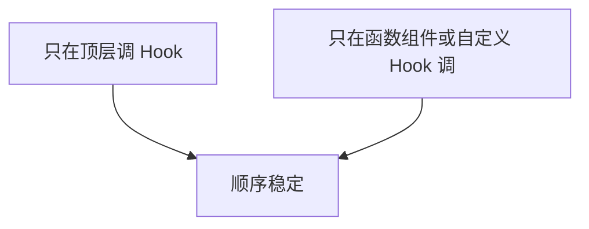
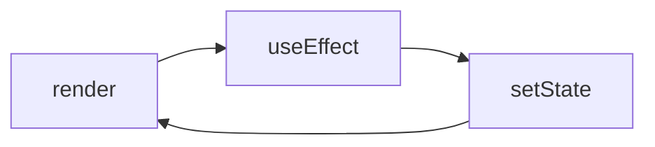

# Hooks 与渲染排障手册

> **Hooks 顺序错、effect 依赖错、闭包陈旧** 是隐性 bug 大户。本篇用**现象 → 根因 → 修法**串联 05、06 模块知识。

---

## 一、Hooks 两条规则复查



| 违规现象 | |
|----------|--|
| 热更新后随机崩 | 条件 Hook |
| 自定义 Hook 里又条件调 useState | 拆子 Hook |

见 [00-Hooks总览](../05-Hooks体系/00-Hooks总览与规则.md)。

---

## 二、stale closure（陈旧闭包）

**现象**：effect 或回调里读到旧的 state/props。

```tsx
// ❌ 定时器永远 log 0
const [count, setCount] = useState(0);
useEffect(() => {
  const id = setInterval(() => console.log(count), 1000);
  return () => clearInterval(id);
}, []); // count 闭包卡在 0

// ✅
useEffect(() => {
  const id = setInterval(() => {
    setCount(c => { console.log(c); return c; });
  }, 1000);
  return () => clearInterval(id);
}, []);
```

| 修法 | |
|------|--|
| 函数式 setState `setX(x => ...)` | |
| ref 存最新值 | |
| 把变量加入 deps | |

---

## 三、useEffect 依赖

| 问题 | 处理 |
|------|------|
| 漏依赖 | exhaustive-deps，或 eslint-disable 注明理由 |
| 对象/函数 deps 每次变 | useMemo/useCallback 或移入 effect |
| 应用 Query 代替 fetch effect | [09-Query](../09-数据获取与缓存/) |

```tsx
// ❌ 无限请求
useEffect(() => {
  fetchData(filters);
}, [filters]); // filters 每 render 新对象

// ✅ 稳定 key
const filterKey = useMemo(() => ({ ...filters }), [filters.status, filters.page]);
```

---

## 四、无限渲染环



| 断环 | |
|------|--|
| effect 内加条件再 setState | |
| 比较前后值 | |
| 用 useRef 标记已处理 | |

---

## 五、父 render 拖垮子树

**现象**：输入卡顿，Profiler 显示无关子树全 render。

| 手段 | 文档 |
|------|------|
| 状态下沉 | [11-01](../11-性能优化/01-React渲染性能原理.md) |
| memo + 稳定 props | [11-02](../11-性能优化/02-memo-useMemo-useCallback.md) |
| Context 拆分 | [08-02](../08-状态管理/02-Context进阶与性能.md) |

---

## 六、Strict Mode 双 effect

开发态 mount → unmount → mount，**effect 跑两次**。

| 不是 bug | 要修 |
|----------|------|
| 预期行为 | effect 无清理导致双订阅 |

```tsx
useEffect(() => {
  const sub = subscribe();
  return () => sub.unsubscribe();
}, []);
```

---

## 七、自定义 Hook 排障

| 检查 | |
|------|--|
| 返回值是否每 render 新对象 | useMemo 包 |
| 是否隐藏条件 Hook | 拆函数 |
| 测试是否用 renderHook | [15-04](../15-测试/04-Hooks与Provider测试.md) |

---

## 八、并发相关

| 现象 | 尝试 |
|------|------|
| 输入卡 | startTransition |
| 旧结果闪一下 | useDeferredValue |

见 [12-02](../12-并发与Suspense/02-useTransition与useDeferredValue.md)。

---

## 九、Checklist

| ☐ | 项 |
|---|-----|
| ☐ | Hook 只在顶层 |
| ☐ | effect 有清理 |
| ☐ | deps 合理 |
| ☐ | 闭包用函数式更新或 ref |
| ☐ | Profiler 验证优化有效 |

---

## 十、小结

| 三大类 | stale closure、effect 环、渲染范围 |
|--------|----------------------------------|

**上一篇**：[01-常见运行时错误与修复](./01-常见运行时错误与修复.md)  
**下一篇**：[03-生产环境监控与日志](./03-生产环境监控与日志.md)
