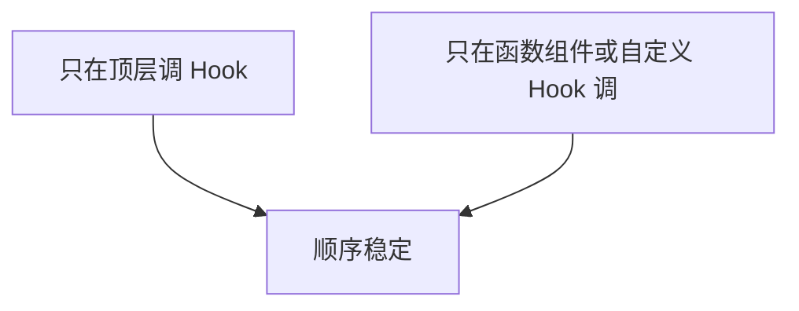
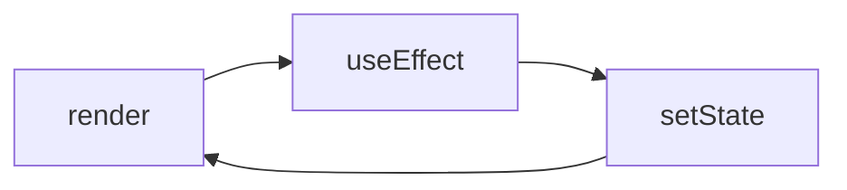

# Hooks 与渲染排障手册

**Hooks 顺序错、effect 依赖错、闭包陈旧** 是隐性 bug 大户。本篇用**现象 → 根因 → 修法**串联 Hooks 与渲染知识。

---

## Hooks 两条规则复查



| 违规现象 | |
|----------|，|
| 热更新后随机崩 | 条件 Hook |
| 自定义 Hook 里又条件调 useState | 拆子 Hook |

Hooks 必须在函数组件或自定义 Hook 的顶层调用，顺序稳定。

---

## stale closure（陈旧闭包）

**现象**：effect 或回调里读到旧的 state/props。

```tsx
// ❌ 定时器永远 log 0
const [count, setCount] = useState(0);
useEffect(() => {
  const id = setInterval(() => console.log(count), 1000);
  return () => clearInterval(id);
}, []); // count 闭包卡在 0

// ✅
useEffect(() => {
  const id = setInterval(() => {
    setCount(c => { console.log(c); return c; });
  }, 1000);
  return () => clearInterval(id);
}, []);
```

| 修法 | |
|------|，|
| 函数式 setState `setX(x => ...)` | |
| ref 存最新值 | |
| 把变量加入 deps | |

---

## useEffect 依赖

| 问题 | 处理 |
|------|------|
| 漏依赖 | exhaustive-deps，或 eslint-disable 注明理由 |
| 对象/函数 deps 每次变 | useMemo/useCallback 或移入 effect |
| 应用 Query 代替 fetch effect | TanStack Query 管理服务端数据 |

```tsx
// ❌ 无限请求
useEffect(() => {
  fetchData(filters);
}, [filters]); // filters 每 render 新对象

// ✅ 稳定 key
const filterKey = useMemo(() => ({ ...filters }), [filters.status, filters.page]);
```

---

## 无限渲染环



| 断环 | |
|------|，|
| effect 内加条件再 setState | |
| 比较前后值 | |
| 用 useRef 标记已处理 | |

---

## 父 render 拖垮子树

**现象**：输入卡顿，Profiler 显示无关子树全 render。

| 手段 | 说明 |
|------|------|
| 状态下沉 | 输入 state 隔离到子组件 |
| memo + 稳定 props | 大列表行组件 |
| Context 拆分 | 按关注点拆 Provider |

---

## Strict Mode 双 effect

开发态 mount → unmount → mount，**effect 跑两次**。

| 不是 bug | 要修 |
|----------|------|
| 预期行为 | effect 无清理导致双订阅 |

```tsx
useEffect(() => {
  const sub = subscribe();
  return () => sub.unsubscribe();
}, []);
```

---

## 自定义 Hook 排障

| 检查 | |
|------|，|
| 返回值是否每 render 新对象 | useMemo 包 |
| 是否隐藏条件 Hook | 拆函数 |
| 测试是否用 renderHook | renderHook + wrapper |

---

## 并发相关

| 现象 | 尝试 |
|------|------|
| 输入卡 | startTransition |
| 旧结果闪一下 | useDeferredValue |

---

## Hook 排障要点

| 项 | 说明 |
|-----|------|
| Hook 只在顶层 | 不在条件/循环里 |
| effect 有清理 | 防双订阅 |
| deps 合理 | exhaustive-deps |
| 闭包用函数式更新或 ref | 防 stale closure |
| Profiler 验证优化有效 | 测量后再优化 |

---

## 小结

三大类隐性 bug：stale closure、effect 无限环、渲染范围过大，deps 与函数式 setState 是常用解法。

Hooks 排障：遵守两条规则（顶层、仅函数组件/自定义 Hook）。stale closure 用函数式 setState、ref 或加 deps。effect 依赖：漏依赖补全、对象/函数 deps 稳定化、服务端数据用 Query。无限渲染环：effect 内加条件、比较前后值、useRef 标记。父 render 拖子树：状态下沉、memo、Context 拆分。Strict Mode 双 effect 是预期，需确保 cleanup。自定义 Hook：返回值稳定化、无隐藏条件 Hook。并发：输入卡用 startTransition，旧结果闪用 useDeferredValue。
