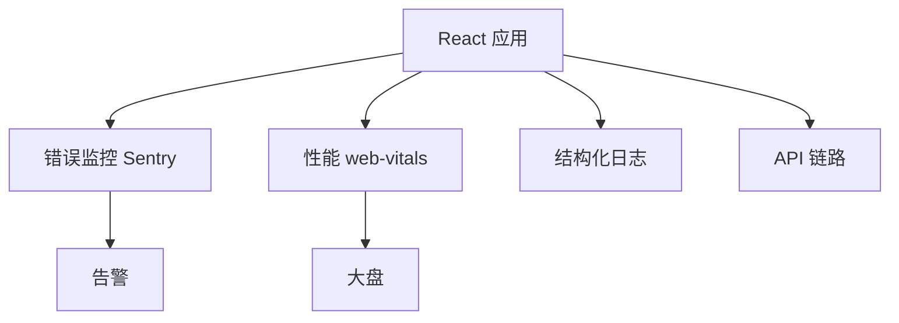

# 生产环境监控与日志

线上 React 应用需要 **错误上报、性能 RUM、关键行为日志**，与开发态 console 不同，要**可聚合、可告警、可关联用户会话**。

---

## 监控分层



| 类型 | 例子 |
|------|------|
| **JS 错误** | 未捕 promise、Boundary |
| **性能** | LCP、INP、长任务 |
| **业务** | 下单失败率 |
| **API** | 5xx、慢请求 |

---

## Sentry 集成示意

```bash
pnpm add @sentry/react
```

```tsx
import * as Sentry from '@sentry/react';

Sentry.init({
  dsn: import.meta.env.VITE_SENTRY_DSN,
  integrations: [Sentry.browserTracingIntegration()],
  tracesSampleRate: 0.1,
});

const root = createRoot(container, {
  onUncaughtError: Sentry.reactErrorHandler(),
  onCaughtError: Sentry.reactErrorHandler(),
});
```

| 功能 | |
|------|，|
| Error Boundary 集成 | |
| release 版本号 | `SENTRY_RELEASE=git-sha` |
| source map 上传 | 还原 stack |

---

## Error Boundary 上报

```tsx
<Sentry.ErrorBoundary fallback={<ErrorPage />}>
  <App />
</Sentry.ErrorBoundary>
```

Boundary **捕不到** 事件 handler 内错误，需 try/catch 或 `Sentry.captureException`。

---

## web-vitals RUM

```tsx
import { onLCP, onINP, onCLS } from 'web-vitals';

function send(metric) {
  analytics.track('web-vital', {
    name: metric.name,
    value: metric.value,
    id: metric.id,
  });
}

onLCP(send);
onINP(send);
onCLS(send);
```

生产环境采样上报 LCP/INP/CLS，验证真实用户体验。

---

## 日志规范

| ❌ 生产 | ✅ 生产 |
|---------|---------|
| `console.log` 满天飞 | 分级 logger |
| 打用户密码 | 脱敏 |
| 无 requestId | 全链路 id |

```tsx
logger.info('checkout_submit', { orderId, userId: hash(userId) });
```

---

## React 特有线上问题

| 现象 | 排查 |
|------|------|
| 白屏 | Boundary、chunk 加载、JS 语法错误（旧浏览器） |
| 偶发 hooks 错 | 双 React、插件注入 |
| 内存涨 | 未清理订阅、Query gcTime |
| 慢 | INP 长任务、大包 |

---

## Source Map 与安全

| 做法 | |
|------|，|
| 构建上传 map 到 Sentry，**不**公开托管 | |
| 或 hidden-source-map | |

---

## 告警策略

| 指标 | 阈值示例 |
|------|----------|
| JS 错误率 | > 基线 2x |
| LCP p75 | > 4s |
| API 5xx | > 1% |

避免 alert 疲劳：分环境、分 release。

---

## 小结

Sentry 捕 JS 错误 + web-vitals RUM + 结构化业务日志；source map 上传但不公开托管。

监控四层：JS 错误（Sentry）、性能 RUM（web-vitals）、结构化业务日志、API 链路。Sentry 集成：init + createRoot onUncaughtError/onCaughtError + ErrorBoundary；release 版本号 + source map 上传。Boundary 不捕事件 handler 错误，需 try/catch 或 captureException。web-vitals 生产采样上报 LCP/INP/CLS。日志：分级 logger、脱敏、requestId。React 线上问题：白屏（chunk/Boundary）、双 React、内存涨（未清理订阅）、INP 慢。source map 上传 Sentry 不公开托管。告警分环境分 release，避免疲劳。
